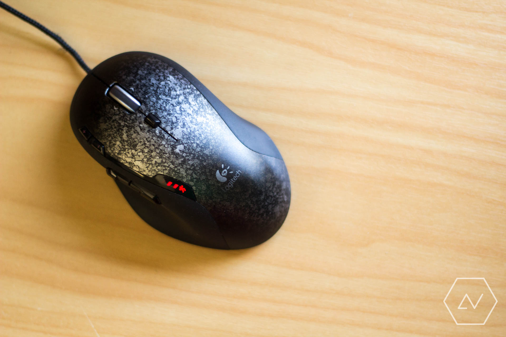

A decent gaming mouse for \$35? Even second-hand, that seemed just about too good to be true. Nevertheless, I bought the mouse as part of my recent [peripherals upgrade][apex]. So far the experience has been fantastic, to say the least.

{:webFeedsFeaturedVisual}

It didn't start off too fantastically though. Just a week after I received my second-hand Logitech G500 I started noticing frustrating double-click issues, where the mouse would erratically click and release when the left button was held down. These second-hand qualms reached the point where I switched back to my trusty [Microsoft WMO1.1A][wmo] while I researched causes and potential fixes. First up, I followed through a [popular video][static] on YouTube, which involved shielding the top of the switch to prevent static buildup. This only worked partially for me however and the mouse was still barely usable. Eventually I bit the bullet and opened up the mouse switch to clean the contact point. The tutorial I used is [here][scrape]. I opted not to remove the spring from the switch and simply scraped the contact point with a flat head screwdriver. While I couldn't see any buildup before scraping, the trick worked marvellously; once reassembled, the mouse was as good as new!

I've had my G500 working for a couple of months now and it's safe to say that I will have trouble ever going back to three-button mice. I don't love the G500 because it's a gaming mouse &mdash; I haven't even been doing much gaming &mdash; I love it because it's a productive mouse, and a comfortable one at that. The software Logitech provides for the G500 manages to get out of the way, quitely sorting out mappings and program detection in the background. And those mappings can be quite powerful. For instance, I've replaced the horizontal scrolling action with switching between dekstops. The first thumb button switches to the previous window in a desktop. Just these two buttons have saved me plenty of time while multitasking. By replacing the DPI down button with Windows Task View, I can get an even more detailed overview of my windows when the thumb button isn't enough. This is perfect when many documents are open.

But it doesn't stop there. The software can detect which program is focused and load up sets of program- or game-specific mappings. For me this is massively helpful in Adobe Lightroom, where I can now flag and develop photos one-handed without having to move my cursor up to the toolbar.

This all sounds very much like a marketing pitch for Logitech, but in reality I am simply amazed by how flexible multi-button mice are. Initially I was fearful that the additional buttons would be flashy and useless, but once I took the time to decide on useful mappings, I realised the potential these mice have to improve the entire window management experience as well as certain applications. Are there other brands who have even better mice and software? Quite possibly. All I know is that I've found a new personal standard for a mouse. I just wish I had discovered it sooner.

[Apex]: 
[WMO]: http://www.newegg.com/Product/Product.aspx?Item=N82E16826105099
[static]: https://www.youtube.com/watch?v=dWJk4EWfyOA
[scrape]: http://zalbee.intricus.net/2014/02/how-i-fixed-my-logitech-g500-mouse/
