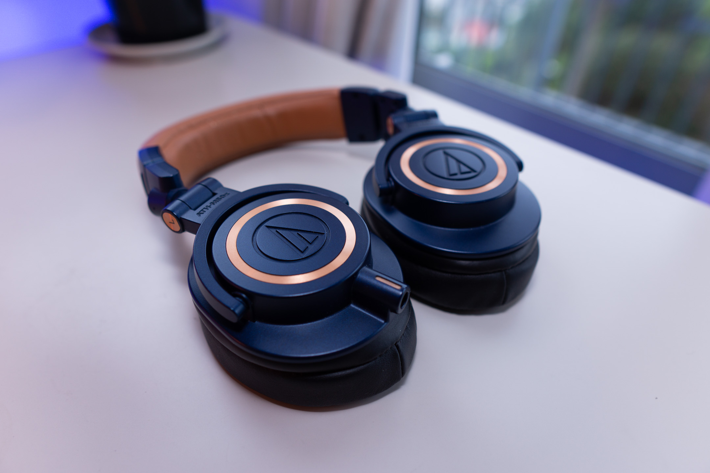
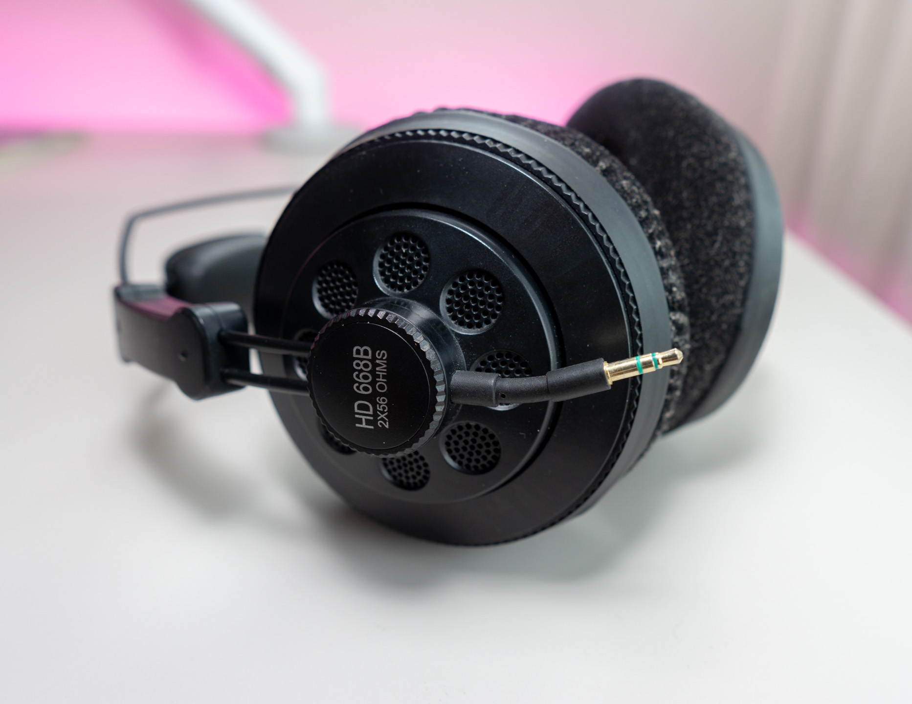
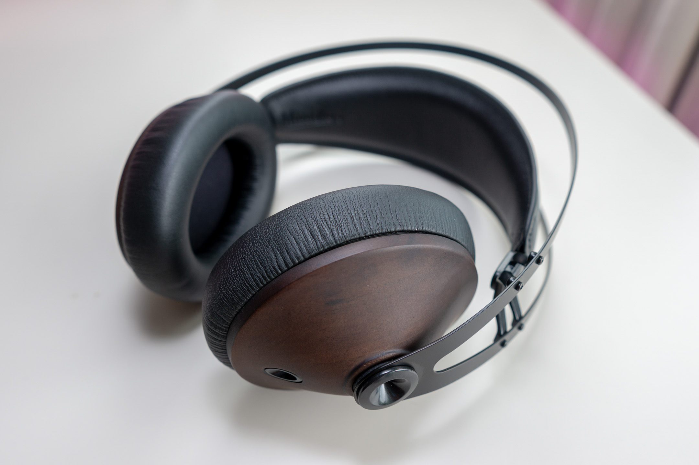
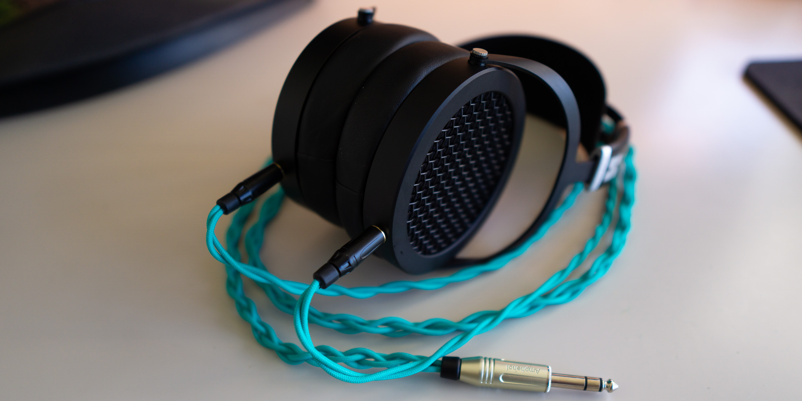

I've tried quite a few headphones in my time. For no particular reason, I have been wanting to document my thoughts on the models I have tried. Is this a note to self? A diary? A series of mini-reviews? You decide. Whatever it is, I've included links to some tracks that help prove the point. All of these songs are meaningful to me and are not to be missed.

Headphones are listed in order of when I acquired them.

# Previous headphones

## 2010-2014: Sennheiser HD212 Pro

My first over-ear headphones, purchased second-hand as an upgrade from some old Panasonic on-ears. While I can't remember how much I bought them for, it must have been a hell of a deal as I wore these things until they starting disintegrating. I remember being impressed by by the isolation and comfort from the soft oval pads. They had a very bassy sound signature but I can't recall the details. I do recall enjoying listening to music through these, however.

## 2014-2015: [GRADO SR125e](https://www.amazon.com/gp/product/B00L1NTJAW/ref=as_li_tl?ie=UTF8&camp=1789&creative=9325&creativeASIN=B00L1NTJAW&linkCode=as2&tag=albertnis-20&linkId=27026b88960f95d8e09e0ef66554e582)

Perhaps it was my Sennheisers falling apart, or online research during a largely idle summer, but I found myself wanting to try something different. Open headphones seemed popular and promised a more impressive sound, so I picked up some discounted Grados and an Audioquest DragonFly DAC. More or less instantly I was disappointed by these cans. They were sublime for acoustic tracks ([_The Summer You Never Meant_](https://www.youtube.com/watch?v=ntEUfm30eFQ) by The Exponents)... and nothing else. This was due to an incredibly airy upper-end which brought so much realism to strings and vocals. Lacking bass made them fall flat for electronic music. Build quality, cable and comfort were appalling also. I'll never realise how people rave about these lower-end SR Grados. If you listen exclusively to soft rock at home and your ears are either tiny or numb I'd highly recommend these.

A clumsy entry into the world of nice headphones. I sold them a few weeks after purchase.

## 2015-2019: [Audio-Technica ATH-M50xBL](https://www.amazon.com/gp/product/B00HVLUR86/ref=as_li_tl?ie=UTF8&tag=albertnis-20&camp=1789&creative=9325&linkCode=as2&creativeASIN=B00HVLUR86&linkId=0d0fc45ccc6b73b1527ba0f168c2215f)

I had actually tried these before the Grados and avoided them - but the Grado experience made me reconsider what I thought I knew. The M50x sound signature had no real surprises but was a clear upgrade from my old Sennheisers in terms of clarity and balance. Moreover, I suddenly appreciated the practicality in the M50x. Removable cables, foldable design, carrying bag - perfect! Plus these things paired so well with the DragonFly DAC, had very little sound leakage, and great isolation. I remember jamming to iconic EDM tracks ([_Afterglow_](https://www.youtube.com/watch?v=I9QGpHScGug) by Wilkinson) through these things during study sessions throughout university. I bought the 2014 Limited Edition blue and tan model which looked sublime. Oddly, the tan-coloured pads seemed less comfortable than the black on the M50xs owned by my friends. A good number of those friends had purchased the M50x on my recommendation.

Tried and true, but I eventually became either sick or bored of their one-trick-pony sound signature which only seemed to sound great for electronic music.

## 2016-2019: [Superlux HD668B](https://www.amazon.com/gp/product/B003JOETX8/ref=as_li_tl?ie=UTF8&tag=albertnis-20&camp=1789&creative=9325&linkCode=as2&creativeASIN=B003JOETX8&linkId=23bb93b047c19298e9f2bbe88574e5e7)

I heard some ravings online about this semi-open model. 55NZD from Massdrop was so tempting I just bought them. My reasoning at the time was something like: _Maybe the "semi" in "semi-open" meant they'd be less bad than the fully-open Grados_. They were certainly less bad but the comfort was horrendous. The sticky vinyl pads were large but shallow and my ears rubbed on the driver. I bought some 15NZD velour pads from ebay and they instantly became some of the most comfortable headphones I've ever owned. The cable design is ingenious, too: The earcups have a stubby male connector and the provided cables are simply extension cords!

The HD668B, helped by the plush new earpads, had an awesomely spacious sound and were my go-to gaming headphones. This soundstage helped with music rendition also, but unfortunately the high frequencies were just too aggressive to derive much enjoyment from the experience, even on the Topping D30/A30 stack I purchased around this time. Even for a dedicated gaming headphone though, these are quite the deal! I sold them for the same price nearly four years later but threw in the bonus pads.

## 2016-2020: [Sennheiser/Massdrop HD 6XX](https://drop.com/buy/massdrop-sennheiser-hd6xx)

There was so much hype around the release of the HD 6XX. This is basically a full-fat HD650 at half the price, after all. A friend and I bought into the hype, each buying multiple pairs with the intention of keeping a pair and flipping the rest on the New Zealand market.

Frankly, the hype was well-deserved and remains to this day. I can't say enough good things about the HD 6XX. I used it almost daily for five years and it didn't skip a beat. The mid-heavy sound of these things is _lush_. Vocals take on this blissfully full and natural tone. High frequencies sparkle but don't dominate. Even after getting used to the sound signature, I would reliably get goosebumps listening to certain tracks on the HD 6XX ([_Amandine Insensible_](https://www.youtube.com/watch?v=_ReWd-Pg81w) by Sevdaliza, [_Going Home_](https://www.youtube.com/watch?v=mszN_cAttaA) by Ásgeir). This is not to mention that the oval pads and light weight of this headphones provided the most comfortable listening experience I've ever had.

Bass was the main weakness of the HD 6XX in my eyes (ears?). It was there, but it was not sufficient to drive electronic music. I found it took on something of a one-note tone and never had much texture or impact to it.

Still, the HD 6XX provides a true high-end headphone experience. I'd recommend this or the HD58X for really taking a dive into awesome-tier headphones. Eventually I sold these to a friend. I can only hope this person derives some of the same joy from these bad boys. Hell, they'll probably last at least another five years.

## 2017-2020: Sony WH-1000XM2

The problem with hi-fi headphones like the HD 6XX is that they're really only good for home listening. There's minimal convenience there. My theory was that a closed-back, wireless, noise-cancelling headphone would provide all the convenience I needed for when I wasn't listening to my HD 6XX - plus it would add some more bass for electronic listening. The Sonys were pleasant. I found the sound quality nice enough: sometimes muddy but usually even more appealing than the ATH-M50x. The comfort was a mixed bag - they were hot and sweaty, especially on my walking commute. They also had a fair bit of heft and undersized earpads. These problems were mostly fixed in the XM3 and [XM4](https://www.amazon.com/gp/product/B0863TXGM3/ref=as_li_tl?ie=UTF8&tag=albertnis-20&camp=1789&creative=9325&linkCode=as2&creativeASIN=B0863TXGM3&linkId=9da712a9f8df7b66d49a70391b3bf310), I believe. Maybe I should have waited. Luckily the Sonys are always in-demand and a co-worker bought them off me.

## 2019: Meze/Massdrop 99 Noir

I had been looking for ATH-M50x replacements in pursuit of a better home-listening experience for electronic music. The identical [99 Classics](https://www.amazon.com/gp/product/B018VZBH5M/ref=as_li_tl?ie=UTF8&tag=albertnis-20&camp=1789&creative=9325&linkCode=as2&creativeASIN=B018VZBH5M&linkId=24e3d65eaf5109652c02c656998fca1c) were selling for almost twice the price domestically. People online left very positive reviews praising a bassy sound signature that retained excellent detail and musicality.

Those people were wrong.

In a similar situation to the Grado SR125i, I found myself wondering how the hell these get such good press. The bass was overwhelming and bloated. The comfort was borderline. They were built attractively but seemed fragile. I bought replacement pads thinking I was going crazy - they didn't help. Thank goodness the Mezes sold quickly second-hand, on TradeMe. I refused to sell them to anybody I actually knew.

## 2020: [HiFiMan HE4XX](https://www.amazon.com/gp/product/B07YBWT8PK/ref=as_li_tl?ie=UTF8&tag=albertnis-20&camp=1789&creative=9325&linkCode=as2&creativeASIN=B07YBWT8PK&linkId=842e2feb4e436bcfc15a3f37219a30a1)

I felt ready to continue on my open-backed journey. I had heard about planar magnetic headphones and how they could provide some of the better open-backed bass. What if the HE4XX was the open-backed electronic-music headphone I longed for to live alongside my HD 6XX? I bit the bullet and purchased from Drop.

The HE4XX was less comfortable than the HD 6XX. The pads were plush but smaller, and the whole device was heavy. Unlike the Sennheiser it was hard to forget about wearing the HE4XX. The sound was surprisingly different to the HD 6XX. It was as if some of the mid-focused prowess of the HD 6XX had been traded for more textured bass and much clearer high-frequencies. I really enjoyed the HE4XX but I returned the headphone due to a notable driver imbalance.

# Current headphones

## 2019-: [Beyerdynamic DT770 Pro 80 Ohm](https://www.amazon.com/gp/product/B0016MNAAI/ref=as_li_tl?ie=UTF8&tag=albertnis-20&camp=1789&creative=9325&linkCode=as2&creativeASIN=B0016MNAAI&linkId=860006d4af673aff6ee7d6012a91408b)

After the Mezes I was still on the hunt for a bassy-enough closed-back headphone to complement the HD 6XX. The reviews of the DT770 are all over the place, largely due to the three impedance versions which have their subtle differences. I settled on the 80 Ohm ones as they ostensibly have the most bass and least treble. I bought them from a UK supplier for a good price - well under what I paid for the M50x.

I really didn't know what to expect from these, but overall I'm pleased. Pleased enough that I sold my M50x for these.

Upon unboxing I was struck with the indestructible build quality and awesome comfort. The bass on these headphones is gorgeous and just what I was after. With the DT770, it's all about sub-bass. It's cavernous, as if there's no note deep enough to miss ([_I Found_](https://www.youtube.com/watch?v=Yj6V_a1-EUA) by Amber Run). The best part is the rest of the bass isn't too bloated. Otherwise, the sound signature is more controversial. Vocals are consistently recessed and highs can be quite sharp - though the good soundstage does add immersion. The DT770 is most at home for electronic instrumental tracks, but is a surprisingly good all-rounder once you get used to the sound. Hell, it's not bad for gaming, either.

## 2020-: [HiFiMan Sundara](https://www.amazon.com/gp/product/B077XDWT7X/ref=as_li_tl?ie=UTF8&tag=albertnis-20&camp=1789&creative=9325&linkCode=as2&creativeASIN=B077XDWT7X&linkId=5ddf8dc07e102a34eb279e4dfb68f597)

The HE4XX experience got me thinking. I really liked the tradeoff compared to the HD 6XX.

1. The top-notch detail afforded by the more present high frequencies was undeniable. I enjoy treble that's crispy but not overwhelming and HE4XX had nailed that.
1. If my open-backed pair could provide enough bass for electronic listening, maybe I could get sell the DT770. I enjoy downsizing after upgrading.
1. The path to improve the HD 6XX involves purchasing expensive subjective audio gear like tube amps and the like, to "improve" the sound by adding imperfections to the audio chain. Would something like the HE4XX be the best choice on my more analytical chain?

I decided to go up a level, purchasing the higher-end Sundara, the bigger brother of the HE4XX/HE-400i. Spending 580NZD on a headphone was a big purchase. To help justify it, I set the expectation that this would replace my HD 6XX, not live alongside it. A high bar, but I wasn't disappointed.

The Sundara solved many of the issues with HE4XX. A better headband, a smaller and lighter design, and slightly comfier earpads were highlights. And the sound is astonishingly enjoyable. Somehow it manages to be neutral but fun. High frequencies are emphasised somewhat, leading to tons of beautiful detail. Guitar strums and vocal consonants are always clear ([_Should Have Known Better_](https://www.youtube.com/watch?v=lJJT00wqlOo) by Sufjan Stevens). Mids are less rich than the HD 6XX but plenty present: vocals seem to surround your head as opposed to caressing your eardrums ([_Watch Me Read You_](https://www.youtube.com/watch?v=EUC2CRc6Its) by Odette). The bass is noticeably nicer than the HD 6XX. It has texture and impact - nothing dominating (I'd still love a touch more) but enough to make electronic music pleasant to listen to ([_Disarm_](https://www.youtube.com/watch?v=9_UFTpfeyIY) by Alltta).

On poorly-produced tracks, the Sundaras won't help: they'll sound flat and boring. Conversely, well-produced tracks will be presented in all their glory ([_Good News_](https://www.youtube.com/watch?v=aIHF7u9Wwiw) by Mac Miller, [_Year of the Cat_](https://www.youtube.com/watch?v=Yxy1eF_w7sU) by Al Stewart).

The Sundaras dethroned my HD 6XX. They're not better in all ways but for me are definitely better overall. I've barely touched my DT770 since using the Sundara; I think I know which headphone to sell next.

## 2020-: [QCY T5](https://www.amazon.com/gp/product/B07YTTXKV2/ref=as_li_tl?ie=UTF8&tag=albertnis-20&camp=1789&creative=9325&linkCode=as2&creativeASIN=B07YTTXKV2&linkId=eeec83f6e829abc892421a317f07e103)

True story: These 40NZD true wireless earbuds replaced my 420NZD Sony WH-1000XM2. I realised my Sonys mostly delivered the convenience I wanted but at the expense of large size and sweaty earpads. I wondered: what would happen if I maximised convenience even at the expense of sound quality? The QCY T5 sounds alright, with super nice controlled bass even if the highs can be a tinny at times and there's a slight buzz. But the convenience is extraordinary. They fit in a pocket, I can choose to use only one earbud, and the noise isolation is decent. Absurdly good for the price.

# Next steps

The Sundara is well in the zone of diminishing returns; I don't see myself entering into the zone of super-high-end headphones any time soon. Rather, I'll probably sell my DT770 and upgrade the QCY T5 to higher-end true wireless earbuds.

# Reflections

It's not so much headphones that I find enjoyable, it's finding different ways to experience the music I listen to. I enjoy owning a headphone for a while then selling it as I upgrade. I don't want to become a hoarder (refer [Zeos' wall 2020][zeos-wall]). I appreciate that I've been able to experience music through all of these headphones over the years!

[zeos-wall]: https://www.youtube.com/watch?v=bcSa8MOz8ug
