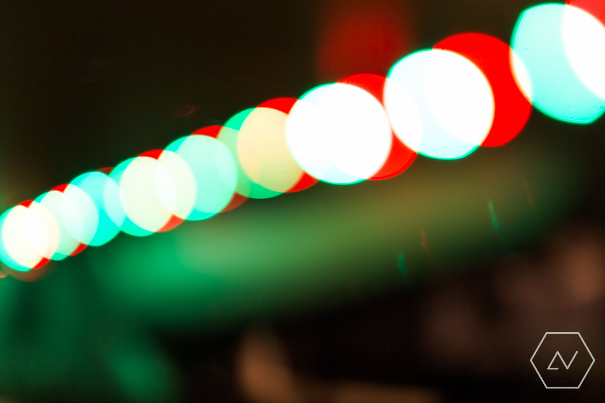

In 2015, I discovered two glorious things in the world of electronics: Arduinos and RGB LED strip lights. Bounded only by imagination and enabled only by eBay, I set out to combine these two items in the grooviest way possible.

As it turns out, with three MOSFETs, an IR receiver and a bit of code, it was surprisingly easy to replicate the functionality of the bundled LED strip controller with an Arduino as the brains. With a bit more code, I was able to implement buttery-smooth colour-crossfading and coloured strobing with different speeds.

This was all very interesting, however I knew I could do more. What if I could get the strip to dance to music? A quick search showed a popular method of achieving this was the fast Fourier transform. Fourier transforms are pretty cool, however after a bit more research I found that a higher resolution and faster response could be attained with a hardware-based approach using an [MSGEQ7][msg] spectral analyser. So I bought a couple on eBay.

The MSGEQ7 is a neat little IC. Essentially, it combines a multiplexer and seven bandpass filters. When wired up properly to an audio source, the MSG receives regular signals from a microcontroller to send back amplitude data from each of the seven bands. This means only three pin connections are required between the chip and the controller - perfect for my Arduino Nano with many pins already used!

The code used for the MSGEQ7 is somewhat particular due to timing requirements, however the code I put together boils down to a nested loop which fetches spectrum data as quickly as possible, corrects for line noise, and maps three of the seven band amplitudes to the colour channels on the LED strip. I messed around with many different mapping configurations, but settled on red as band 1/7 (low bass, 63Hz), blue as band 2/7 (high bass, 160Hz) and green as band 6/7 (treble, 6.25kHz). I ended up avoiding mapping mid-tones because it didn't look quite as impactful as emphasising bass and treble frequencies. I suppose that often these midtones are dominated by vocals, keyboard and the like, which are typically less rhythmic than bass or treble.

After settling on a colour scheme, I had a great deal of fun paging through my music library identifying the best- and worst-looking songs for the setup. One of the best was _Red Dress_ by Submotion Orchestra. Here's the result:

    <iframe width="660" height="400" src="https://www.youtube.com/embed/vmSqzH9hZJs" frameborder="0" class="video" allowfullscreen></iframe>

This project has been a great one so far, but there were frustrating times. The main annoyance was the capacitor used on the audio stage before input to the MSGEQ7. At relatively high volumes, the capacitor blew, resulting in a sad, flickering green output to the LED strip with which I became all too familiar. While I simply replaced blown capacitors, the problems could probably be fixed with higher quality caps, or additional circuit protection.

So what's next for the LED strip? I am keen to continue experimenting with the MSGEQ7 project, as I think there are some refinements to make. Some sort of denoising or time averaging could reduce the amount of flickering. There may also be other algorithms worth exploring to increase the smoothness and "realism" of the light response with introducing too much lag. It may also be interesting to compare the MSGEQ7's output with FFT methods to see what the difference really is.

After that, I'm looking forward to continuing to experiment with other hardware which can interface with the Arduino. These future experiments sure look bright.

[msg]: https://www.sparkfun.com/products/10468
