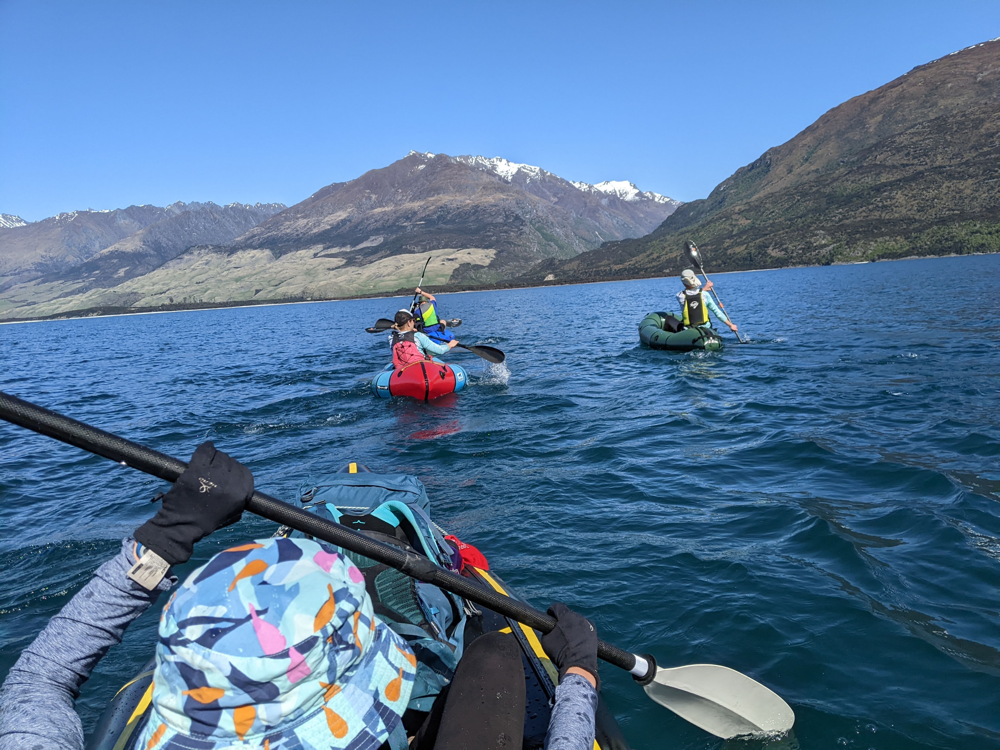
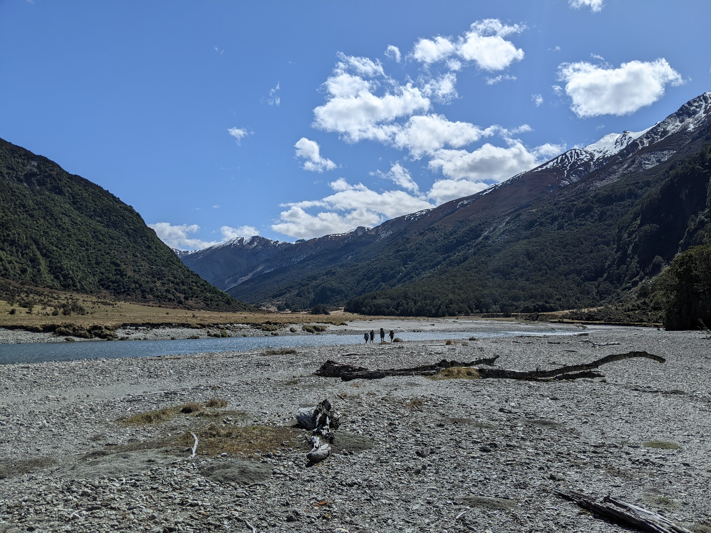
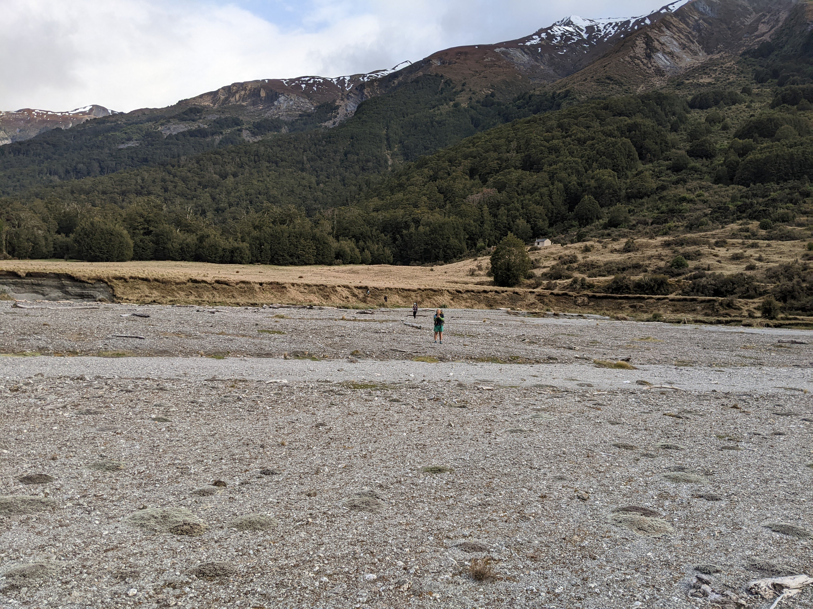
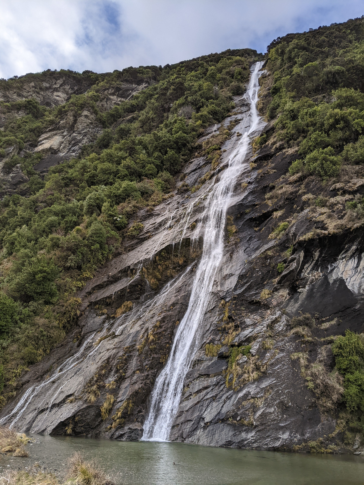
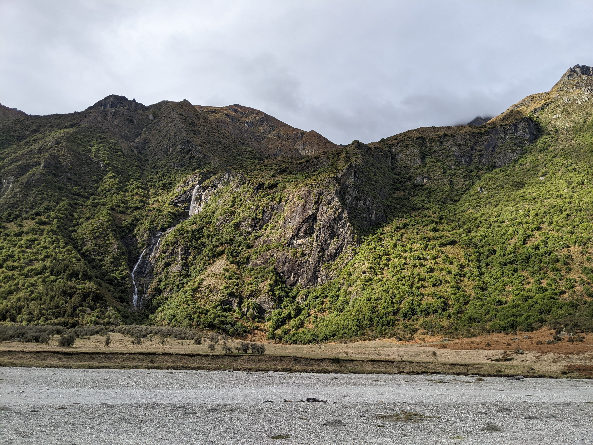

Albert Burn Hut is the only hut in the entire country named Albert. This seemed like an excellent opportunity to make it a birthday destination. There are a couple of ways to approach the valley but the easiest is surely to paddle just over 2km across the lake from Boundary Creek Campsite then walk the remaining 10km. If you're going out this way, make sure to plan the trip for calm weather.

# Day 1

With packrafts inflated, we paddled across the northern tip of the lake. It was an absolute bluebird day and a lot of fun on the water. We made it across in about 30 minutes.

<figcaption>Rafting across Lake Wānaka on a bluebird Saturday</figcaption>

One of the benefits of this trip is that the paddling leg is adjacent to the carpark. This means no need to carry rafts! Kayaks would work even better here. We stashed the raft amidst a manuka forest just north of the Albert Burn inlet.

Walking up the track was a fairly straightforward affair. We zigzagged across the water as the river twists and turns, eventually picking up the marked track on the true left of the river just downstream of the narrow gorge section of the river. The track climbs up the riverbank a wee bit, before dropping down for a crossing in the middle of the gorge. On this clear day the river was waist deep here, so we locked arms and made it across safely. This is definitely not a crossing to be attempted at rainy times.

<figcaption>One of the Gorge sections of the Albert Burn</figcaption>

Continuing along the track on the other side of the river, it became increasingly clear that this track is not well-frequented. Beech debris were scattered everywhere and we shoved many branches out of the way as we walked. After about a kilometre, the track opens up to a beautiful wide river valley. We spotted numerous waterfalls coming down from the steep rocky hills lining the valley as we meandered up the river.

<figcaption>Stunning riverbed travel up the Albert Burn beyond the Gorge</figcaption>

The hut sits above a large clearing, a bit further up a hill than I thought. It's a surprisingly nice hut for one which receives about a dozen parties each year: built in 1995 and having two levels of four bunks each, with lovely evening sun and only minor sandfly leakage.

<figcaption>Albert Burn Hut on the hillside</figcaption>

The valley is really wide at this point and we took the opportunity to check out the dramatic waterfall on the opposite side of the valley. It made for a sublime spot for some swimming, frisbee throwing, and refilling of water bottles. This was absolutely a moment to remember.

<figcaption>Beautiful 146m waterfall cascading down the cliffs opposite the hut. The basin at the base forms a delightful swimming hole.</figcaption>

# Day 2

With some showers overnight, I was worried that the river would be swollen. It was reassuring to see many of the waterfalls, presumably fed by snow melt, were actually lower than the previous evening. We crossed the river without incident.

<figcaption>One of the many steep, rocky waterfalls draining into the Albert Burn</figcaption>

What became somewhat more troubling was the ever-increasing wind as we approach the lake shore. A stiff northlerly - stronger than forecast - was whipping down from the Makarora Valley. With minimal delay, we loaded up with sugar and carbs, inflated the rafts, then set out back to the campsite. It took over an hour to get back in the inefficient and highly blowable little packrafts - over twice the time it took in the other direction. With tired arms, but thankful to have made it back safely, we regrouped at the carpark and prepared for the trip home.
