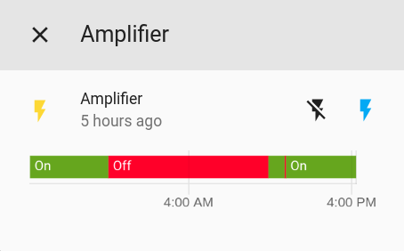
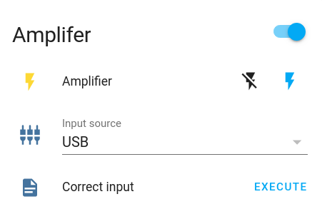
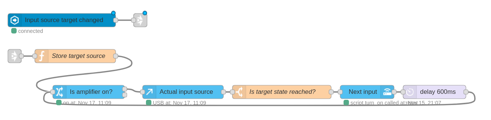
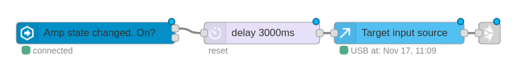
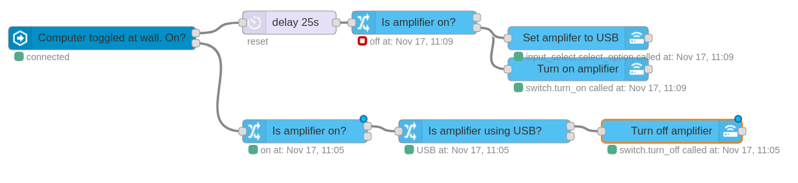
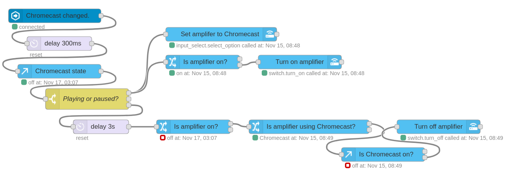

Smart speakers are great in some regards. They have voice assistants built-in and are always on and listening. But they lack the flexibility and modularity of the classic amplifier and passive speaker setup. I have just one pair of speakers for everything - Bluetooth, Chromecast and computer audio are my use-cases. But the only way to control my [AD18][] amplifier is manually, using an IR remote.

**How can such a traditional speaker setup be automated to deliver some more smarts?**

With an IR blaster and some setup, that's how! Here's what I'm trying to achieve:

- Amp is on when needed and off when not needed
- Amp is always on the correct input

If I can achieve these things then I'll never have to reach for the remote again!

# Hooking the system into Home Assistant

## Power state

It's important to be able to turn the amplifier on and off. Enable power control and state with a Broadlink switch within Home Assistant. [Find the IR packet][ir-control-post] for your amplifier's on and off commands. Then register it with something like the following yaml:

```yaml
switches:
  - platform: broadlink
    host: 192.168.1.100
    friendly_name: Bedroom Amplifier
    mac: '4A:E8:E6:9D:51:A6'
    switches:
      amp:
        friendly_name: Amplifier
        command_on: JgBIAAABKpEVEBU1FRAVEBU1FRAVEBUQFRAVERQ1FRAVNRU1FRAVEBU1FRAVEBUQFRAVEBUQFRAVEBU1FTUVNRQ2FDUVNRU1FQANBQ==
        command_off: JgBIAAABKpEVEBU1FRAVEBU1FRAVEBUQFRAVERQ1FRAVNRU1FRAVEBU1FRAVEBUQFRAVEBUQFRAVEBU1FTUVNRQ2FDUVNRU1FQANBQ
```

This should appear in Home Assistant as below:



Pressing on and off should send the correct commands and toggle the amplifier!

## Input state

Here's where things get a bit harder. How can the input be changed? In my case, I want to switch between computer, Chromecast and Bluetooth inputs. Because there's no state feedback from the amplifier, we need to keep state in Home Assistant. My amplifier has a single button to cycle through the states. Here's how I tackled this problem.

I have two `input_select` entities in Home Assistant. They're basically dropdown menus with a list of options. One is the full list of five inputs of the amplifier and will reflect the current input of the amplifier. The second is the target list - a subset of the options from the full list containing only the three desired input options.

```yaml
input_select:
  amp_input_current:
    name: Input source (actual)
    options:
      - Bluetooth
      - AUX
      - USB
      - OPTI1
      - Chromecast
      - COAX
    initial: USB
    icon: mdi:video-input-component
  amp_input_target:
    name: Input source
    options:
      - Bluetooth
      - Chromecast
      - USB
    initial: USB
    icon: mdi:video-input-component
```

Now add a script to select the next input. The script will turn on the amp, broadcast a "next input" command then update the current input state accordingly.

```yaml
amp_next_input:
  alias: Next amp input
  sequence:
    - condition: state
      entity_id: switch.amp
      state: 'on'
    - service: broadlink.send
      data:
        host: 192.168.1.100
        packet:
          - JgBYAAABKZIVEBU1FRAVEBU1FRAVEBUQFRAVEBU1FRAVNRU1FBEVEBU1FDUVNRURFBEUERQRFBEUERQRFBEVNRQ1FTUVNRU1FQAFjwABKkgUAAxZAAEpSBUADQU=
    - service: input_select.select_next
      data:
        entity_id: input_select.amp_input_current
```

While we're at it, add a simple script to send the command to the amplifier _without_ updating the state. This is useful if the amplifier becomes out of sync with Home Assistant.

```yaml
amp_next_input_naive:
  alias: Correct input
  sequence:
    - service: broadlink.send
      data:
        host: 192.168.1.100
        packet:
          - JgBYAAABKZIVEBU1FRAVEBU1FRAVEBUQFRAVEBU1FRAVNRU1FBEVEBU1FDUVNRURFBEUERQRFBEUERQRFBEVNRQ1FTUVNRU1FQAFjwABKkgUAAxZAAEpSBUADQU=
```

Add the power switch, target input and correction script to the UI and it'll look a bit like this:



But nothing happens when the input is changed. Now it's time to automate the link between the input selector and the next input script.

# Automating input selection with Node-RED

When the target input source is changed, I want to keep calling the "next input" script until the actual state matches the target. Here is the flow I'm using in Node-RED:



Upon a target change, the target is stored in the flow for future comparison. We check to see if the amplifier is on - no use trying to change the input if it's off! Then we get the current input from Home Assistant. If it doesn't match the target, we switch to the next input, wait some time for the amplifier to catch up, then repeat the process. Go ahead and try changing the input from the Home Assistant UI, then watch the amp play catch-up.

# Automations

Here are some automations which have worked well for me over the last few months. I've been using the amp in conjunction with my PC, Chromecast Audio and Google Home.

## Go to target on amplifier power-up



When the amp turns on, wait for the amp's power-up routine, then get the target state and trigger the input selection automation.

## Turn on with the computer



When the PC is turned on at the wall plug, wait 25 seconds for the boot. If the amplifier isn't on, turn it on and set it to USB. This ensures that if the speakers are already in use then there will be no interruption or input switching. When the PC turns off, power off the amplifier if it's switched to USB input.

## Turn on when casting starts



If the Chromecast starts playing, turn on the amp and set it to Chromecast input. When the Chromecast becomes stopped or idle (ie not playing or paused), wait a few seconds in case it's just a change of track or playlist. Then turn off the amplifier.

Instant smart speakers right there! Ask Google Assistant to play a song through the Chromecast and the speakers will magically turn on and switch to the correct input.

# Reflection

In this project, I learnt that - with a bit of automation - even old and/or "dumb" equipment can be made to be more convenient. I use these automations every day - it's nice to be able to ask Google to play music on the speakers or boot the computer without having to think about what the amplifier was last being used for. I haven't touched the remote for a long time. Best of all, I barely need to open Home Assistant to correct the input manually. That's what's automation's all about: removing repetitive actions and genuinely making things faster and easier.

[ir-control-post]: /reverse-engineering-ir-ad18/
[AD18]: http://www.smsl-audio.com/productshow.asp?id=95
