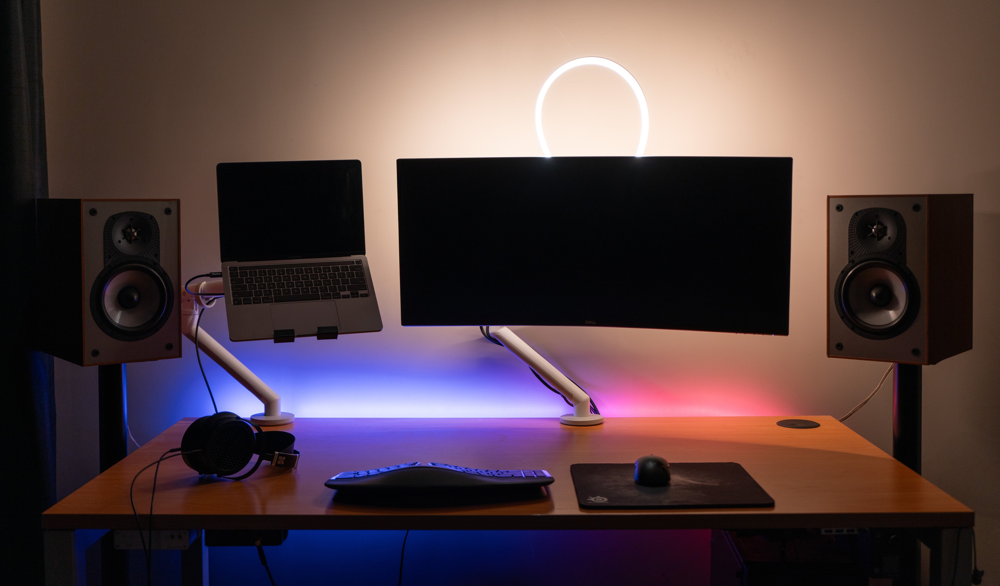
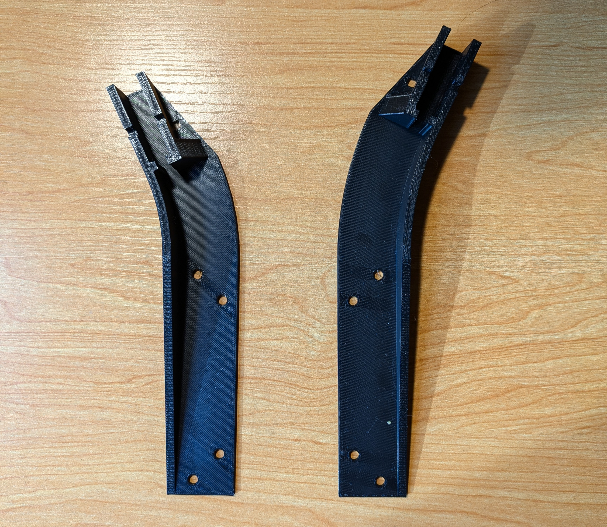
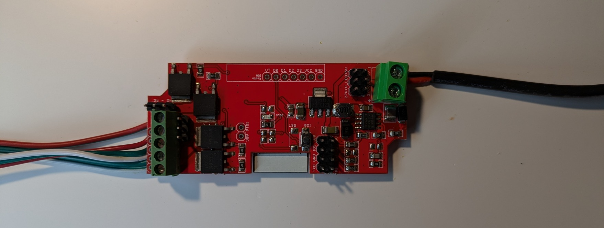

My home office lacks natural light, and this can lead to a fairly grainy and poorly-lit webcam feed. I've been considering upgrading the lighting setup with a key light but realised that, in theory, I could make my own camera light with parts and tools I already had:

- Decent-quality LED strip (the same 24V strip I once used for a [ceiling light](/esp32-led-strip/))
- WiFi LED driver (the awesome ElectroDragon ESP32-C3 one I used in that project; it's currently driving a 24V LED strip behind my desk as a bias light)
- Some silicone LED strip conduit I purchased a while back but never ended up using
- 3D printer

After some tinkering, I now have a VESA-mounted camera light which automatically turns on whenever an application starts the webcam. Here's how I did it!

# Mounting the light

The silicone conduit is flexible and from the get-go I imagined the light as a curve of the conduit which would "pop up" from behind the monitor. I also knew that I wanted it to attach to the monitor's VESA mount so that I didn't need to rely on adhesive (which so often leads to disappointment!).

I measured the conduit then whipped up a basic design in OpenSCAD, which I printed then iterated. The part is essentially an "adapter" which connects to half a VESA mount at one end and the conduit at the other. By printing two mirrored parts, I can mount both ends of the conduit to a VESA mount.




# Powering the light

I'm using an ESP32-C3 driver board for the bias lighting behind my monitor. The new light will be in a similar place--it's just pointing in the opposite direction (towards my face instead of the wall). I decided to drive the new LED strip from the same board. This works well as the board has four PWM output channels. They're labelled "RGBW", but that doesn't mean they can only be used for coloured LED strips. Each temperature adjustable strip uses two channels (one for cold white, one for warm white), therefore I can wire the new strip to the currently unused "blue" and "white" pins. The common 24V anode on the strip will be soldered to the same "V" pin as the other strip, as both strips are the same voltage.



I also double-checked to ensure my power supply's 24V rail would be able to drive the extra strip at max brightness. These strips max out at 8W/m, so the 40cm camera light will draw no more than 4W or so at max brightness on both channels. On top of the 10-15W already used by the bias light, this should be easily managed by the 24W supply.

Now, I updated the ESPHome config to make it aware of the second light on the "blue" and "white" pins:

```yaml
esphome:
  name: 'esphome-desk-light'
  platformio_options:
    board_build.flash_mode: dio

esp32:
  board: esp32-c3-devkitm-1
  framework:
    type: arduino
    version: latest

wifi:
  ssid: !secret wifi_ssid
  password: !secret wifi_password

  # Enable fallback hotspot (captive portal) in case wifi connection fails
  ap:
    ssid: 'Desk Light Fallback Hotspot'
    password: !secret wifi_ap_password

captive_portal:

web_server:
  port: 80

logger:

api:
  # Redacted

ota:
  platform: esphome

light:
  - platform: cwww
    name: 'Desk bias light'
    cold_white: redpin
    warm_white: greenpin
    cold_white_color_temperature: 6000 K
    warm_white_color_temperature: 2700 K
    constant_brightness: true
  - platform: cwww
    name: 'Desk camera light'
    cold_white: bluepin
    warm_white: whitepin
    cold_white_color_temperature: 6000 K
    warm_white_color_temperature: 2700 K
    constant_brightness: true

output:
  - platform: ledc
    pin: GPIO5
    id: redpin
    frequency: 19531Hz
  - platform: ledc
    pin: GPIO8
    id: greenpin
    frequency: 19531Hz
  - platform: ledc
    pin: GPIO4
    id: bluepin
    frequency: 19531Hz
  - platform: ledc
    pin: GPIO3
    id: whitepin
    frequency: 19531Hz
```

And everything magically appears in Home Assistant!

# Turning the light on with the Mac webcam

At this point, I have a sweet camera light that I can turn on using Home Assistant, just like my other lights. But a smart home's only smart if it's automated, and in this case the automation is clear: when my laptop's camera is in use, I want the light to turn on; when the camera is not in use, the light should turn off.

In MacOS, there are a few commands that can help achieve this. The following ones work on MacOS Sonoma 14.5, but tweaks may well be needed for different versions.

To detect when the camera is off on on, I can use the long-running command:

```bash
exec log stream --predicate 'process == "appleh13camerad" && (eventMessage CONTAINS "PowerOnCamera" || eventMessage CONTAINS "PowerOffCamera")' --style compact --color none
```

I should be able to hook into the events I need now, but it's important that I only toggle the light when I'm actually at my desk! To work this out, I can check to see whether the laptop dock is connected:

```bash
system_profiler SPThunderboltDataType | grep -q "UID: 0x014AFA4DCC5947BE"
```

This will get the Thunderbolt devices connected to the laptop and fail if my dock's specific UID is not present.

Finally, I need to actually toggle the light from the command line. Because I enabled `web_server` in ESPHome, I can just use cURL to POST the relevant endpoint on the light:

```bash
curl -X POST 'http://esphome-desk-bias-light.local/light/desk_camera_light/turn_on'
curl -X POST 'http://esphome-desk-bias-light.local/light/desk_camera_light/turn_off'
```

## Putting it all together

Much of this is inspired by an [AskDifferent](https://apple.stackexchange.com/questions/424789/can-i-trigger-a-homekit-scene-when-my-laptops-camera-is-turned-on-or-off) question which used a similar solution for a "do not disturb" light outside a room.

Using the commands above, the following script waits for relevant events, checks whether the dock is attached, then requests the relevant state from the light.

```bash
#!/bin/bash

exec log stream --predicate 'process == "appleh13camerad" && (eventMessage CONTAINS "PowerOnCamera" || eventMessage CONTAINS "PowerOffCamera")' --style compact --color none |
  /usr/bin/grep -vE --line-buffered '^Filter|^Timestamp' | # Remove the useless "header" row in output
  tee /dev/stdout | # Display matching events
  /usr/bin/sed -Eu 's/.*(PowerOnCamera|PowerOffCamera).*/\1/' | # Extract the relevant word from the event
  while read -r event; do # Store that word in the $event variable
    echo "Camera $event"

    system_profiler SPThunderboltDataType | grep -q "UID: 0x014AFA4DCC5947BE" # Check to see whether Thunderbolt Dock attached
    OFFICE_DOCK_ATTACHED=$?  # Capture the exit status of the previous command (0 if success)

    if [ "$OFFICE_DOCK_ATTACHED" -eq 0 ]; then
      if [ "$event" = "PowerOnCamera" ]; then
        echo "Lamp on"
        curl -X POST 'http://esphome-desk-bias-light.local/light/desk_camera_light/turn_on' &
      else
        echo "Lamp off"
        curl -X POST 'http://esphome-desk-bias-light.local/light/desk_camera_light/turn_off' &
      fi
    fi
  done
```

I haven't tried this yet for Windows or Linux, but I'm sure there's an approach which works similarly on each of those operating systems. Let me know if you have any ideas as to how it can be done!

# The result

The light works just as I imagined: when any application starts using the camera, a request is fired off to enable the light. Here's the behaviour switching between Google Meet and Photo Booth:

<iframe src="https://www.youtube.com/embed/kJ2qLW6nl0o" frameborder="0" class="video" allowfullscreen></iframe>

# Further improvements

While I'm happy that the automation is possible, there are a few things that could be better about this setup:

- **There's some delay in turning the light on.** The HTTP web server on ESPHome has fairly poor performance. I'm not sure whether this is the fault of ESPHome or just an ESP32-C3 hardware limitation. ESPHome's native API--the one used by Home Assistant to talk to ESPHome devices--is a much more lightweight setup based on protocol buffers and encryption. In theory I could work out the exact command to send to the device over TCP, either by replaying the payload or building it up using the [official definitions](https://github.com/esphome/esphome/blob/dev/esphome/components/api/api.proto). I opted for HTTP as it's easier and lets me use cURL to remove the need to install specific dependencies on a work laptop.
- **The light could be brighter.** This amount of lighting helps to fill out some shadows but it's not sufficient to greatly reduce camera noise. There are many ways that this could be improved, including using more lights or more transparent conduit. The most tempting solution is to completely swap out this conduit-based light with an [old screen which has been converted to diffuse a set of bright LEDs](https://www.dpreview.com/news/2291236447/video-how-to-upcycle-old-tvs-and-monitors-into-a-natural-looking-light-source). I have a broken monitor lying around which might be perfect for this purpose. This may well be an upcoming project.
