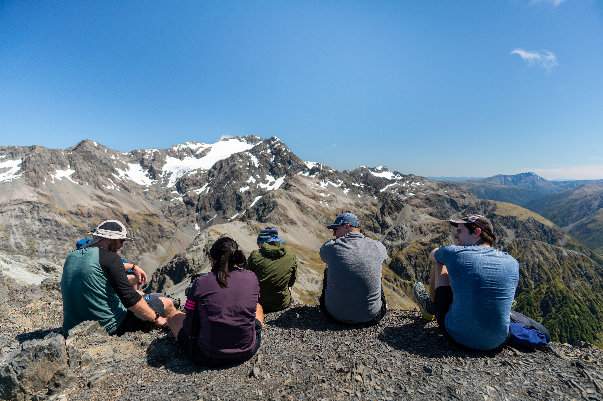

The trip starts at Arthurs Pass village with an ascent of Avalanche Peak. Just like the [previous time](/avalanche-peak) I did this section, the views get increasingly stunning as the track goes up.

Before long, the group made it to the (very busy) summit for a snack while looking out over the surrounding mountains.

From here the goal became to make it to the ridge leading towards the dramatic Mount Rolleston. To get there, we dropped off the summit to the south down some nice scree before looping back to the saddle just west of the summit.

We followed the ridge towards the highlight of the trip: the lengthy scree descent into Crow Valley. The drop was further along the ridge than I expected but is quite obvious, with a sturdy pole at the top and (on this bluebird day) a clear line of sight right to the base of the valley.

We followed our noses down the valley, picking up track markers just above Crow Hut. This would make a great overnight stopover but we pressed on, exiting to Klondyke Corner on the same day.
