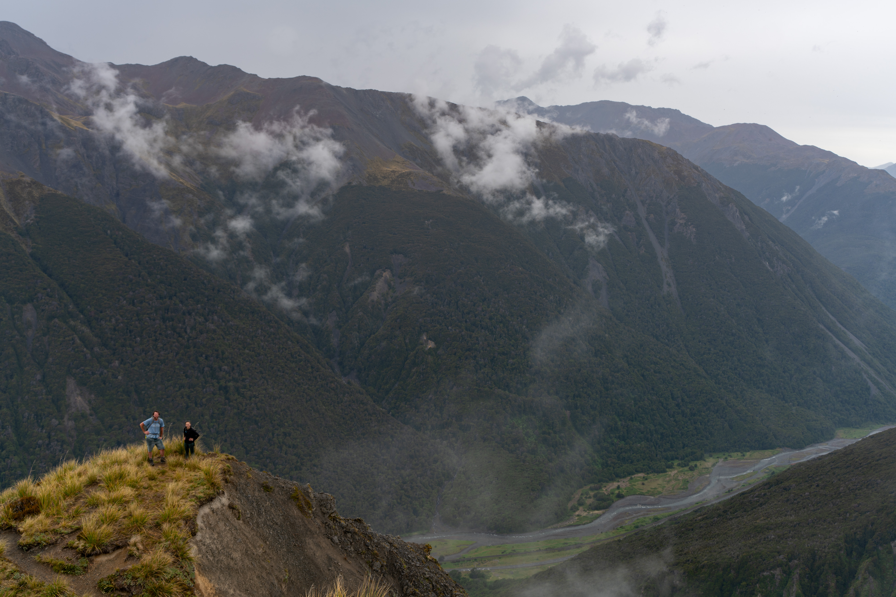
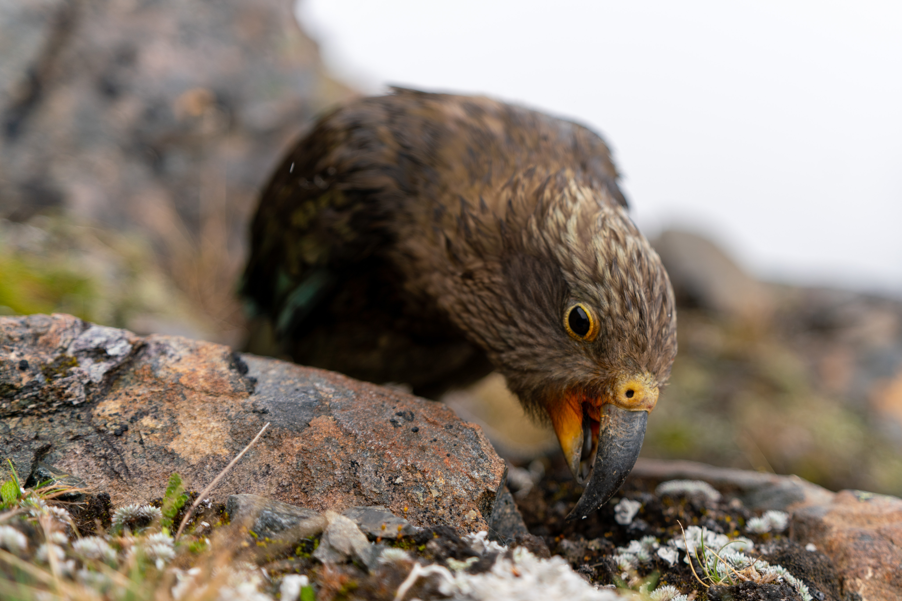
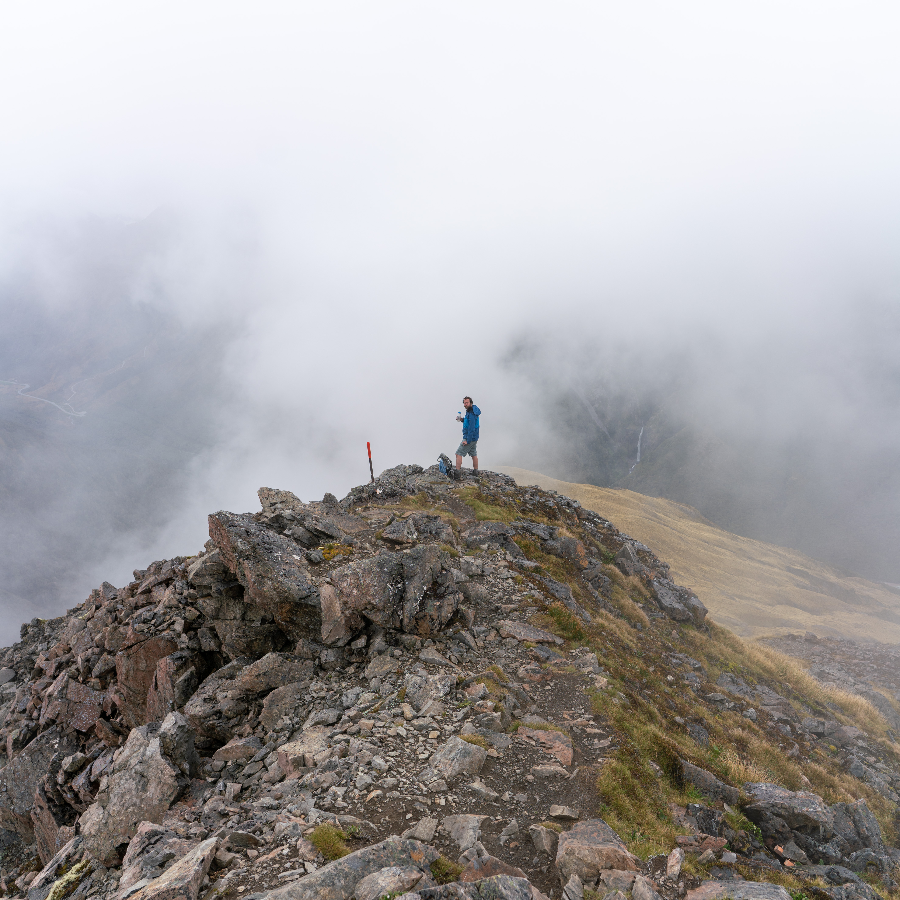

Avalanche Peak is an amazingly accessible mountain about two hours' drive from Christchurch. There are two routes to access the summit: Avalanche Peak Track and Scotts Track. We ascended on Avalanche Peak Track and saved the more gentle Scotts Track for the descent. Both tracks are steep but well-marked and quite manageable.

If you're tackling this trip, make sure to bring plenty of water and keep an ear out for kea.

The two tracks meet just shy of the peak. This final section is a rocky ridge with stunning views all around.

As we left the ridge and commenced our descent, I was distracted by a roving gang of young kea that landed nearby. Now I think of it, maybe they were the ones being distracted by me. It's always hard to tell with these intelligent creatures.

