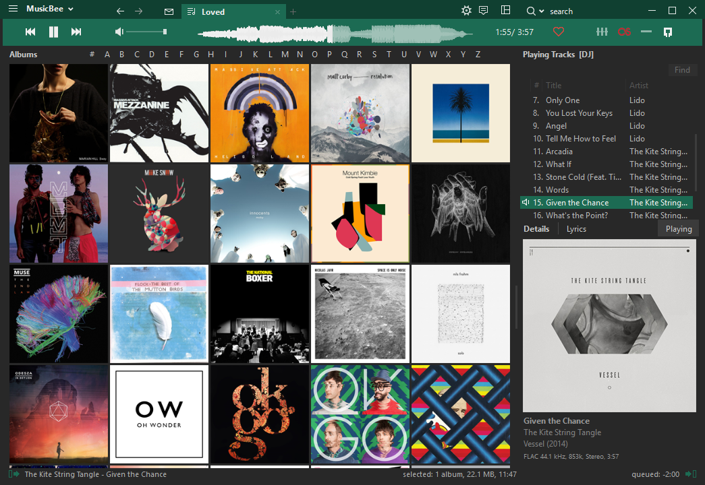

[MusicBee][musicbee install] is without a doubt the best desktop music player I have used. I've been a convert now for about two years, lapping up features such as custom application launching, custom hotkeys, automatic renumbering, folder organisation and transcoding. The list goes on, and if you're on Windows I highly suggest giving it a go.

Early in 2016 I attempted to combat one of my few gripes with MusicBee: the mediocre built-in themes. While the latest 3.0 version of MusicBee has helped, the only decent theme in previous versions was the rather fantastic [DarkRED Flat](http://getmusicbee.com/forum/index.php?topic=10884.0) by forum user Endeavour1934. Using these theme files as a starting point, I developed a slightly more colourful variation. The idea was to have a single accent colour which could be easily changed to any desired colour

{:webFeedsFeaturedVisual}

During the process, I identified a couple of things about the skinning process which I thought could be improved:

1. The titlebar colour and border colour are actually a tiled PNG image, defined in base64 encoding within the theme file.
1. Themes cannot expose any settings to the user through the MusicBee UI.

My skin contains one accent colour, but I realised that if the user wanted to change this colour they would have to not only change the colour variable within the theme XML file, but also generate matching PNGs for the border and title bar shades before exporting to base64 and pasting into the file. Not ideal!

From this conundrum, DarkMOD was born. DarkMOD is basically a php file which does the following:

1. Receives a colour via GET request, sent from a webpage frontend with a pretty preview window which I spent far too long Photoshopping.
1. Calculates required shades and tints for use in the theme.
1. Generates PNG images in base64 to represent borders, title bar and checkboxes.
1. Runs through a template of the skin, replacing placeholders with the correct colours and resources.
1. Returns the completed skin file as XML.

Don't have or want MusicBee? Don't have or want Windows? Head over to the project anyway; the preview window should give you a good idea of what DarkMOD is about!

[musicbee install]: http://getmusicbee.com/
