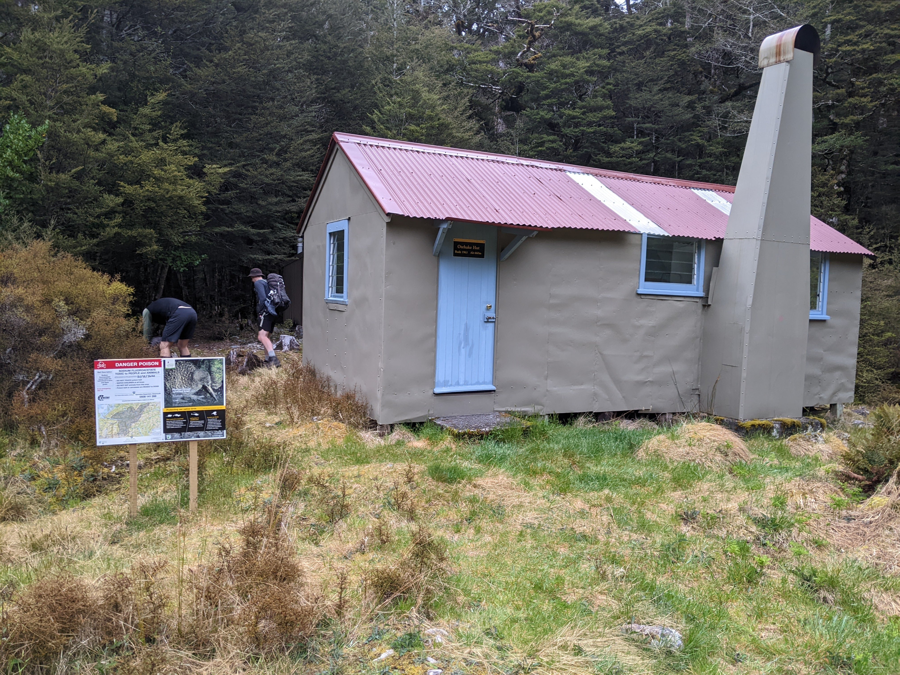
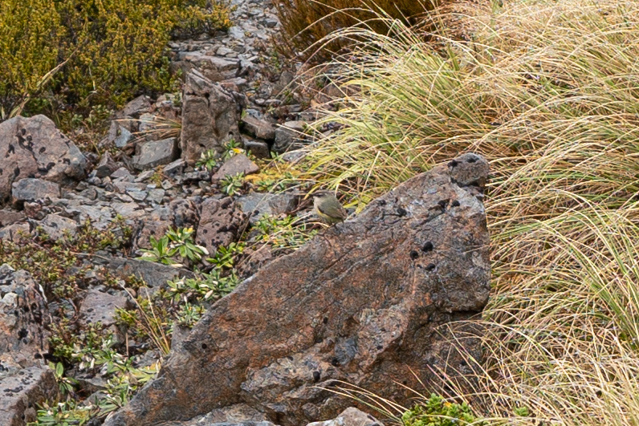
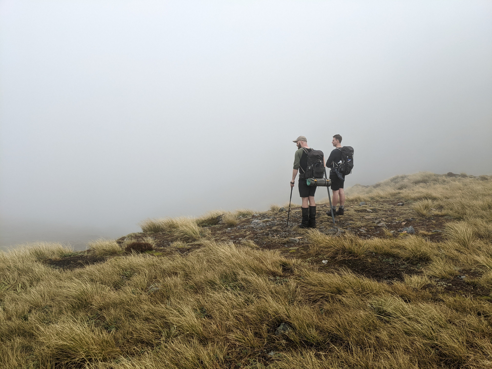
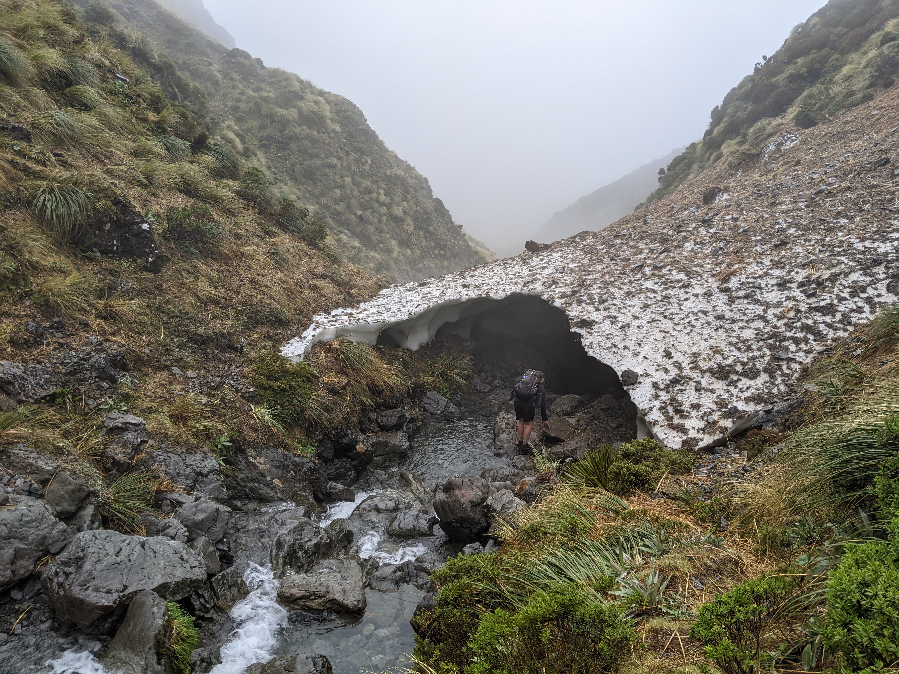

<figcaption>Attractive scrub in the upper Edwards Valley beyond Edwards Hut</figcaption>

<figcaption>Rockfall near Taruahuna Pass</figcaption>

<figcaption>Approximate summary of the proper Tarn Col routes - including our mistaken route</figcaption>

<figcaption>Looking down Otehake West Branch Valley from Taruahuna Saddle</figcaption>

<figcaption>Getting ready to leave Otehake Hut</figcaption>

<figcaption>Rock wren at Taruahuna Saddle</figcaption>

<figcaption>View - or lack thereof - from Tarn Col</figcaption>

<figcaption>The tarn at the top of Tarn Col (is it called "Tarn Col Tarn"? Or "Col Tarn"?)</figcaption>

<figcaption>Avalanche debris snow cover over the stream draining from Tarn Col Tarn</figcaption>

<figcaption>Descending the stream gorge from Tarn Col, with Pt 1742 looming large in the dramatic cloud</figcaption>

<figcaption>Tarn near Walker Pass with Blackball Ridge visible in the skyline</figcaption>
