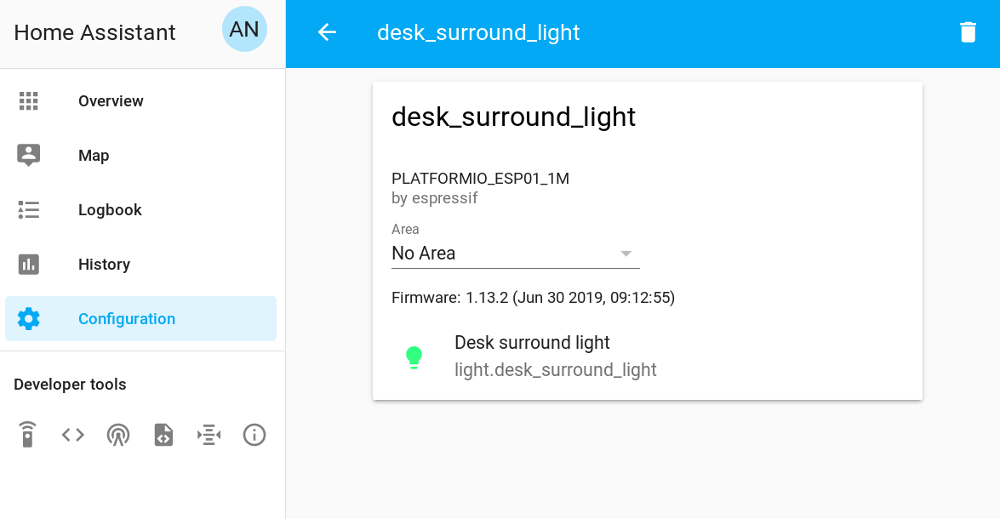

A few weeks ago I changed the firmware on my LED strip controllers, migrating them from my custom software Lightt to [ESPHome](https://esphome.io/). I really enjoyed Lightt as a project. It taught me a ton about MQTT, LED strips and how home automation software interfaces with lights in general. It was also surprisingly reliable and had months of uptime on my strips. I identified [several issues](https://github.com/albertnis/lightt/issues) in Lightt which needed attention, such as OTA flashing and LED effects. Rather than implementing these features myself I decided to cut my losses and move to ESPHome which already supports these things.

So what is ESPHome? It's a home automation device manager for ESP8266 and ESP32 devices. It takes a yaml configuration file and uses it to compile a flashable firmware binary for an ESP device. ESPHome also includes a dashboard for managing devices and reconfiguring them - all over-the-air and within the dashboard! There are two components to ESPHome: the software that generates binaries, and the binaries themselves which run on devices. I'm going to call the software "ESPHome" and the binaries "ESPHome firmware" to avoid confusion.

There are really four steps for setting up an ESPHome system:

- Install ESPHome on a PC
- Configure the device through the ESPHome dashboard
- Upload a binary over serial (first-time use)
- Upload a binary over-the-air

## Install ESPHome on a PC

First, get ESPHome running on a PC. Here's a docker-compose v1 entry I'm using on an Odroid XU4 (ARMv7 like a Raspberry Pi). This will also work on an x86 PC if you remove the `-armv7`. Remember that ESPHome is just a configuration and build tool for the devices. It's not required to be running all the time, just when you want to configure devices. The devices will maintain connectivity without ESPHome running on a server.

```yaml
esphome:
  container_name: esphome
  net: 'host'
  restart: always
  user: 0:0
  environment:
    - HOME = "/"
  image: esphome/esphome-armv7:1.13.2
  ports:
    - 0.0.0.0:6052:6052
    - 0.0.0.0:6123:6123
  volumes:
    - /mnt/dietpi_userdata/esphome-docker:/config:rw
  command: config/ dashboard
```

Run the docker-compose file with `docker-compose -f docker-compose.yml up -d` or the equivalent `docker run` command.

Now go to the server at port 6052 and you should be greeted with the following dashboard. At this stage there will be no devices present.


## Configure the Device Through the ESPHome Dashboard

Press the pink "Add" button and follow the prompts before hitting "Submit". You should see your new device listed on the dashboard. Click "Edit" next the new device and a yaml editor will appear. In the yaml configuration file you can specify all the features relevant to the device. This could include sensors, switches, lights, or any combination of things listed on the [official website](https://esphome.io/). In this case, we're just using lights. My configuration file looks like this (secrets redacted):

```yaml
esphome:
  name: desktop_light
  platform: ESP8266
  board: esp01_1m

wifi:
  ssid: 'ssid_here'
  password: 'wifi_password_here'

# Enable logging
logger:

# Enable Home Assistant API
api:
  password: 'api_access_password_here'

ota:
  password: 'ota_access_password_here'

light:
  - platform: neopixelbus
    name: 'Desktop light'
    id: desktop_light
    restore_mode: RESTORE_DEFAULT_OFF
    type: GRBW
    pin: GPIO2
    num_leds: 144
    variant: SK6812
    method: ESP8266_UART1
    default_transition_length: 300ms
    effects:
      - addressable_rainbow:
          width: 200
          speed: 1
```

Take some time to craft your configuration yaml, then click "Save" to save the changes before closing the editor to return to the dashboard.

## Upload a Binary Over Serial

OTA firmware flashing relies on ESPHome firmware being installed in the first place! This means that for first-time setup on each ESP device, ESPHome firmware will need to be flashed to the ESP device manually over serial. Luckily ESPHome makes this quite easy. Click the menu dropdown next to the newly-created device.


Click the "Compile" button. ESPHome will do its magic, generating C++ code based on the yaml configuration before compiling it for the ESP device. It uses [PlatformIO](https://platformio.org/) behind the scenes.


Now click "Download binary" to save the ESPHome firmware. Plug in the ESP device to your computer over serial (using an FTDI adapter if needed). To flash the chip, I recommend using [esptool.py](https://github.com/espressif/esptool) with the [`write_flash`](https://github.com/espressif/esptool#write-binary-data-to-flash-write_flash) command.

## Upload a Binary Over-the-Air

The hard work is over! Now that the ESP devices have the ESPHome firmware flashed, they should appear as "Online" in the dashboard. Future configuration changes can now be pushed directly to the devices OTA. Simply find the "Upload" button either next to the dashboard entry for the device or below the yaml editor. Pressing this button will compile the binary as before, then poll the device until it comes back online with the new configuration.


It's all working nicely. Remember that each ESP device exposes its own API, so ESPHome itself is only really needed for configuration changes and compilation.

# Adding the Device in Home Assistant

Home Assistant has a solid ESPHome integration. Simply navigate to the Configuration -> Integrations screen and discovered devices can be added easily. If you're doing a migration, I'd recommend renaming old devices _before_ adding the ESPHome ones to avoid IDs being suffixed by Home Assistant. If set, enter the API password used earlier. Once added, you can view the entities associated with the device.



# Reflections

The migration process was quite easy once I worked out how to get the Docker image up and running (`user: 0:0` and `- HOME = "/"` were key). In fact, the [official guide](https://esphome.io/guides/getting_started_command_line.html) says setup is only possible on an RPi using Hass.io or `pip`, which is bogus. These days, if I can't Dockerise a self-contained service then I'm quite hesitant to install it on a server.

I'm enjoying the simplicity of modifying configurations and also the gamma-correction features that are baked into to ESPHome's light component. One point of disappointment is how the firmware manages the white channel on my RGBW LED strip. I would prefer the white channel not be directly accessible and instead be used to add CRI to the existing RGB channels (in other words, use white LEDs for brightness and add colour cast using RGB only as needed). That's the way Xiaomi Yeelights work, and I modeled Lightt on that behaviour.

ESPHome has some quite powerful integrations and components which I'll definitely consider in future projects as an alternative to (poorly) coding C++ myself. It's also a good alternative to [Tasmota](https://github.com/arendst/Sonoff-Tasmota) which I'm currently running on a Sonoff Pow R2 switch. Perhaps a migration for that switch is the next project!
