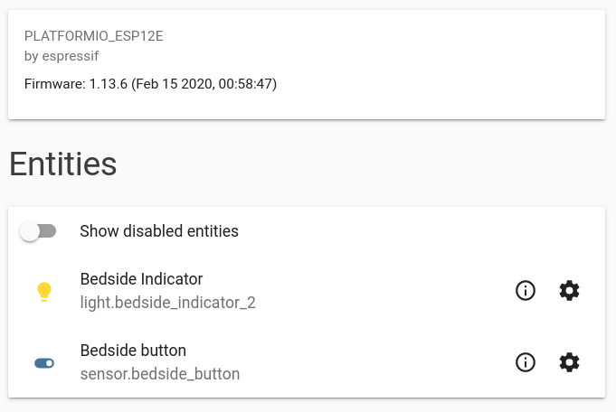
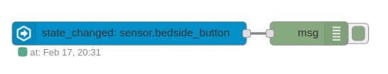
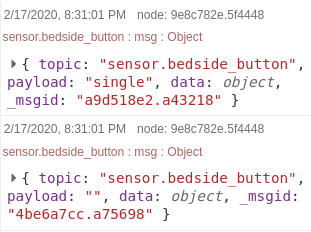
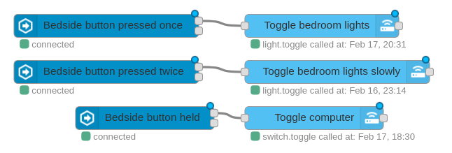

Bit by bit, I'm moving all my WiFi IoT devices over to use [ESPHome][esphome]. I migrated my [LED strips][esphome-light-migration] a few months ago and have been impressed with the reliability and convenience of ESPHome since. This time, I'm migrating the last device which is still running custom firmware.

The device in question is a button which lives beside my bed. I use it for turning off my lights at night and for toggling my PC at the wall. It's WiFi-connected and uses the same [brilliant ElectroDragon board][lightt-hardware] as my LED strips. I made some firmware for it a while ago which was based on [lightt][], my firmware for LED strip control. It kind of sucked. Crucially, it lacked any debouncing - so single clicks on the cheap button would register as double clicks about 30% of the time.

I started implementing debouncing in the codebase, but quickly realised I should just move to ESPHome. The problem? ESPHome doesn't have an all-in-one multi-click button component! Luckily the platform is flexible enough for me to implement one myself.

# Desired behaviour

Here I was inspired by zigbee2mqtt and its [implementation][z2m-switch] of multi-click behaviour for a Xiaomi Zigbee button which I migrated recently. Upon a series of clicks, the Home Assistant device emits an event with a payload corresponding to the number of clicks (e.g. `"single"`, `"double"`) immediately followed by an empty state `""`. I like this representation of an instantaneous state, so decided to follow this behaviour for consistency's sake.

# Implementation

The implementation of the button in ESPHome consists of two key components: a text sensor and a binary sensor.

## Text sensor

This is responsible for emitting the correct state text, and is the part visible to the "frontend" - Home Assistant, in my case. It's basically a default sensor but with one twist: when the state is set to a non-empty string, the sensor will set itself back to a default empty state as per the desired behaviour.

```yaml
text_sensor:
  - platform: template
    name: 'Bedside button'
    id: bedside_button
    icon: 'mdi:toggle-switch'
    on_value: # When a state is set
      then:
        - if:
            condition:
              text_sensor.state:
                id: bedside_button
                state: ''
            else: # If non-empty
              - delay: 20ms
              - text_sensor.template.publish:
                  id: bedside_button
                  state: !lambda 'return "";' # Reset to empty
```

## Binary sensor

The binary sensor is the brains of the operation. It reads the actual state of the pin across which the switch is connected. The switch contains some filters: `invert` makes the logic more intuitive; `delayed_on` and `delayed_off` provide basic debouncing. The real logic lives in the `on_multi_click` section. In each case, the text sensor is invoked to set an externally visible state. Crucially, this sensor is `internal` because its only purpose is to manipulate the text sensor.

Here's a config which has a single click and a hold:

```yaml
binary_sensor:
  - platform: gpio
    pin:
      number: GPIO5
      mode: INPUT_PULLUP
    id: raw_switch_state
    internal: true
    filters:
      - invert:
      - delayed_on: 30ms
      - delayed_off: 30ms
    on_multi_click:
      - timing:
          - ON for 40ms to 400ms
          - OFF for at least 50ms
        then:
          - text_sensor.template.publish:
              id: bedside_button
              state: !lambda 'return "single";'
      - timing:
          - ON for at least 2s
        then:
          - text_sensor.template.publish:
              id: bedside_button
              state: !lambda 'return "hold";'
```

I've put a more complete config up on [Gist][full-config]. It contains definitions for double- and triple-click, as well as components for the switch's built-in LED.

# Testing

Once getting the config uploaded and added in Home Assistant (see my [LED strip migration][esphome-light-migration] for more details) I can see the externally-visible components of my switch in Home Assistant via the Devices screen. Great!



To test the states, I'll load up Node-RED with a classic debugging flow:



When I press the button once, the following state changes are logged:



That's perfect! Look at the `payload` attribute. The state is set to "single" before being cleared almost instantly.

# Automation

Now it's very easy to add the desired automations in Node-RED. I just create state event nodes, restricting to the bedside button entity and the state string desired:



[esphome]: https://esphome.io

[esphome-light-migration]: {{ site.url }}/posts/esphome-arm/
[lightt-hardware]: {{ site.url }}/posts/voice-activated-lighting-hardware/
[lightt]: https://github.com/albertnis/lightt
[z2m-switch]: https://www.zigbee2mqtt.io/devices/WXKG11LM.html
[full-config]: https://gist.github.com/albertnis/f33066b0b3623a9839a3429c8f19f4d4
