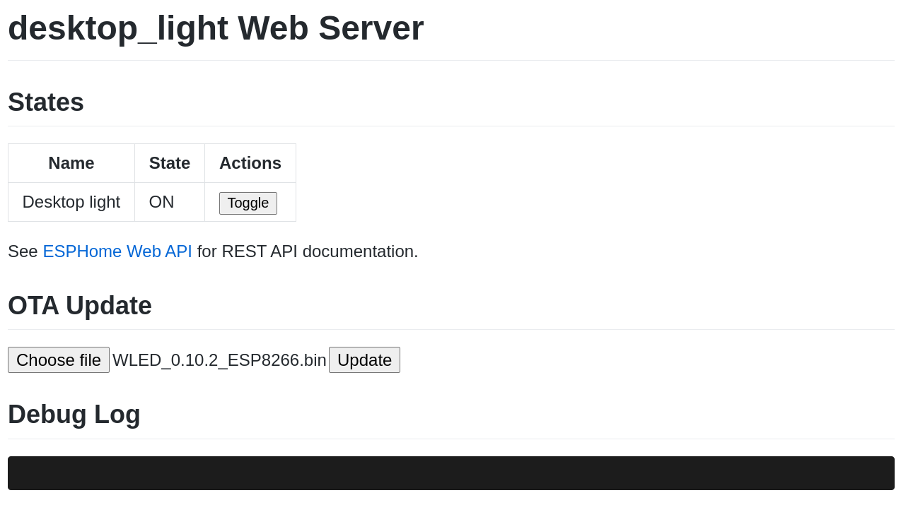

Over a year ago, I [migrated][esphome-article] my LED strips from Lightt to [ESPHome][esphome]. I have recently moved on to the popular LED strip project [WLED][wled]. This means my trusty [Electrodragon ESP LED Strip Boards][edragon-esp] are on their third incarnation and have nearly two years of total uptime.

# Switching to WLED over-the-air (OTA)

Migrating to WLED is super easy using the OTA features of ESPHome combined with the pre-compiled binaries available for WLED.

1. Enable the `web_server` for the ESPHome device (if it isn't already). Do this by adding the following to the device config and uploading:

   ```yaml
   web_server:
     port: 80 # Or your preferred port
   ```

1. Download the relevant binary from the [WLED releases page][wled-releases]. All ESP32 and many ESP8266 devices are supported - you'll probably want the `_ESP32.bin` or `_ESP8266.bin` files respectively. My Electrodragon ESP LED boards use an ESP-12F module which is supported.

1. Navigate to the webserver of the ESPHome device using either IP address or mDNS name. Under the "OTA Update" section a "Choose file" button should be present.

   

1. Click "Choose file", select the WLED binary, then click the "Update" button.

1. Now you're ready for WLED setup, starting at step 3 in the [official quick start guide][wled-setup].

# Reflections on the migration

I was looking for an alternative to ESPHome due to some major bugs which were introduced with later versions. Most notably:

- Transition time was ignored so all transitions were the default duration.
- One of my strips would sometimes glitch out and flash random, strobing colours. This happened once or twice a week, especially when effects were running.

Some really compelling features attracted me to WLED.

- Home Assistant integration
- Hyperion/real-time support (that's one for a separate post)
- Customisable white-channel behaviour
- Gamma correction for colour but not for brightness
- Effects are more intuitive (they respect the colour and power state of the strip)

I've been pleasantly surprised by WLED so far. The only real loss from ESPHome is the file-based configuration. What impresses me the most is how scalable the software is: It has everything you need for basic control via the app or web interface - even timers and macros are baked in. But it also has great support for integration in larger systems with Home Assistant, MQTT, and Hyperion control. Because of this, WLED is great for anyone from LED strip first-timers to experienced home automators.

At this point, my recommendation for almost any LED setup is simple: Buy a SK6812 LED strip and the correct power supply. Control it with a Electrodragon ESP board running WLED.

[edragon-esp]: https://www.electrodragon.com/product/esp-led-strip-board/
[esphome-article]: /esphome-arm
[esphome]: https://esphome.io/
[wled]: https://github.com/Aircoookie/WLED
[wled-releases]: https://github.com/Aircoookie/WLED/releases
[wled-setup]: https://github.com/Aircoookie/WLED/wiki
