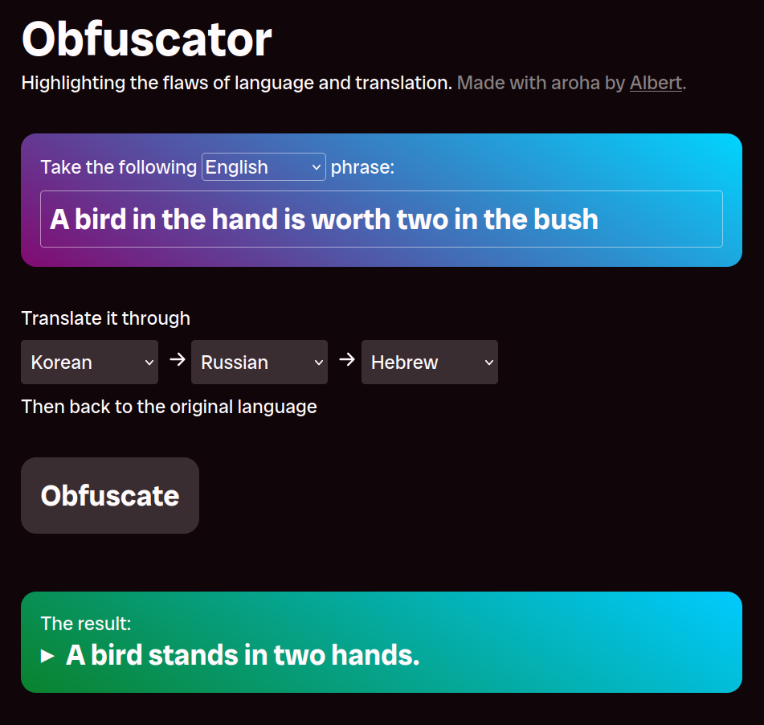

I've been recently reading about tools like [htmx](https://htmx.org/) and [Hotwire Turbo](https://turbo.hotwired.dev/). These frameworks rely on sending HTML, not JSON, over the wire, with a focus on graceful degradation and reduced custom client-side JavaScript code. The simplicity is tantalising!

To learn more about this tech, I re-wrote my Obfuscator project using htmx. You can find the latest incarnation [here](https://obfuscator.albert.nz), with source code on [GitHub](https://github.com/albertnis/obfuscator-htmx). The functionality of Obfuscator remains the same as ever: it translates some user-entered text through multiple languages in sequence, returning the result in the original language.

## Then and now

The [first version](/obfuscator) of Obfuscator was written in PHP and used the Bing Translate API, but I had no server to host it on an ongoing basis. The [second version](/serverless-side-rendering) was a React/Redux setup which ran on AWS Lambda plus AWS Machine Translation. It had 174 runtime dependencies for what basically amounts to a simple form with five inputs and a button.

The latest verion is hosted on CloudFlare Pages, my preferred static host these days. There's no framework or additional third-party dependencies to be seen here--just htmx at runtime, plus TypeScript and CloudFlare's CLI for development (thankfully, the CLI wraps all the build shenanigans for backend code). I enjoyed writing a fairly stripped-back frontend in vanilla HTML. As for the backend: it's amazing how painless writing serverless backend code has become with the likes of Netlify and CloudFlare Pages Functions, compared to when I first wrote Obfuscator in 2016. I was even able use CloudFlare for translation using the [m2m100](https://developers.cloudflare.com/workers-ai/models/m2m100-1.2b/) model which is surfaced as part of CloudFlare Workers AI. It's certainly slower and less accurate than Amazon's offering, but is much cheaper with a perpetual free tier. Besides, accurate translation was never really the point!
