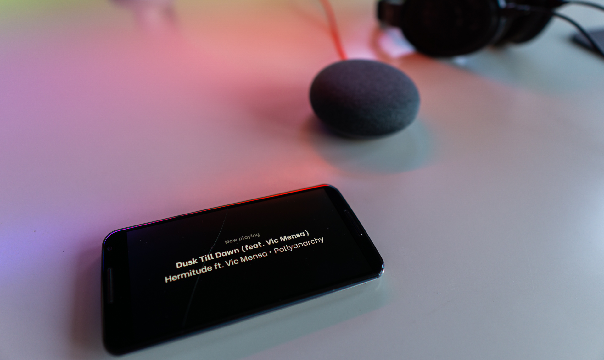
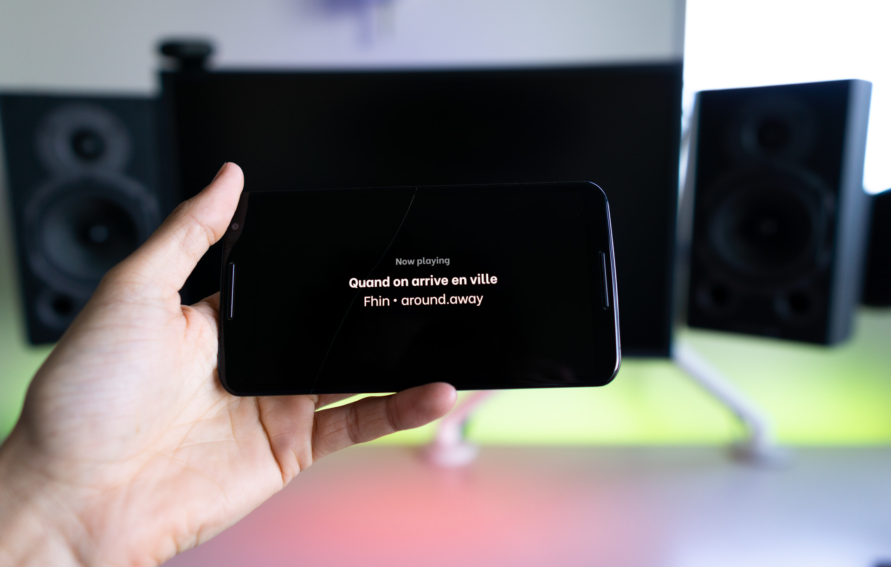
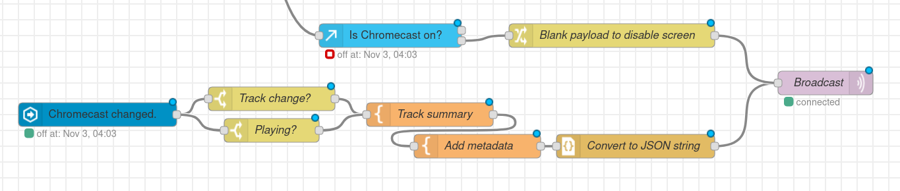
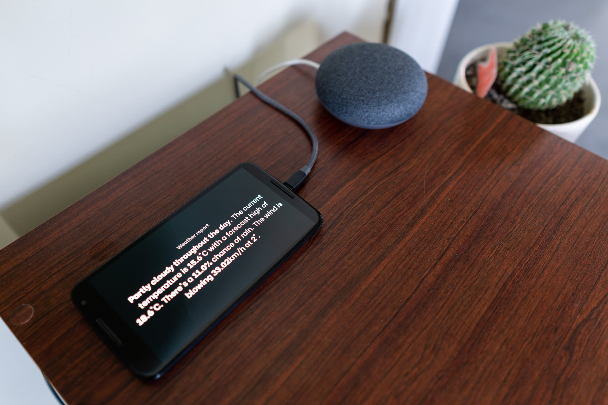
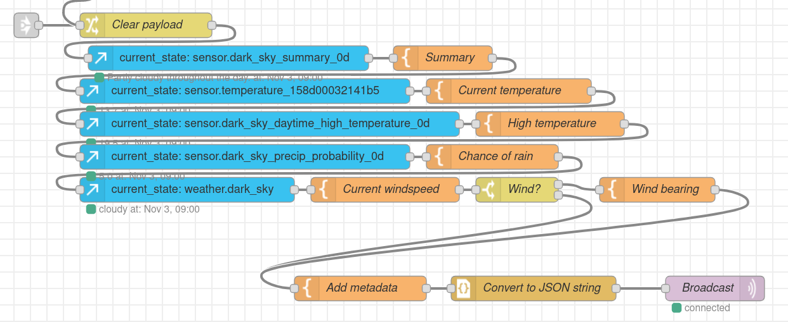

When it comes to smart home displays, I've seen two main options:

1. Use a [small 1-inch OLED screen][oled] with a microcontroller.

1. Buy a tablet, [nail it to a wall][tablet] and load up the Home Assistant frontend.

Personally, I love the simplicity of the first option. I just want a screen to read out the weather in the morning and show me what's playing on the Chromecast. Nothing fancy. I also like the OLED aspect - this way, I can leave the screen "on" but black by default and will appear to be off. But why settle for a cheap 1-inch display when I have an old Nexus 6 lying around? To solve my problem, I built mq-display.

Mq-display is a React frontend which allows any web browser to behave as an IoT connected display. The site subscribes to a specified MQTT broker and listens for messages. Incoming messages can have a title, brightness, display duration and markdown content. If you're interested in setting it up for yourself, check out the [GitHub repo](https://github.com/albertnis/mq-display).

# Integrations

I'm hosting mq-display and mosquitto on a home server and accessing the frontend from an old Nexus 6 with the screen turned to maximum brightness and auto-locking disabled. Because of the OLED panel, the phone emits no light when it's showing a blank black page. As a browser, I'm using [WallPanel][]. This is a full-screen Android browser recommended by some members of the Home Assistant community.

## Now playing

It's great being able to ask Google Home to play music on my Chromecast Audio. I use the feature daily. Incredibly, the system has no great way of telling you what song is playing (in the streaming world, maybe [people don't care][streaming-death]). Usually when I want to find out the song I open up home assistant on my phone to see. That ends with mq-display.

Whenever my Chromecast Audio changes state, I check to see if the device has starting playing or has changed track. If that's the case, I want the display to show track information. So I format it with a template and broadcast it the to the `virtual/screen/nowplaying` topic. If the Chromecast stops playing, I broadcast an empty message on the same topic, which causes mq-display to remove that screen. The Node-RED automation looks something like this:

And just like that, gone are the days of scrambling to find what song that is.

## Weather report

Every morning, I use my phone's browser to check what the weather's going to be like for that day. That's important for answering several Important Morning Questions:

1. What should I wear?
1. Can I fly drones today?
1. How wild is ultimate frisbee going to be?

Suffice it to say my weather report checking is very predictable. Therefore I can automate it.

Every morning when I get out of bed (that automation is one for another post), I set Node-RED to get the latest weather information from Dark Sky and my outdoor temperature sensor, all via Home Assistant. It aggregates a weather summary, forecasts, wind and rain information, and puts it all in a nice little summary to show on my display. The Node-RED automation is a bit more complicated for this one, but it's repetitive. Basically I grab various bits of data from Home Assistant then append them to the end of a message. I set the message to disappear after a few minutes.

# Reflections

I enjoyed mq-display as a project because it fills a niche which I can really benefit from. Hopefully other people can also see the use-case for such a project too. For me, home automation is all about being able to make repetitive behaviours effortless. I'm already finding the system useful for reducing the number of times I pick up my phone to get weather or track information; I'm sure I will find even more opportunities for automation in the future.

## Next steps

As a frontend-only application, I see no reason why I can't host mq-display in one place on the internet to be used by all. I even set up a build on [Netlify][netlify]. The problem: Netlify (and, well, most of the modern internet) serves traffic over HTTPS and therefore unencrypted websockets will not work properly in most browsers. Fixing this would be great, though I'm not sure if many home users have set up encrypted websockets on their brokers.

Some more fields could be quite nice for the payloads accepted by mq-display. I'm already imagining image support (cover art or camera feeds could be awesome) and maybe features for icons and key-value pairs.

[oled]: https://www.aliexpress.com/item/32896971385.html
[tablet]: https://imgur.com/a/9xMZLdS
[wallpanel]: https://play.google.com/store/apps/details?id=com.thanksmister.iot.wallpanel
[streaming-death]: https://bluelabyrinths.com/2019/08/26/whats-wrong-with-streaming-the-death-of-music-as-art/
[netlify]: https://mq-display.netlify.com
