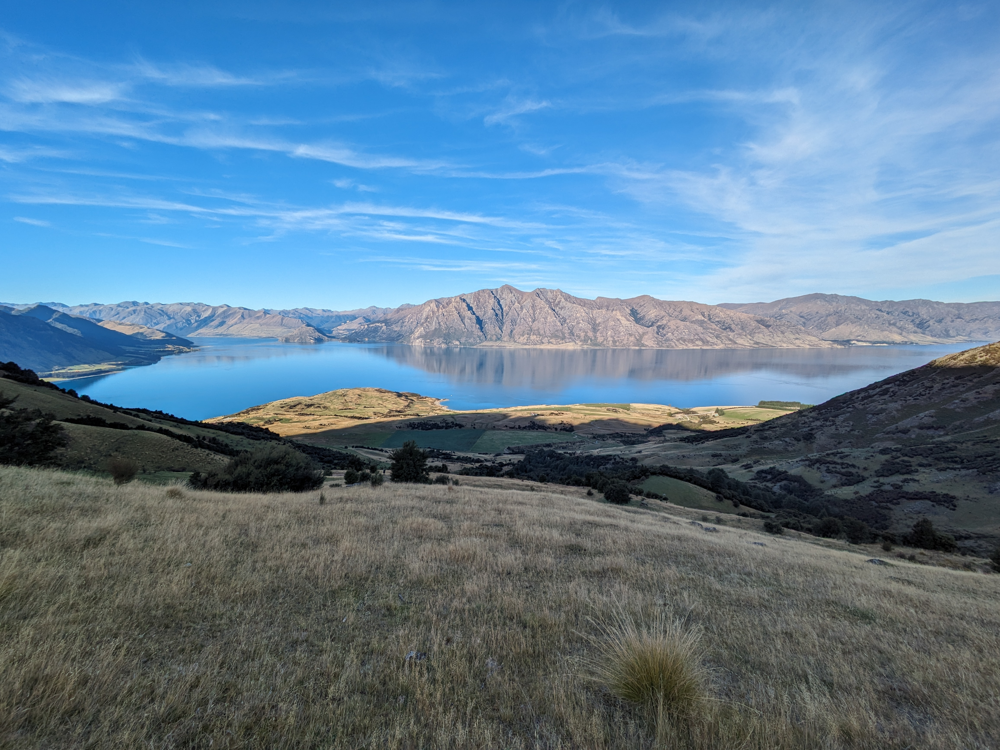

Isthmus Peak track is accessible from State Highway 6 just a few minutes' drive north of Hāwea. There are multiple car parks opposite the trailhead. On the blissfully calm autumn day we visited, the track seemed only moderately busy. I imagine it must be heaving in the summer months, though presumably not to the level of Roys Peak.

Apart from a short bush-clad start, the route is almost entirely 4WD track through private farmland. We visited during the roar season and got to see a couple of stags fairly close to the track. They're much tamer than deer I've experienced in the backcountry as they're farmed for tourists who hunt them on site. This is a good reason to stay on the track!

After many switchbacks, the track straightens and levels somewhat for a beautiful tops approach to the summit.

The view from the top is truly panoramic, with great sight-lines over both Lake Hāwea and Lake Wānaka. Pride of place to the north is Mt Albert which sits above [Albert Burn](/albert-burn-hut-track). We got a glimpse of the snowy peaks in Mt Aspiring National Park, too.

