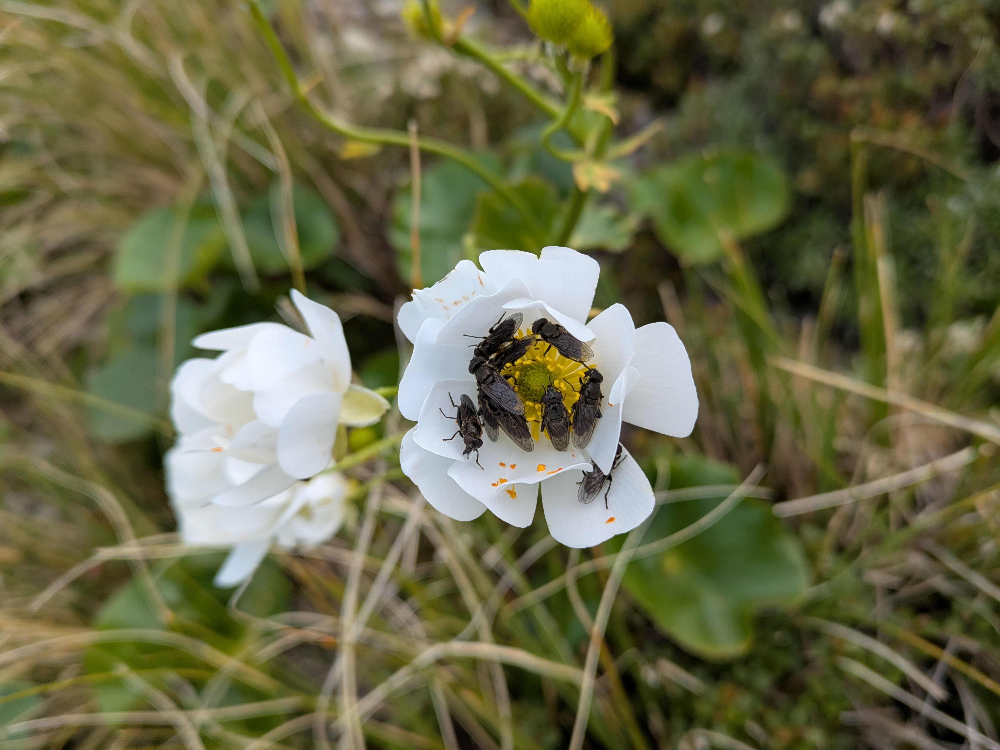
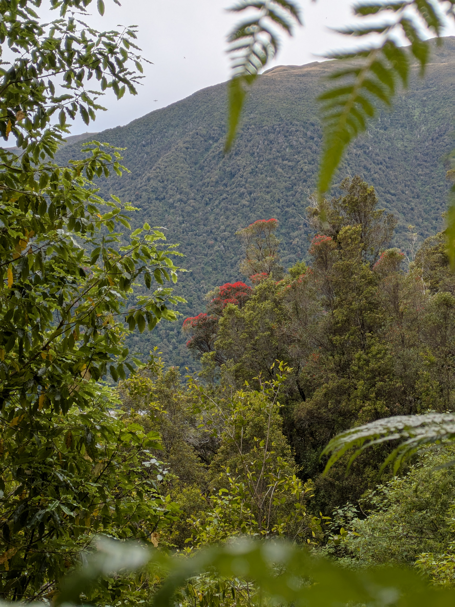

The track up Kellys Hill is certainly steep, but one of the most direct ways to access the open tops near Otira. The trailhead is at a fairly large carpark at the intersection of Kellys Creek and State Highway 73. The creek is a great option for a post-hike swim, so I'd recommend packing a towel in summer.

My favourite part of the track is the approach to the tops, with spectacular shrubs and buttercup clinging to the hillside as the tree cover lessens and the view open out.

Shortly past this point, the tops open up and Carroll Hut becomes visible. There were many visitors during the holiday season, with a full hut and families camping on the flat below the hut. We filled our bottles from the stream before continuing to our destination: the tops above the hut.

There is good camping on the tops, but it took us a while to find a level spot among the rolling terrain.

We awoke to the grating sound of my favourite alpine alarm clock: nearby kea investigating our tents at 5:30am.

Instead of going back to sleep, I climbed up Kellys Hill itself, to check out the radio station at one of the peaks and enjoy the views.

There is a poled route up to the radio station from the the main Kellys track. It branches of the track near the tarns.

