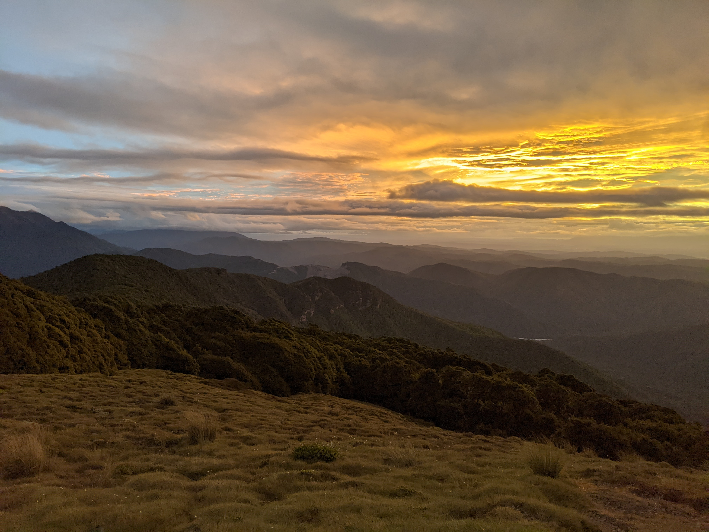

This beautiful trail ascends through lush West Coast jungle to reach a hut with a grand view of the surrounding mountain ranges. As a former mining track, the gradient is remarkably steady (the elevation plot looks like a triangle). A highlight of the route was a bridge which implausibly emerges from a man-made tunnel.

**Update**: I considered revisiting this track in 2024, but unfortunately a rockfall near the bridge has closed the track we took. The hut is still accessible from the east, from Gannons Road via Montgomerie Hut.

The hut is fairly modern and warm, but we had a hard time getting the coal burner started on a surprisingly cold New Year's Eve.

On our outwards journey, we attempted to locate "Fiery Cross Gold Mine", as present on the Topo50 map. We found neither mine nor track, despite our attempts to ascend Caples Creek.
