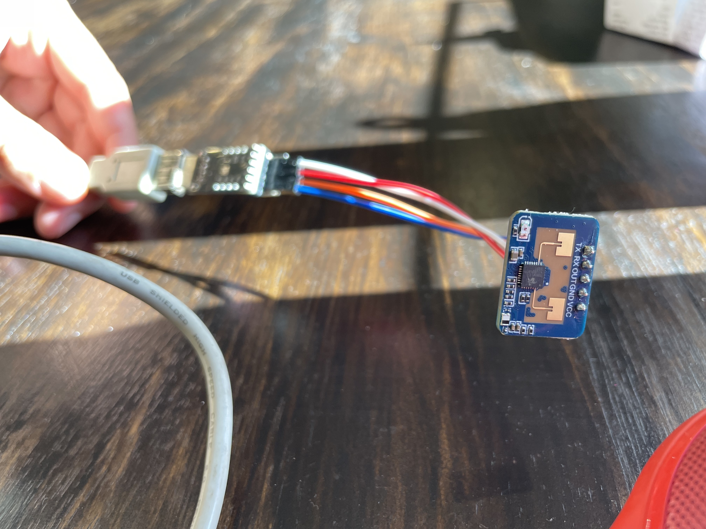
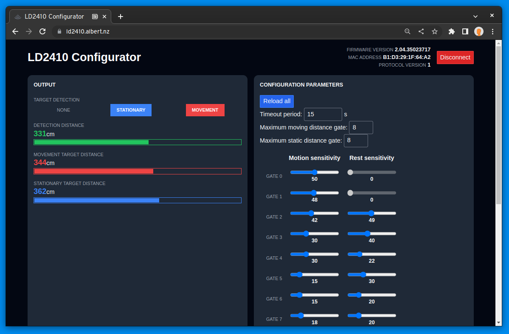

I recently stumbled upon the LD2410 mmWave sensor manufactured by HiLink. These little devices use radar to measure distance and detect motion--and they're a hell of a lot more sensitive than the more traditional PIR sensors, being able to detect the breathing motion of a stationary human from several metres away. The DFRobot SEN0395 is a similar mmWave sensor and has gained some popularity recently. I'm hoping the LD2410 can deliver most of the rock-solid reliability I've experienced from the SEN0395 but at a tenth of the cost and a third of the size.

The LD2410 uses a serial bus for configuration and for detailed output from the sensor. The configuration in particular is quite powerful here: with the right tweaking of sensitivity values, the sensor can be set to only detect motion within certain distance ranges. For example, you could configure it to trigger when something is between 3 and 4.5 metres of the sensor.

So how can this configuration be achieved? HiLink provides a first-party tool but it only runs on Windows and is closed source. That's why I have recently developed and released an alternative!

LD2410 Configurator is my first foray into the [WebSerial API](https://developer.mozilla.org/en-US/docs/Web/API/Web_Serial_API). It was very interesting to be able to dabble with serial functionality right within the web browser. Using SvelteKit and Cloudflare Pages, it was quite easy to build and deploy this simple app. The most interesting learning was how to use custom Svelte stores for basic reactive features; I used one to implement an event-based serial data store that other components could subscribe to.

Check out the LD2410 Configurator at [ld2410.albert.nz](https://ld2410.albert.nz) or view the [source code](https://github.com/albertnis/ld2410-configurator)!
