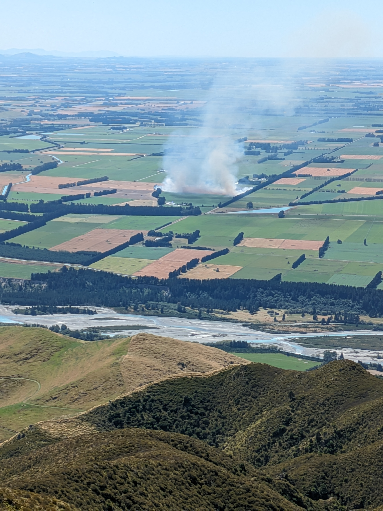

We picked one of the hottest days of summer to take on this peak. The first half of the ascent along Deer Spur is in lush bush, before the track emerges into lower scrub. This second half was much more exposed, and hotter as a result.

After having a lovely picnic in the shade of the summit shelter, we decided to go back the way we came. There is the option of forming a loop with South Ridge, but this route looked more exposed and rocky.

