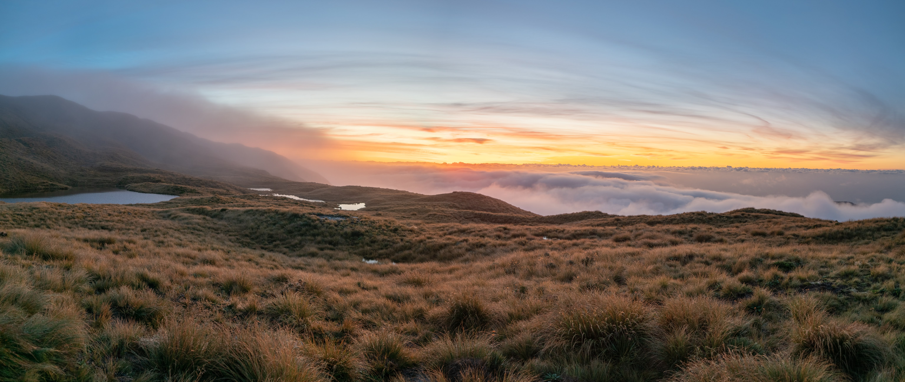
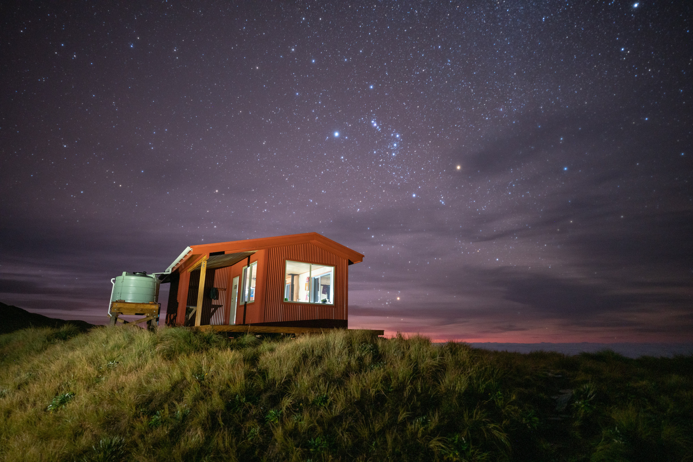
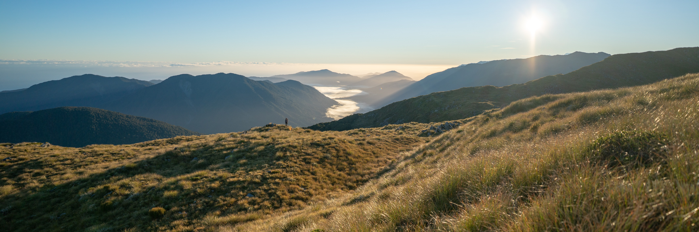

This recently-built hut has been on the to-do list for a few months now, ever since a friend recommended it while we were walking up [Taipo Valley](/taipo). Mataketake Hut sits high on the range of the same name, accessed from the Haast to Paringa Cattle Track north of Haast, a 6.5-hour drive from Christchurch.

There is a small network of tracks around the Mataketake Range. Confusingly, they're not all on topomaps and the cattle track is closed south of Maori Saddle. We decided to go to and from the hut via the Mica Mine tops route to maximise our chance of getting great views. Going up via Maori Saddle Hut would have the benefit of forming a longer loop and opening up a side trip to Lake Law.

With a sketchy-but-passable weather forecast for ANZAC weekend, we committed to the trip and set off!

# Day one

After the long drive, it was under an hour's walk to Blue River Hut. What a great feeling to stretch the legs before arriving at this historic, cosy, building for the night! We even got a clear sky overnight. A noisy group of three kea zoomed overhead while we took some photos.

![Posing for a photo outside Blue River (Blowfly) Hut on an unexpectedly clear evening][blowfly-group]

By night the top-bunkers among us discovered a downside of this hut: the low ceilings made it comically easy to bump limbs and heads during the night.

# Day two

With the skies still clear against the odds, we were keen to get up the hill! The track was generally straightforward, fast travel the whole way to the bushline, becoming more of a grind at the top. A highlight of this section was seeing many kererū flying through the bush and hearing the calls of kākā and kea mix across the forested valley.

Before we knew it, we were out into openness with the sky still clear. Beautiful views of the surrounding ranges emerged, only to be swallowed up by low cloud as we approached Mataketake Hut.

![Proceeding along the tops with clear skies to the left and low cloud to the right][entering-tops]

![Mataketake Hut spotted!][hut-approach]

# Day three

As a personal first, I had planned for an entire hut day on this trip. This was based on the nice things I had heard about the hut. Hopefully it would increase our chance of getting good weather and having the building to ourselves. Turns out neither of those things occurred during the first night at the hut. Sunday proved to be an excellent day to be indoors, with a storm bring plenty of rain and wind. Plus, over the course of a cosy day in the hut filled with board-gaming, tarn-swimming, and book-reading, we realised we would have a clear evening and sole occupancy in the second night.

![Improvising some kindling for the fire by cutting larger pieces. There wasn't much firewood but we somehow got the fire raging.][wood]

As sunset approached and the cloud layer lifted, it became clear that this hut's situation is truly special.

![Watching shooting stars in the dying light of dusk][astro-couple]

![Mountains to the east of the range][astro-hills]

# Day four

We awoke at dawn. This seemed fitting for ANZAC day and meant we would get back to Christchurch earlier. With a crisp breeze behind us and the day dawning in front of us, we packed up and headed out before sunrise. The views were distractingly stunning.

![Dawn breaks on ANZAC day, revealing excellent weather for our early departure][astro-dawn]

We made it out from the hut in 4.5 hours, a fair bit faster than the 8 hours estimated by DOC. Before we knew it we were back in Christchurch and dreaming about getting back to the hills.

[blowfly-group]: ./DSC09590.jpg
[entering-tops]: ./DSC09610.jpg
[hut-approach]: ./DSC09618.jpg
[wood]: ./DSC09621.jpg
[astro-couple]: ./DSC09685.jpg
[astro-hills]: ./DSC09691.jpg
[astro-dawn]: ./DSC09693.jpg
