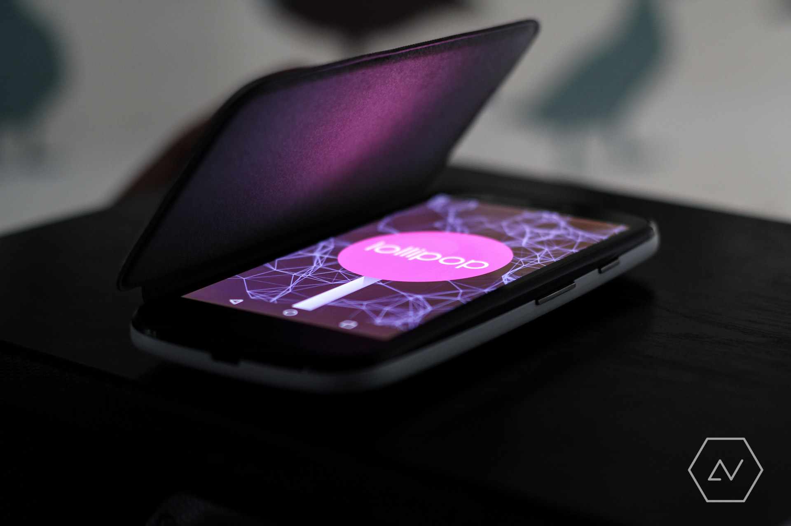

Lollipop has been a long time coming.

In fact, it still hasn't officially arrived to a large proportion of Moto G owners, myself included. Motorola's rollout of Android 5.0.2 Lollipop has been [frustratingly slow][motorola-forum], having taken nearly three months and counting, releasing to individual carriers in individual countries. I'm sure that I'm missing something but the whole ordeal is a shambles given that the software on the Moto G is so very nearly vanilla. What's more, 4.4.4 KitKat has been plagued with memory leak issues. The Facebook app started taking 30 seconds to open. Every time I returned to the home screen the launcher would have to restart after having run out of memory and music would stop playing after a few seconds if I opened another app. Clearing the cache didn't help.

My phone is the 'Global GSM' version of the US Moto G XT1032. After waiting months with no update, I became fed up with my nearly-crippled phone and turned to [Reddit][moto-reddit] and [XDA Forums][moto-xda] where I found many users in the same situation. I read daunting guides about manually flashing system images and custom ROMs. Yesterday I bit the bullet and somehow succeeded in manually installing Android Lollipop 5.1 on my phone (technical details below).

My first impressions of 5.1 compared to 4.4.4 are fantastic. Not only are those slick material design elements abundantly present, but memory management has come a long way. Apps open promptly, and the launcher only crashes if I do some serious multitasking. I can listen to music while browsing Facebook and using Facebook Messenger with no issues whatsoever. Plus there's a whole host of new settings to explore, and a mysterious camera flash bug has been fixed. It's early days for Lollipop on my phone though; I'm just hoping that performance won't deteriorate over time. But so far, so good. In fact, 5.1 is so smooth and bug-free that this whole experience has made me even more skeptical of Motorla's customer support and rollout strategy.

There were many steps to installing Android 5.1 Lollipop, and I'll summarise them here:

1. **Unlock the bootloader.** This step has [officical instructions][bootloader] provided by Motorla itself. This voids the phone's warranty and erases all data on the device. Unlocking the bootloader allows the installation of images and ROMs not authorised by Motorola. I had some trouble rebooting afterwards, but it worked after retrying a couple of times.
1. **Flash Android 4.4.4 GPe.** [_pfufle_'s excellent tutorial][pfufle-tut] at XDA Forums is what I followed for the rest of the process. After downloading and setting everything up on my computer, I followed step 2.2 to install the Google Play Edition of 4.4.4 KitKat on my phone. This essentially changes the phone to the Google Play Edition of the Moto G which, like a Nexus Device, receives updates early and directly from Google.
1. **Flash the 5.0.2 OTA update.** Still following pfufle's tutorial, 5.0.2 now needs to be flashed (manually, for some reason). This is done through booting into recovery and using ADB. After doing this step I ended up being stuck at the boot animation. After trying a [suggested fix][bootloop] in vain, I realised I had actually missed some lines of code in step 2.2. The key things to learn here are (a) use the batch files provided, (b) if anything gets stuck while booting, holding down the power button for a few seconds will force the phone to turn off, and (c) the process can always be restarted from step 2.1.
1. **Install Android 5.1.** This is the easy part. After successfully booting into 5.0.2, connect to the internet and wait a few minutes if needed. Just like an unmodified phone, a notification to install 5.1 will appear. Simply download and install it.
1. **Flash modem firmware (if needed).** The tutorial mentions flashing modem firmware. For whatever reason, my network performed just fine, 3G and all, without additional modification. Perhaps this means the hardware in the Global GSM Moto G is identical to that in the GPe device.
1. **Consider rooting (optional).** It doesn't look hard, but I decided to pass on this step. Rooting the phone does have its perks, however I'm happy with 5.1 as it stands.

[motorola-forum]: https://forums.motorola.com/posts/edc7501cc4
[moto-reddit]: http://www.reddit.com/r/motog
[moto-xda]: http://forum.xda-developers.com/moto-g
[bootloader]: https://motorola-global-portal.custhelp.com/app/standalone/bootloader/unlock-your-device-a
[pfufle-tut]: http://forum.xda-developers.com/moto-g/general/gpe-ota-lrx21z-5-0-1-xt1033-xt1032-t2969847
[bootloop]: http://forum.xda-developers.com/showpost.php?p=57444986&postcount=1
