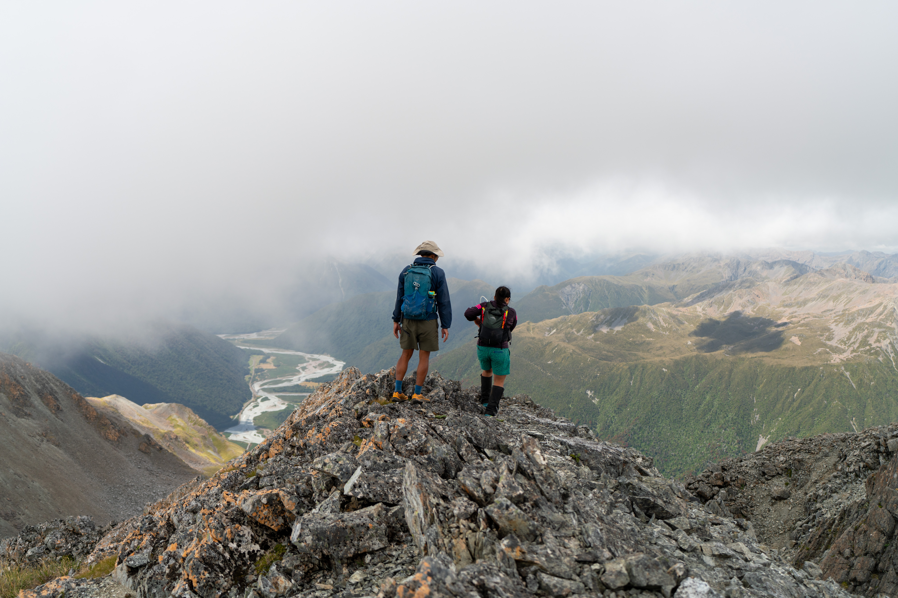
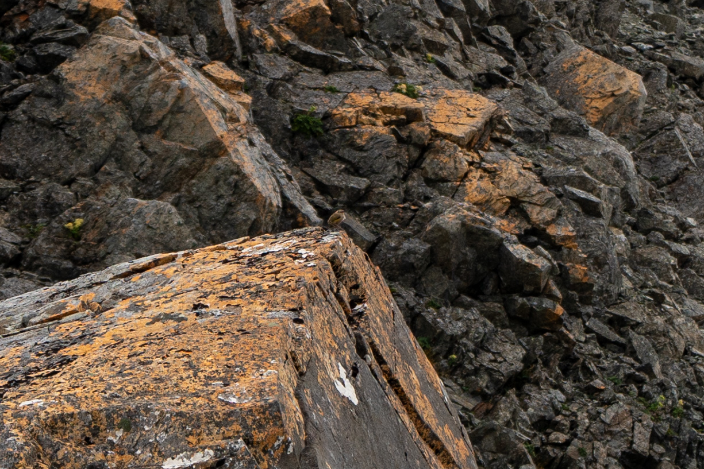

This semi-loop access Mt Barron up Goat Creek and down scree. Ironically, it entirely avoids the named "Mt Barron Route". It's one of the more technical tramps I've ever done, with a good proportion of the travel over rocks. There's scrambling, rock hopping and descent down loose scree--with some of the best views in the park. All in all it's a long and rewarding day on the feet!

The first section follows the pipeline prominently marked on Topo50 just south of Otira township. There's a corresponding parking area on the east side of the road. The map and other trip reports are a bit misleading in terms of the first section of the route. The narrow pipeline reaches a large metal box then widens and proceeds to the creek intake. If you're doing this trip, ensure you pick up the ribbon-marked track which turns off at this metal box to steeply climb the spur. We overshot and reached the creek before backtracking. At least it provided an opportunity to fill water supplies for the dry day ahead!

From the tops, we sidled around in the vague direction of Mt Barron summit. There's no need to climb point 1629 or reach the ridge early.

Scree below the summit may be suitable for descent, but for our upwards route we chose to head up the more stable rock to the right. This reaches a narrow saddle.

We sidled behind a rock formation to reach the main saddle (visible at the top of the main scree chute in the earlier image). This side yielded a fresh view of Kellys Range. From the saddle it was a matter of carefully climbing between rocky outcrops to reach the low peak of Mt Barron.

The aim of the descent route was to follow the ridge over point 1569 then down the scree below point 1265. We made a mistake by picking up the ridge too soon--this would have been sensible in the opposite direction but really just lost us time. Instead the goal should be to get to the bottom of the basin south of the summit before picking up the ridge. This is where we ended up regardless, but there was a much more direct scree we could have ridden there from the low peak!

A benefit of our little detour was the chance to see and hear some elusive rock wrens nearby.

We found our way to the ridge and enjoyed some easier travel as the tops step down towards our scree exit point.

Our exit scree chute was the one below point 1265--we specifically took the northern branch visible on Topo50. We found the rock very loose (especially near the top), so care, patience and liberal spacing were needed to get all of us down without any concussions.

I suspect the track is a more practical descent route, especially with a large group and/or tired knees. That said, the scree is certainly a more interesting option. At the base of the chute, a surprisingly straightforward downhill bush bash took us to the (incredibly solid and level) unsealed service road for the Otira rail tunnel, a short walk from the carpark where it joins SH73.
