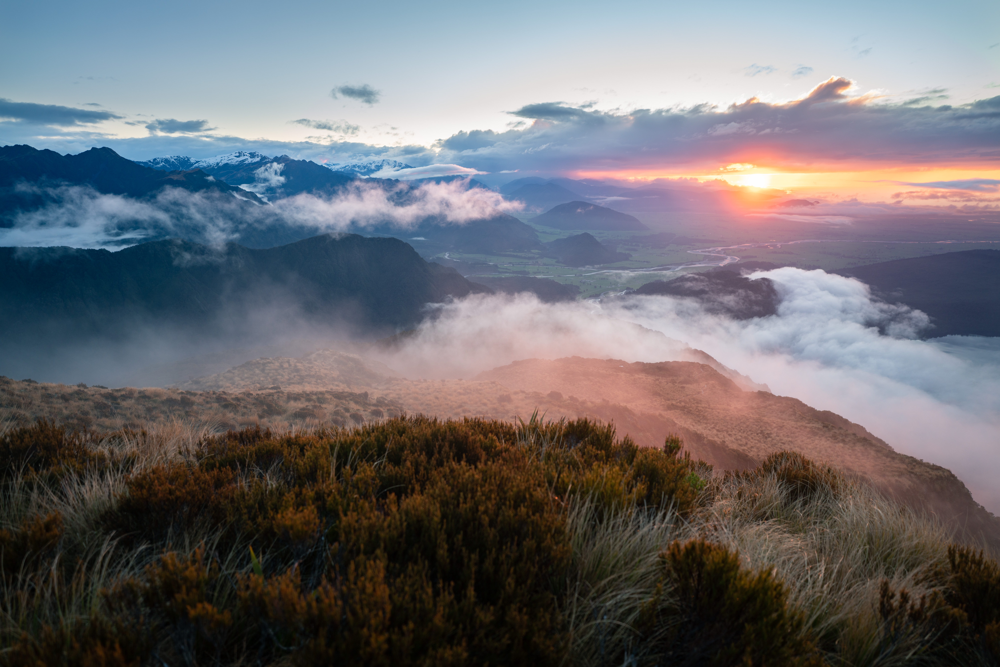
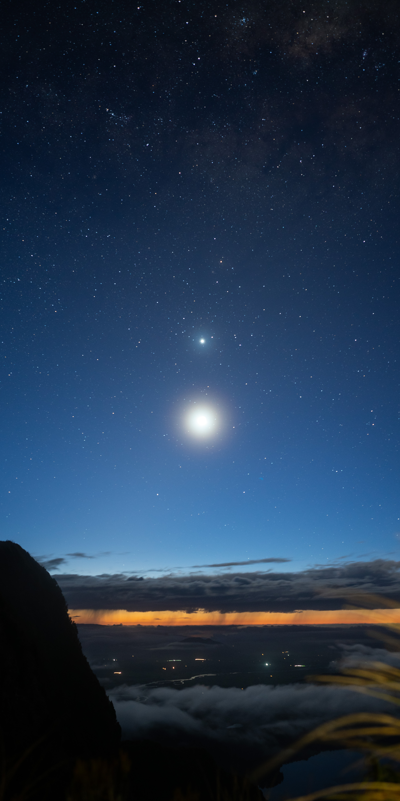

Mt Brown Hut is a classic overnight trip near Hokitika, to a hut renowned for its views and character. It's about a 3.5-hour drive from my home in Christchurch. Another 3.5 hours is the time it took us to complete the short but sharp 4km climb from the carpark.

During the climb through forest, increasing glimpses of Lake Kaniere are offered. By the time we reached the bushline we were surrounded by dense cloud which, thankfully, started clearing soon after.

Upon reaching the hut, we instantly recognised it as the building pictured on the information sign in just about every DOC hut in the country. Ironically, the hut is not actually a DOC hut, being managed by the Kokatahi Tramping Club.

Mt Brown Hut is a cosy hut with only four bunks and a fireplace. Its small size belies its high popularity so I would recommend bringing a tent if you are heading up here, especially on summer weekends. The hut sits directly adjacent to a lip which drops off steeply to reveal gorgeous views out to the coast. Views are even more stunning from the hill just to the south of the hut. It was exciting to watch these views improve as the cloud cleared into the evening.

