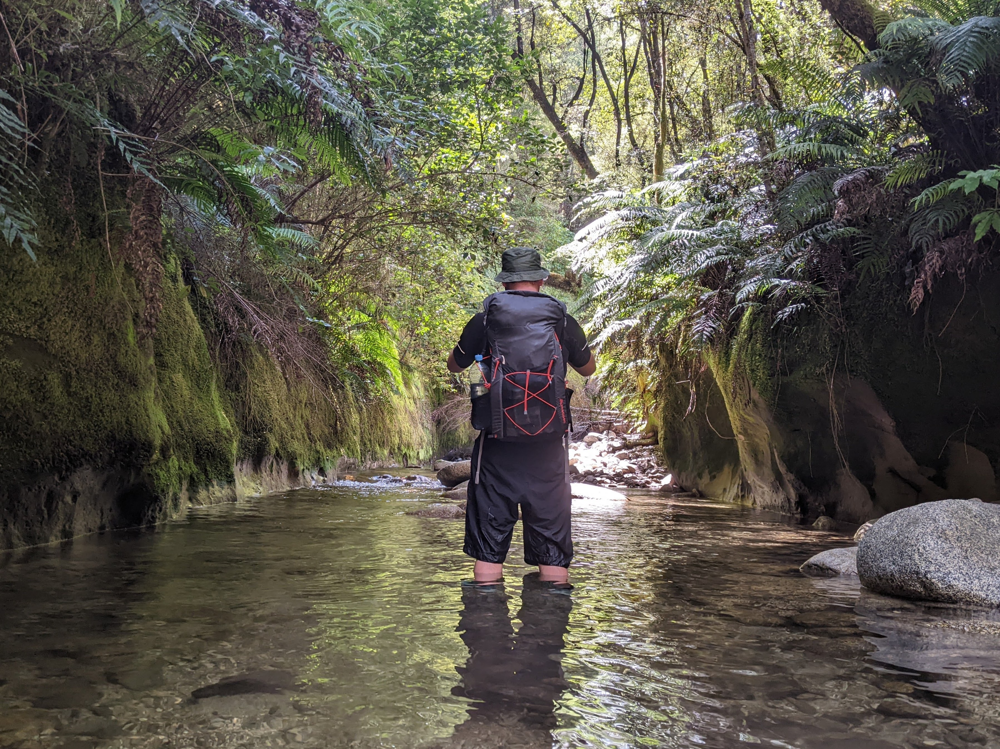

During an idle evening of scrolling topo maps I discovered a hut situated up Mt Curtis on the West Coast. Mt Curtis Hut is publicly accessible but is not a DOC hut; rather, it is maintained by a community group. This group rebuilt the hut in 2012 with some of the funding coming from DOC. There is remarkably little information about this hut on the internet and the track to the hut is unmapped near private land with no obvious trailhead or signage. As I attempted to interpret the terse trip reports that are available, I became increasingly intrigued by this well-kept secret. I had to go! So I planned an overnighter in this rugged part of the country.

What follows is hopefully a more complete description of getting to and from Mt Curtis Hut based on our experience. It is up-to-date as at time of writing.

## How to get to Mt Curtis Hut

Access is from the bridge which crosses Dee Creek, just East of Inangahua. There's a decent-sized layby on the West end of the bridge for parking. Cross to the Eastern side of the bridge and descend to the river on the true right. You'll have to jump a fence to get down to the river from the road. The next step is to follow Dee Creek for a couple of kilometres--there are no markings in this section and travel is through farmland along a paper road which follows the river.

Eventually the river plunges into forest. Continue following the river until you reach point 1515277E 5364463N on the TL bank.


At this point there exists a marked trail but you need to head directly away from the river to find it. Look for orange and pink ribbons visible from the parallel side creek a few metres to the south of the main river. If you struggle to find it, consider continuing 100-300m further up the main river then bush-bashing south to intercept the track while it is close to the river.

The track runs vaguely parallel to the river at first, tracking the top of the bluffs marked on Topo50. It then moves to follow the spur past Pt 489 and all the way up to the hut, becoming increasingly well-marked along the way. We encountered a wasp-infested section of beech about halfway along the trail--watch out for that if you're doing this tramp in the summer months.

## How we got to Mt Curtis Hut

This, of course, was not the way we went up. Only after coming back down do I have the privilege of describing the actual track to you.

With such concealed marking and little information, we completely missed the turnoff for the track, heading up the river for another few hours. Dee Creek develops gorge sections higher up, leading to beautiful sights, slow travel and steep bush-bashing to bypass unnavigable parts.




Eventually the river rose out of a gorge to meet the bank on the TL. We took this opportunity to depart the river to head in the direction of the hut. Fully prepared to bash the remaining two kilometres to the hut, we hedged our bets by detouring to the spur--a decision inspired by recalling a vague report of a marked track up one of the spurs in the area. After pushing through scrub for a while, we reached the spur and found an orange track marker! The going got steep shortly afterwards and it was amazing to experience the shift from mentally-exhausting bush-bashing to physically-exhausting climbing.

## The hut itself


Even before we could collapse on the hut deck, we were greeted by a weka scurrying through the adjacent flax plantation. (An entire family of curious weka meandered past while I was on the toilet in the morning, much to my surprise.)

Mt Curtis Hut is a modern-but-basic four-bunker with a spare fifth mattress. The hut book indicates about a dozen visits per year. There's a fairly well-stocked pantry here with a few pots and pans. It's double-glazed and we certainly had no need for the fire on this clear summer night. The hut sits just below the bushline and the view is largely obscured by trees. Just five minutes' walk up the hill (quite doable in sandals) is a small knoll which has unobstructed views to the West. Mt Curtis summit itself is also easily accessible but might be a more appropriate side trip for a two-night stay.


## The return

Descending the marked track was straightforward enough experience (despite a wasp sting) and one we had been looking forward to since the previous day. We expected to have missed an obvious turnoff but once we got to the bottom of the track the markers thinned then stopped well out of sight of Dee Creek. In the end, then, we didn't have any reason to beat ourselves up for missing the track on the way up.

Our misguided trip in to the hut took 6½ hours. Out, it had taken just 3½.

## Paying for Mt Curtis Hut

This is not a DOC hut so hut passes and tickets do not apply. Payments towards the hut can instead be made to the following account which was displayed on a sign in the hut.

```
Mount Curtis Community Hut
38-9012-0653480-00
```

Also listed in the hut are details to contact some of the people involved in its maintenance. Contact me if you would like those.
