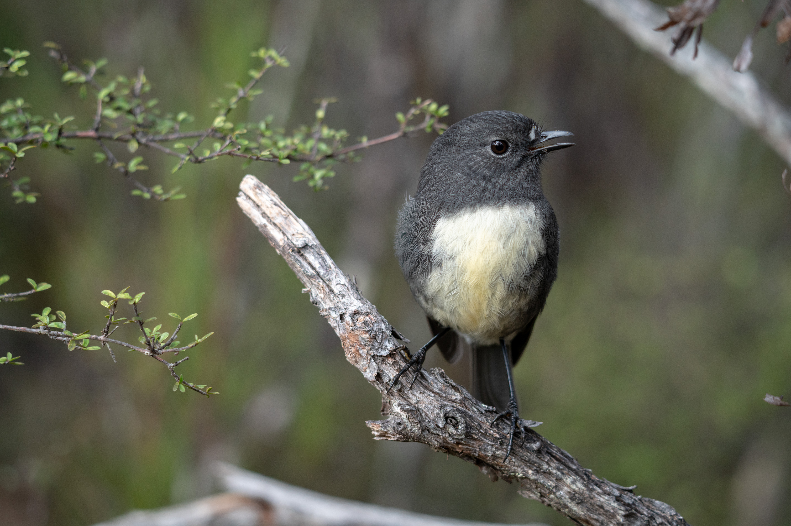
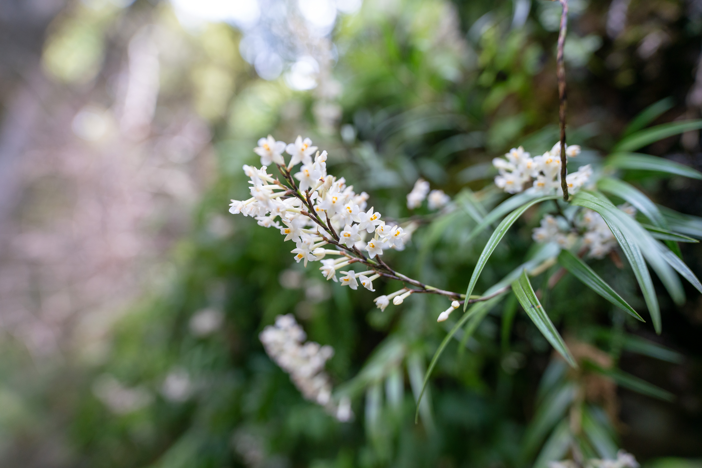
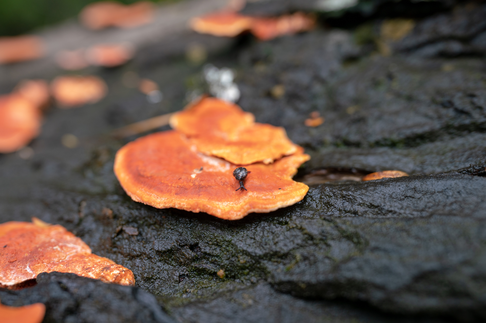
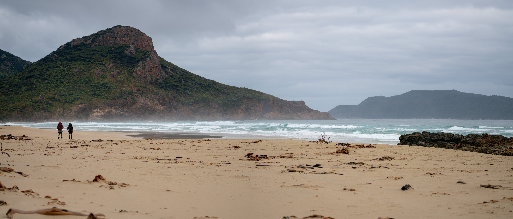
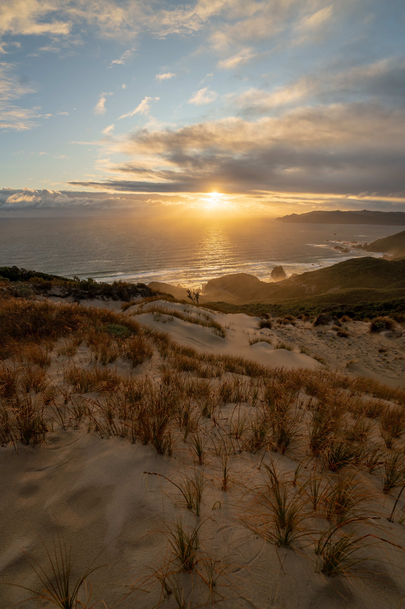

Stewart Island's North West Circuit track provides a walk like no other. Even a speedy hiker will take 7 days to complete this loop. Those with plenty of spare time may combine it with the Southern Circuit for a 12-16 day doozy. In the 10 days we took to complete the one circuit, we trekked through undulating damp bush, traversed remote beaches and experienced all types of weather within the span of a single day. It's a rewarding challenge that for many people will push the limits of their self-sufficiency.

## Flora and fauna

The birdlife is plentiful in this part of the country. Hours of walking were set to the sounds of clusters of bellbirds calling in unison, kakariki chattering (though rarely seen) and the cheeps of tomtits and riflemen. Kiwi were around, too; I saw no fewer than seven during the trip. They're audible early and late in the day making horrendously shrill cries to each other, but we saw a few alongside the track in daylight, too. They're faster, bigger, and more oblivious than I ever expected, often just about colliding with a walker before turning around and zooming off in the other direction.

Robins were numerous in the sheltered low-lying stretch between Mason Bay and Freshwater River.

There's a varied range of plants around the place. Unfortunately the huge deer population is successful at continually suppressing new broadleaf growth, so there are large stretches of forest consisting of ferns, mature broadleaf trees, and nothing in between. I suppose hunters enjoy the good sight lines afforded by this distorted ecosystem.

The forest is incredibly damp from the large amount of precipitation received on Stewart Island. Windfall and dead trees rot quickly and give rise to new plant life.

We saw some bright orange and blue fungi, too.

## Landscape

The vast and pristine beaches did a great job of making me feel very small. It's a humbling wilderness.

<figure>
  
  <figcaption>Three hikers on Mason beach. The prominent rock becomes impassable at high tide; the high tide route does not look fun. This photo was taken about two hours after a 2.7m high tide. Green marram grass is present on the foredunes on the right.</figcaption>
</figure>

<figure>
  
  <figcaption>Looking west to East Ruggedy Beach and the Rugged Islands with the Ruggedy Mountains visible in the distance along with approaching rain</figcaption>
</figure>

<figure>
  
  <figcaption>West Ruggedy Beach with Codfish Island / Whenua Hou visible in the background</figcaption>
</figure>

Possibly my favourite terrain feature was the incredibly tall sand dune adjacent to Big Hellfire Hut. I was not prepared for a hut at 200m elevation to have a beach on its doorstep.

# What to expect if you're doing the North West Circuit

Here's a bit more information if you'd like to learn more about doing this tramp.

## North West Circuit itinerary

Counter-clockwise is the standard direction for the North West Circuit but you can totally do it the other way, too.

The standard track description includes all 10 huts on the circuit, which would take 11 days. If you're staying at all huts, the amount of walking per day will vary from 3 hours to 7 hours. Note that the first and last (Port William and North Arm huts) are Great Walk huts on the Rakiura Track, meaning they book out early and cost more money than the $5 standard huts on the rest of the track. It's common to skip these huts to avoid the bustle and make it to the cheaper huts more quickly. If you do this, be aware that you will need to walk from Freshwater Hut to Oban in one day, which has a DOC-provided time of 10-11 hours. I'd recommend getting a water taxi for this leg! See the transport section below. Some experienced hikers we encountered also skipped Yankee River Hut, Long Harry Hut or Mason Bay Hut to reduce the amount of days.

We took 10 days and skipped the Great Walk huts only. This meant we had an additional rest day, which we spent at Mason Bay Hut.

## Transport to and on the island

Transport to Rakiura / Stewart Island is via boat or plane. The boat is operated by [realnz](https://www.realnz.com/en/experiences/ferry-services/stewart-island-ferry-services/) and costs $99 each way from Bluff. I'd agree with their website that it is quite an experience; the Foveaux Strait lives up to its name and even on a calm day those prone to seasickness (like myself) will be reaching for the sick bag during the hour-long crossing. Get on the boat mentally prepared and with an empty stomach--or catch the plane. The [flight](https://www.stewartislandflights.co.nz/) is $240 return from Invercargill. It takes less than 30 minutes but is limited to 15kg baggage allowance.

Water taxi services are available within the island. For $70 per person, they will shuttle you between Bungaree Hut and Oban, or Freshwater Hut and Oban. We used a taxi to skip our last day from Freshwater Hut to Oban--the taxi arrives at the landing adjacent to the hut at high tide then slaloms down Freshwater River at impressive speed, reaching Oban in about 45 minutes. You need at least three people to charter a boat (or get lucky and book onto an already-chartered boat) and you'll need to book ahead. Freshwater Hut has no cellphone reception and you're not guaranteed any reception from Rocky Mountain, either. There are two operators who sail to Freshwater Hut: [Rakiura Adventure](https://rakiura.nz/) and [Rakiura Charters](https://www.rakiuracharters.co.nz/).

## Huts

Apart from the Great Walk huts, all huts are standard. You can use $5 hut tickets or a hut pass. There is alternatively a North West Circuit Pass which I am told is cheaper than individual tickets. There's little information online about this pass but you should enquire at the DOC visitor centre.

The standard huts are quite generously sized. Most have 10-12 bunk beds with the exceptions being Mason Bay Hut (20 bunks) and Freshwater Hut (16 bunks). They all have at least two sleeping areas, with the exception of Long Harry Hut and Big Hellfire Hut which are single rooms with a "marae-style" sleeping area.

The northern huts (Bungaree, Christmas Village, Yankee River and Long Harry) have cell reception in or near to the hut.

Long Harry hut is dramatically positioned above the beach with a stunning view to the north. It would have been my favourite if it wasn't for the sandfly leakage--the window mesh is too coarse and sandflies just crawl through.

Many of the huts have great rivers nearby to bathe in. Being somewhat clean makes a big difference on such a long hike.

## People

The circuit was far busier than I expected. We walked it in March as a group of three and didn't have a single hut to ourselves. We heard from some circuit hikers a day behind us that they experienced full huts and were forced to hut skip as a result. If you're doing this trip in summer or autumn and are looking forward to 10 days without seeing another soul, adjust your expectations!

A few of the circuit walkers we encountered had just finished Te Araroa southbound. Early autumn may be a common time for such walkers as they would have started TA in late spring and taken about four months to complete it.

Solo and duo circuit hikers are common because it's hard to organise a group for a 10-day tramp on an island. That said, the hut books did have reports of groups up to six people in size. You might find that you form an ad-hoc group with people you encounter along the way, if they're pleasant company!

Some of the huts (at least Bungaree, Yankee River and East Ruggedy) can be used by hunters as the corresponding hunting blocks do not have dedicated hunters' huts. They're only allowed to use half the bunks in these huts but in some cases will unpack their stuff throughout the hut, leading to some tension with trampers. The friendlier hunters will offer hot water, good conversation and maybe even meat.

Mason Bay Hut is commonly used by wealthy groups who charter a helicopter in, stay a few nights in the $5 hut, then walk the three hours to Freshwater to catch a water taxi out. Needless to say, this can cause tension with circuit walkers who arrive after seven days of walking and dehydrated meals, looking for a bunk and perhaps some solidarity. It was certainly jarring for me to walk into a party of six drinking wine and gorging on delicious-looking hamburgers.

## Tidal considerations

There are several parts of the trip that are difficult in high tide. There may be other parts we missed out of sheer luck, but here are the two we noticed:

1. The section east of East Ruggedy Beach. There's no high tide track here. This one nearly caught us out but the tide wasn't quite high enough to cut us off.
1. The rock in the Mason Bay section. It's described on the DOC webpage. There is a high tide route but it looks difficult--DOC says it adds an hour of walking.

For Mason Bay tides, the guidance from the DOC visitor centre was to subtract two hours from the official LINZ Oban tide predictions. For Mason Bay, aim to avoid this time by two hours either side.

## Track condition

The track was well marked--much better than I expected. When we did the track there were many sections between Long Harry Hut and Mason Beach that were overgrown and had significant windfall. DOC told us there hasn't been much maintenance in the last couple of years due to COVID-19 but that they were expecting to get maintenance teams in there over winter 2023.

## Side trips

### Mt Anglem / Hananui

We skipped the side trip to Mt Anglem / Hananui from Christmas Village Hut. According to our DOC informant, it's a stunning view on a clear day but generally you can't tell whether it's a nice day until you're 80% of the way up the mountain. It wasn't worth the gamble for us.

### East Ruggedy Beach lookout

There's a lookout signposted just before the descent to East Ruggedy Beach. It's only 50m from the main track and well worth it.

### Hellfire tops

A local staying at Big Hellfire Hut informed us there are some great views to be had along the ridge south of the hut. He suggested departing the track by a few metres to reach the various false peaks along the ridge. We found the views from the track were good enough!

### Big Sandhill

Definitely worth the 90-minute return trip from Mason Bay Hut. There are nice views from up there and it's easy to squeeze into a day even if you're walking on to Freshwater Hut. Playing on the dunes is fun, too.

### Rocky Mountain

2-3 hours return from Freshwater Hut, the top of Rocky Mountain has a grand view back towards Mason Bay, and even towards Oban--or so we were told. As we climbed the hill, the weather closed in and it was cold, wet and windy at the top. Probably only worth doing in good weather. Some say you can get cell reception at the top (theoretically great for booking or rescheduling a water taxi from the hut) but on this stormy day we had neither the patience nor the line of sight to find it.

## Weather

The weather was all over the place. Most days would go from cloud to rain to sun and back to rain again--in the span of an hour. We had warm sunny times and cold blustery southerlies. Forecasts were good enough to predict storm systems passing through, but don't rely on them for day-to-day weather. Pack for all conditions!
