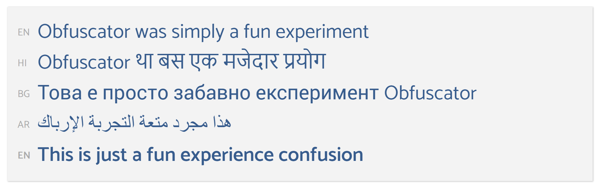

I have always found online translators so interesting. With the continuous shrinking of the world led by the continuous growth of the internet, it is hardly surprising that we have been algorithmically converting between languages for years now, with online services like Google Translate and Bing Translate establishing themselves as vital when travelling, learning and communicating. These algorithms are good. Darn good, in fact — with [computer vision][google-translate] adding to the mix for an even more functional experience.

If my years of learning French only taught me two things about language, they would have to be the following:

1. Language is complicated.
1. When it comes to translation, darn good is not equal to perfect.
   Indeed, while online translators are nearly always good enough, they are not perfect by any stretch of the imagination.

I set out to explore and exaggerate the shortcomings of online translators by creating Obfuscator (I'm no longer hosting this version, but the latest version which uses a similar concept can be found [here](https://obfuscator.albertnis.com/)). For those who only speak one or two languages, it can be hard to gauge the inaccuracy of translation software from a single pass. Using the Bing translate API, Obfuscator takes a phrase and translates it through three successive languages before returning it to the origin language where it can be revealed to the viewer in all its glory. Depending on the languages and phrase, the translation software may completely nail it. Other times, it may not:

The source code for the original version of Obfuscator is available on [GitHub](https://github.com/albertnis/obfuscator/). Or read more about the [new version](/serverless-side-rendering)!

[google-translate]: http://petapixel.com/2015/01/14/googles-translate-app-can-now-use-camera-translate-world-real-time/
