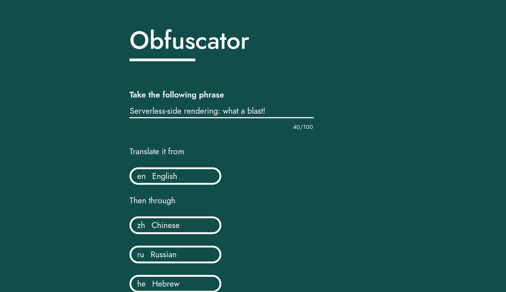
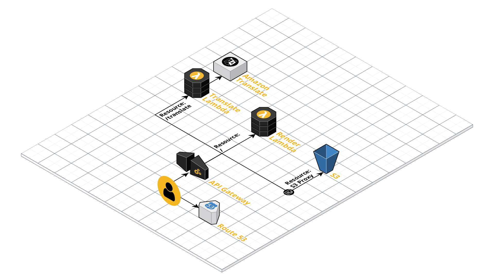
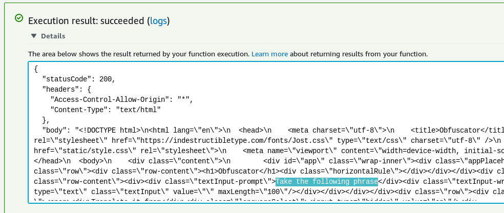
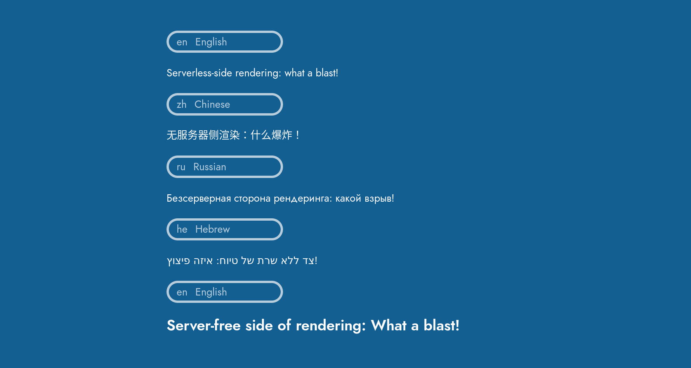

I've been working on a React project called [Obfuscator][]. It's a rewrite of an older [project][obfuscator-old-gh] where you can enter a phrase to translate through multiple languages in sequence. Essentially it's a fun way to make a computer translator play Chinese whispers with itself.



With the product well-defined and my React knowledge workable at this stage, there was something else I focused on with this project: infrastructure. I wanted the entire thing to be serverless, cheap and scalable-to-zero. Single-page applications (SPAs) with serverless APIs and data stores are nothing new. But I realised nobody was running React one their Lambdas. Surely that's a missed opportunity! So what did I do?

I ran React on a Lambda.

## API Gateway

The infrastructure of Obfuscator looks like this:



It basically boils down to an API Gateway REST API with three resources:

- **S3 Proxy**: An S3 bucket contains static resources, namely the Javascript and CSS bundles. Normally with SPAs an HTML file would live in here also. But not in this case!
- **/translate**: Points to a Lambda which runs my translate API. This is a simple lambda which chains calls to Amazon Translate, all bundled in validation logic.
- **/**: The root resource is what serves the HTML when visiting `obfuscator.albertnis.com/`. Normally you'd want this to point to a static HTML file à la `index.html`. But in this case it points to a Lambda which serves up HTML based on the results on a React render.

## The Application Code

The React root component here is called `<App />`. The fun part is how we include this component. Backend and frontend have separate ways to "reach" the App component - beyond that it's shared code all the way down. That's the magic of server-side rendering (SSR).

### Backend

The code is pretty typical of an SSR app: it renders the app as a string and puts that string in a larger HTML template. In this case the logic gets wrapped into the Lambda entrypoint function:

```js
// server.js
import view from '../../backend/view'
import ssr from '../../backend/ServerClient'

// Lambda entrypoint
export const server = (event, context, callback) => {
  // Get string representing app HTML
  const { content, state } = ssr()

  // Inject app HTML into full HTML template
  const page = view('Obfuscator', content, state)

  callback(null, {
    statusCode: 200,
    headers: {
      'Content-Type': 'text/html',
    },
    body: page,
  })
}
```

The server client serves as the base React element wrapping `<App />`.

```tsx
// ServerClient.tsx
// [...]
const ssr = (): { content: string; state: AppState } => {
  let content = renderToString(
    <Provider store={store}>
      <App />
    </Provider>
  )
  let state = store.getState()
  return { content, state }
}
```

Here's the result of the Lambda run from the the console. The rendered app is clearly present:



### Frontend

The client has a simpler structure with a simple client wrapper being used:

```tsx
// Client.tsx
// [...]
hydrate(
  <Provider store={store}>
    <App />
  </Provider>,
  document.getElementById('app')
)
```

Note that `hydrate` is used rather than `render`. This indicates to React that it should expect to see an existing render from the server rather than populating a previously empty element.

## Deploying the Application

Code is bundled via webpack with multiple entrypoints:

- **Client.tsx**: The frontend client ends up as the main JavaScript bundle which is sent to S3 during deployment and served statically.
- **server.js**: The backend bundle used for rendering on Lambda. This includes the HTML template which is populated by the render.
- **translate.ts**: The translate API entrypoint used on the translate Lambda.

## But Why?

The main reason I see to use SSR is that behaviour improves in the time it takes to download the bundle to the browser. Instead of a blank page, users see a perfectly rendered - just unresponsive - application.

### How Feasible is it on Lambda?

It was really quite doable to get SSR up and running on Lambda. But that doesn't mean it's a good idea. Lambda rendering a React application is going to be slower than statically serving a pre-rendered HTML file from S3 or especially a CDN. In the case of Obfuscator, pre-rendering is clearly a superior option as the page doesn't change between loads or for different users.

This app is quite a simple SPA in that it's a single route. Architecture may get more complicated for an app with routing. I'm guessing a Lambda proxy would be useful here but I'm not sure if that would play nice with the existing S3 proxy.

Then there's the issue of cold starts. While barely noticeable, it is worth considering that performing SSR on Lambda will mean slower page loads after no requests have been made for a period of time. Caching at the API Gateway level could be a winner here.

## Reflections

It's been nice to revisit Obfuscator and give it some TLC. It's even nicer that it now stands in a production environment with all infrastructure defined in code. Plus the serverless architecture means I don't pay anything if it's not used. There are definitely improvements to be made to the frontend and more features to add (perhaps saving results to DynamoDB and making them sharable).

Highlights of this coding journey included TypeScript and webpack. TypeScript never ceases to amaze me by making JavaScript not suck. I made the webpack configs from scratch for this one and for the first time I'm starting to really understand how to configure it.

As for using Lambdas for rendering - SSR for Obfuscator is totally unnecessary. One day I might look into ways of doing pre-rendering instead. But if your application is truly a good candidate for SSR just know that it is possible with Lambda.



[obfuscator]: https://obfuscator.albertnis.com
[obfuscator-old-gh]: https://github.com/albertnis/obfuscator
