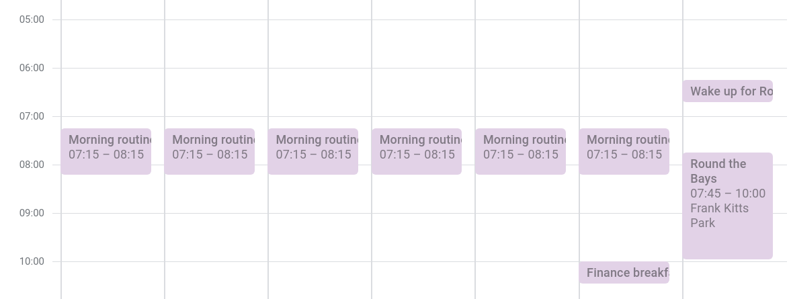
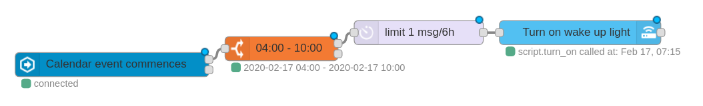

I'm currently reading [Why We Sleep][why-we-sleep] by Matthew Walker. There's an interesting section where he discusses the potential of technology and sleep science to improve our lives in the future. I was surprised that many of the suggestions seem achievable today for anyone with the right home automation devices. Here's an excerpt:

> Come the morning, we can... saturate our indoor environments with powerful blue light that shuts off any lingering melatonin. This will help us wake up faster, more alert, and with a brighter mood, morning after morning.

Sounds desirable, right? I've been using my bedroom LED strips as an wake-up alarm light for years now. After reading the paragraph above, I was inspired to make a couple of improvements to the system.

# Blue light alarm

This is the easy bit! Previously my wake up light had a few phases. The idea was to simulate a sunrise - the lights would shift from off to orange to white. I simplified it such that now they just turn on to melatonin-busting blue. Here's an example of my new wake-up script in Home Assistant. It's not rocket science and simply wraps a light.turn_on service call.

```yaml
script:
  wake_up:
    alias: Wake up
    sequence:
      - alias: Bedroom lights to blue
        service: light.turn_on
        data:
          entity_id: light.bedroom_lights # Group light which targets all lights in the room
          brightness: 255
          rgb_color: [0, 20, 255] # Blue, more or less
          white_value: 80 # Add some white channel to make it more natural
          transition: 300 # Fade on over 5 minutes
```

# Calendar-based scheduling

I used to hardcode the time for triggering my light alarm. A simple automation would trigger the script at 7:15am on weekdays and 7:45am on weekends. That worked find 95% of the time, but didn't properly account for mornings where I needed to wake up earlier or wasn't at home.

## Setting up the integration

I decided to leverage the Google Calendar integration in Home Assistant. The aim is to have the wake-up light activate when the first event of the day starts. The full setup is easy enough to follow (see the [Home Assistant docs][gcal-ha]) and boils down to a couple of lines in the configuration file:

```yaml
google:
  client_id: !secret google_client_id
  client_secret: !secret google_client_secret
```

## Event strategy

By default, the Google Calendar entity is a sensor that is either "on" (event in progress) or "off" (event not in progress). The docs have some interesting options for tracking events such as sensor offsets and filter keywords, but I kept mine basic because I want my calendar to remain human-readable and simple.

Next, I created a repeating daily event for a morning routine. This establishes a "default" wake-up time. The best part is that now I can change up my scheduling when I have something early - or delete the alarm altogether if I don't want the lights to turn on. Here's what my calendar mornings look like:



## Triggering the alarm

So far, the wake-up script is set up and so is the Google Calendar integration. Time to stitch them together with some automation goodness! As always, my go-to- for automation is Node-RED. I'm using the [time range switch][node-red-time-range-switch] and [Home Assistant websocket][node-red-home-assistant-websocket] integrations.

Here is a simple subflow which does the trick. The wake up light will be triggered by the first calendar event which begins between 4am and 10am. Awesome!



# Bonus round: Using Google Assistant to change the alarm time

Now that the system is hooked into the Google ecosystem, it's really easy to add a calendar event using Google Assistant which will trigger the lights early using. It's a one-liner:

> Hey Google, add a calendar event: "Wake up early for my flight" tomorrow at 5:30am.

That's almost as easy as setting a traditional alarm with Google Assistant! As for moving or deleting existing events, I haven't worked that one out yet.

[why-we-sleep]: https://www.amazon.com/Why-We-Sleep-Unlocking-Dreams/dp/1501144316
[gcal-ha]: https://www.home-assistant.io/integrations/calendar.google/
[node-red-time-range-switch]: https://flows.nodered.org/node/node-red-contrib-time-range-switch
[node-red-home-assistant-websocket]: https://flows.nodered.org/node/node-red-contrib-home-assistant-websocket
