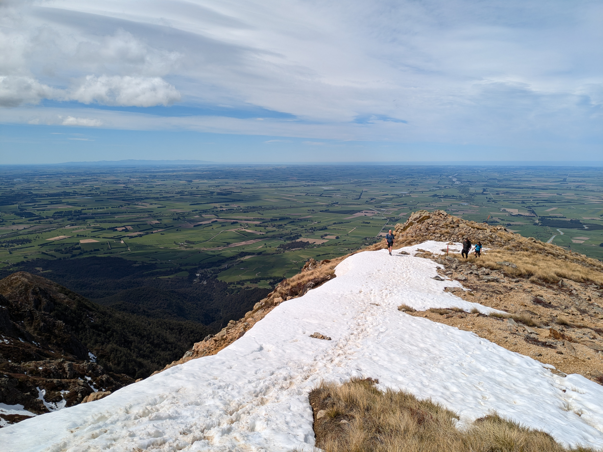

I have [run around](/somers) Mt Somers before, but never previously made it to the summit. With a one-day weather window, I tackled the summit track with friends as part of a birthday trip.

The track was better marked than I thought, with poles present for the entire loop. This is despite the northern part of the route being entirely missing from Topo50. We completed the loop in clockwise direction which is better for getting to the summit quickly. A counter-clockwise attempt would be worth considering to ensure the steepest section (the northern section of the track, directly above the saddle) is an ascent.

