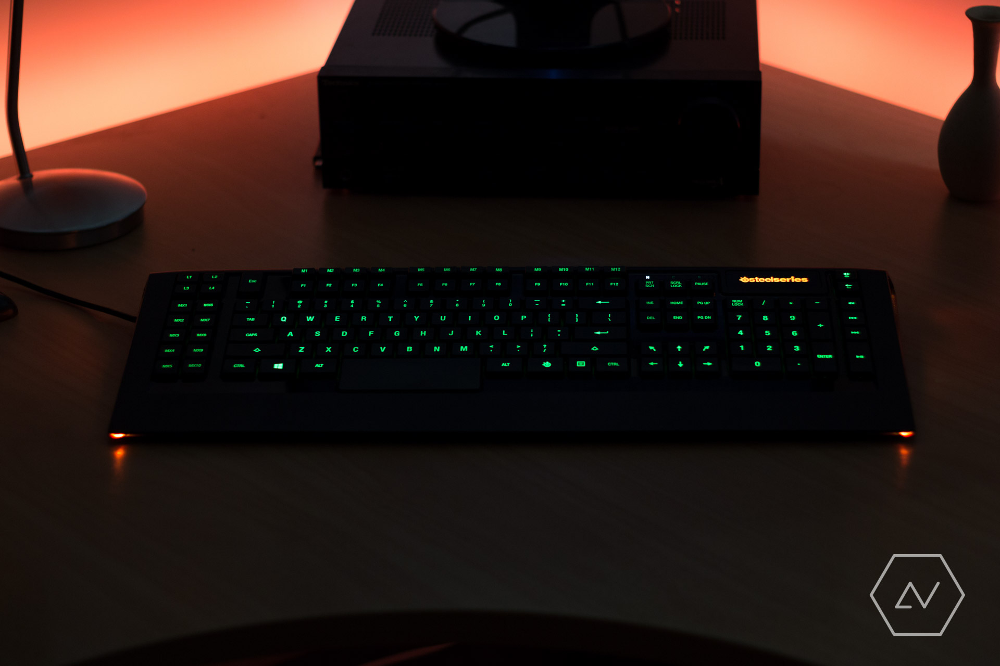

A new house means a new setup. With my audio system pretty much as good as I need it to be, I took this opportunity to turn my attention to my computer peripherals. First up: the keyboard.

I've been using a [Logitech K220][] for over two years now. While I like having a portable keyboard which barely takes up any desk space, the K220 is truly unnatural to type on and, at least in my experience, invariably elicits negative comments from those who use it for the first time. It was this that triggered the start of my research into mechanical keyboards. Having tried a friend's Das keyboard with Cherry MX Blue switches, I had experienced first-hand what mechanical typing felt (and sounded) like, and I liked it. My enthusiasm was short-lived. It turns out that even second-hand mechanical keyboards sell for over \$100, not to mention the cost of high-end boards with individual backlighting and USB hubs. Part of me just wasn't ready to spend so much on a keyboard. Which is why I compromised by buying a second-hand [Steelseries Apex][] keyboard.

The Apex is a membrane keyboard, and it turns out that, in comparison to a mechanical keyboard, the Apex was a pretty big compromise indeed. Don't get me wrong: with five backlight colour zones, macro keys and a USB hub, the Apex has some decent features in a good-looking package, but after using the keyboard for a few hours I realised that I had lost sight of my original keyboard goal of increased comfort, instead giving in to the allure of features. The allure of needless gimmicks. The truth is that the Apex isn't particularly comfortable to type on, and is particularly cumbersome in size. And who really needs 22 macro keys? Not me.

Nevertheless, in a situation not unlike the time I [went open][going open], using the Apex has ended up being a useful learning experience in that I have a better understanding of what I want and what I don't want in a product. I'd like a mechanical keyboard. I'd like a backlight, but I don't need a colour-changing one. I'd like a relatively compact keyboard. I'd like a comfortable keyboard. I don't want gimmicks.

Knowing this, I jumped onto Massdrop and investigated their fantastic mechanical keybaord section. Sure enough, the [Magicforce 68-Key Mini Mechanical Keyboard][mech] seemed to fit the bill, with full-size keys, a backlight and a solid design. I got one with Gateron brown switches for their general-purpose tactility and look forward to receiving it in April. I'm really hoping that it will quench my thirst for a better typing experience &mdash; without satiating my hunger for gimmicks.

[logitech k220]: http://www.logitech.com/en-nz/product/wireless-combo-mk220
[steelseries apex]: https://steelseries.com/gaming-keyboards/apex-350
[going open]: /going-open
[mech]: https://www.massdrop.com/buy/magicforce-68-key-mini-mechanical-keyboard?mode=guest_open
