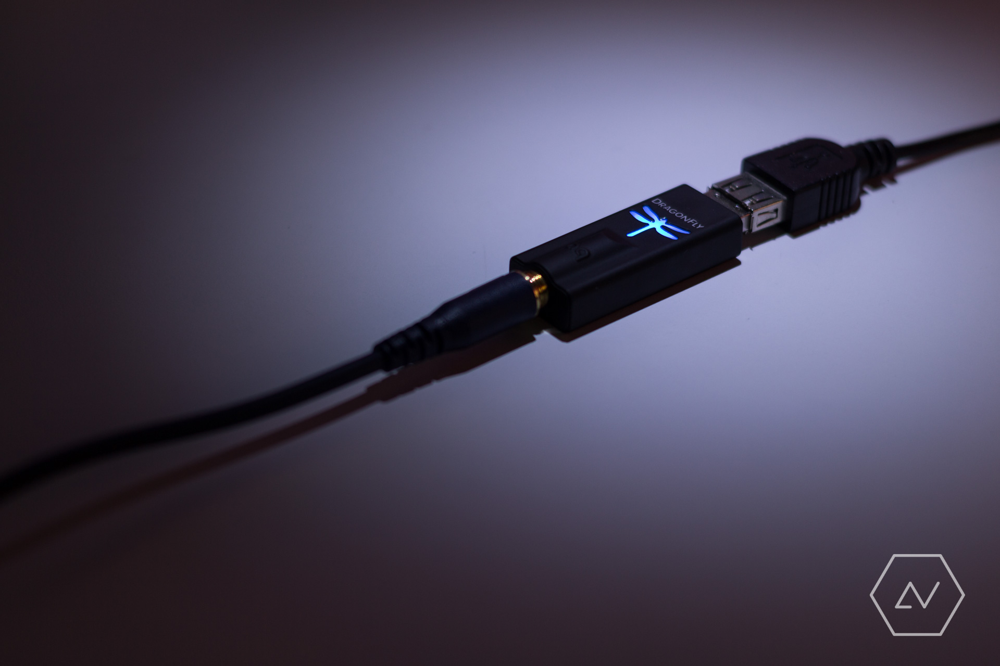

Around the time I bought my [Grado SR125i][], I found the Audioquest Dragonfly DAC at [Online Hi-Fi][online-hifi] for a fantastic price. So why did I buy a DAC? Well, I had been thinking about purchasing an amplifier to improve the sound quality of my music, when I realised an amplifier isn't very useful if the source isn't up to par. Enter the Dragonfly DAC: a well-reviewed and affordable digital-to-analogue converter which could bypass my laptop's sound card to provide at least theoretically improved sound quality suitable for my soon-to-be-upgraded headphones.

When I unboxed the Dragonfly, I was surprised by how well-built this little machine is. It feels like a heavily over-engineered flash drive: heavy for its size and beautifully surrounded by a soft-touch finish. A cap and pleather case is included. Just when I thought it couldn't look any cooler, I plugged it into my computer. The Dragonfly emblem lights up with one of four colours, depending on the sample rate at which it is being used. On Windows, sample rate is set globally, but applications can override it if needed. MusicBee can use WASAPI to essentially commandeer the Dragonfly to change its sample rate depending on the track playing.

So far, so good. However, the most important attribute of a DAC is undoubtedly sound quality. Flicking through my test track playlist with my ATH-M50XBL on, the Dragonfly performs nicely compared to my PC's built-in soundcard. I heard the most notable improvement in the high frequencies. Crackles, pops and cymbals become far clearer, more spacious and more realistic. This effect comes off as eerie in several tracks by Baths, with the sibilance in Lovely Bloodflow and Miasma Sky suddenly seeming to breathe down my neck. The Dragonfly also shines when it comes to bass. Luckily bass isn't boosted here, but becomes tighter. This is not always apparent in electronic music but is clear in more acoustic music: The drum kicks in Aaron Jerome's very well-mastered version of Dancing Girl became less boomy, enabling me to hear the actual kick of the bass pedal more clearly. In terms of mids, I haven't been hearing much difference. Vocals, guitar and piano do seem more spacious and maybe a touch more forwards, however a different pair of headphones would probably show more improvement.

So what's the verdict? Has the humble Dragonfly revolutionised my music experience? The answer is both yes and no. For better or for worse, the Dragonfly and the ATH-M50XBL enable me to identify well-mastered albums. Tracks on these albums sound clean, detailed and generally sublime. But not everything is well-mastered (Amy Winehouse and Imagine Dragons come to mind). It is on such albums that the Dragonfly effect is wasted.

[online-hifi]: http://onlinehifi.co.nz/
[grado sr125i]: /going-open
