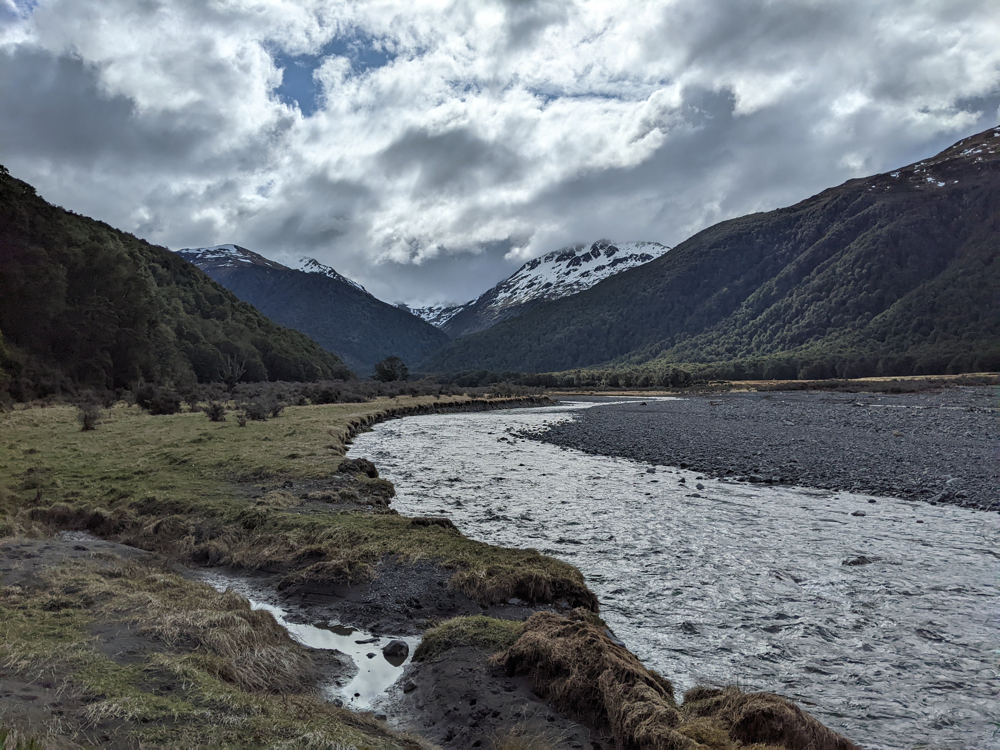
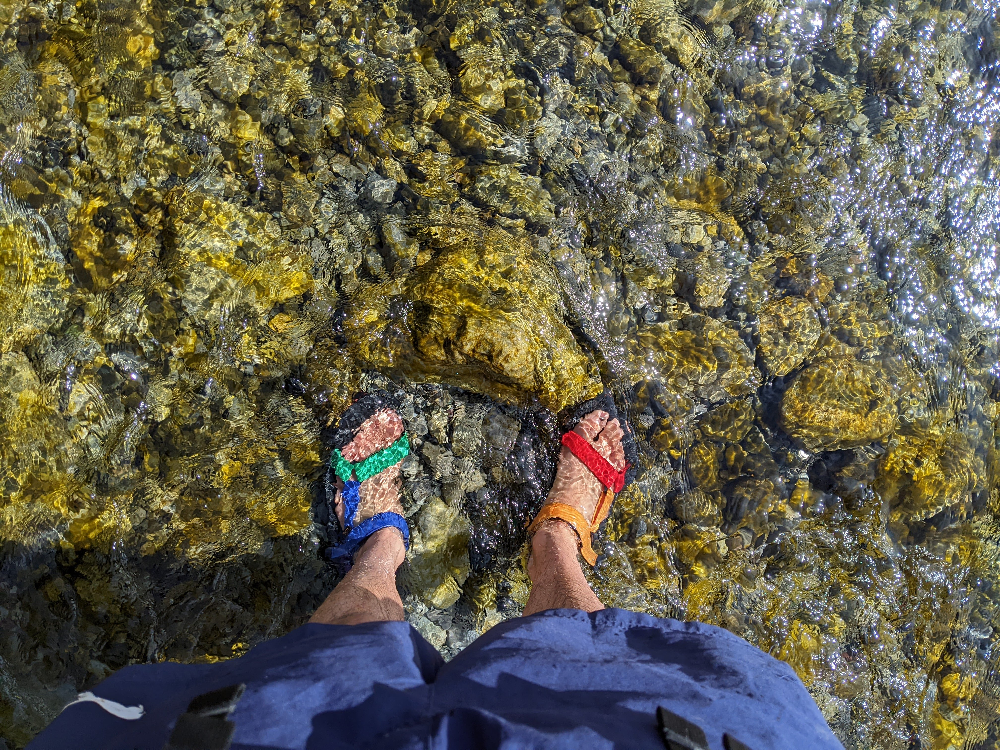
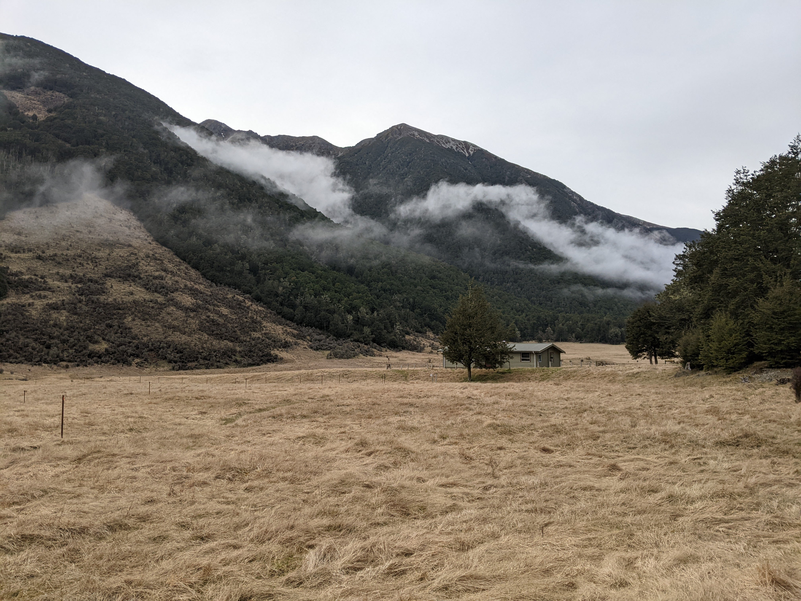

Top Hope Hut has been refurbished in the last couple of years--now is an excellent time to check out this classic but very tidy old hut near Lewis Pass. We combined it with a second night at the large (and popular) Hope Kiwi Lodge. For a summer trip it would be awesome to spend the second night at Lake Man before exiting through either Doubtful Range or Doubtful Valley.

<figcaption>Looking up Hope Valley shortly before reaching St Jacob's Hut</figcaption>

About halfway between St Jacob's Hut and Top Hope Hut, the track peters out on the true right of the river. It looks like undermining from the river is eating away at the track. We wasted a fair amount of time trying to find the track higher up on the bank, as marked on Topo50. But it turned out to be easier to just hop into the river and walk the final 30 minutes of the approach with wet feet.

<figcaption>Top Hope Hut itself</figcaption>

<figcaption>The mighty Tevas performed spectacularly for the half hour of river crossings after leaving the hut on our way out</figcaption>

<figcaption>Hope Kiwi Lodge with its lovely open surroundings. I went here for my first ever tramp; this is the first time I have revisited a hut!</figcaption>

<figcaption>The bridged gorge section of the Hope River was surprisingly pretty</figcaption>
