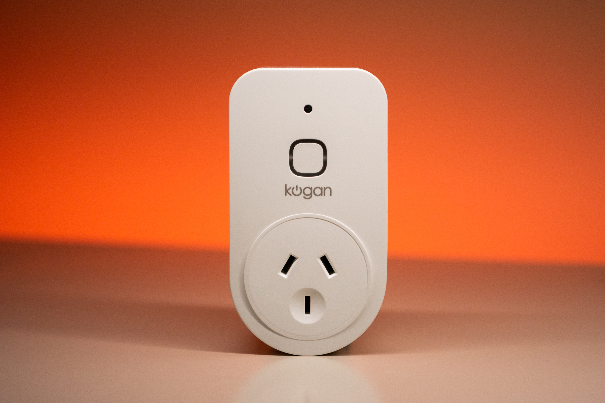

A couple of weeks ago I was given a Kogan smart plug. This controls a wall outlet over WiFi and measures power draw. It's a feature set similar to the [Sonoff Pow R2][pow-r2] which I'm currently using to control my PC. It has a couple of notable benefits over the Pow R2:

- It is sold officially in New Zealand
- It requires no mains wiring

The Kogan smart plug is manufactured by Tuya, a company making IoT devices on behalf of many brand names around the world. Thanks to a security vulnerability in Tuya devices, they're known for being easy to reflash over-the-air with a tool called [tuya-convert][]. If you've read many of my previous posts, you may be aware that [I like ESPHome](/esphome-button-xiaomi-zigbee/) and that [I don't like brands telling me what to do](/smart-home-architecture/).

With that in mind, I set out to install ESPHome on my Kogan smart plug. Here's how I did it using tuya-convert.

> This could totally brick your device. Follow these steps at your own risk and be aware that this is not a substitute for the official guides linked below!

> Unsure if your device is made by Tuya? Check out the [tuya-convert wiki][] to ensure your device is supported.

# Flashing the device

Getting ESPHome flashed was surprisingly easy and just a matter of following instructions on the relevant guides.

## 1. Build an ESPHome binary

Before flashing, we need a flashable binary file for the device. For ESPHome, this means creating an entity and compiling a binary. To do this I mostly just followed the [official guide](https://esphome-configs.io/guides/tuya-convert/#esphome) so read that for more details. But the process for me boiled down to this:

1.  Go to ESPHome dashboard
1.  Create a really basic config with WiFi and OTA enabled. (This is so that there's enough information to build a firmware file and enable updating. The exact device configuration will be fleshed out later.)
1.  Compile
1.  Download binary

## 2. Flash it

I used tuya-convert in Docker on a Linux laptop for this process. For this you'll want to follow the [tuya-convert Docker guide](https://github.com/ct-Open-Source/tuya-convert#using-docker). Here's a summary:

1.  Clone the [tuya-convert][] repo
1.  Copy your ESPHome binary to the `files` directory. (You'll need to do this before the Docker build as for some reason the binaries are copied to the image rather than mounted in the container by default.)
1.  Build the image

    ```shell
    docker build -t tuya .
    ```

1.  Copy the docker-compose template

    ```shell
    cp docker/docker-compose-sample.yml docker-compose.yml
    ```

1.  Open the Docker Compose file and ensure the `WLAN` environment variable is the same as the one on your PC. (`ip link` will show all interfaces; I had to change mine from `wlan0` to `wlp3s0`).

1.  At this stage I needed to manually disconnect my laptop from my home WiFi network

1.  Follow the instructions to run tuya-convert

    ```shell
    docker-compose up -d
    docker-compose exec tuya start
    ```

1.  The remaining instructions will be displayed in the command line

# Getting it working with the new firmware

At this stage the Kogan plug has been flashed with a minimal ESPHome install. It should show up as "online" in the ESPHome dashboard. The good news is that it's free from the manufacturer's firmware! The bad news is that the minimal firmware has no real functionality so the device won't actually do anything.

## Make a configuration for the device

You'll need to build up the ESPHome configuration with components to get it working like it did before. That requires you to know which pins on the ESP8266 do what inside the device. There are a few ways to obtain this information.

### Look on the ESPHome Device Configuration Repository

This is the easiest option. The repository is available at [esphome-configs.io](https://esphome-configs.io/). If your device has a known config, it should be present in the relevant section. I managed to find the Kogan smart plug [here](https://esphome-configs.io/devices/kogan-smarterhome-smart-plug-with-energy-meter/). Be sure to carefully copy the relevant parts of the config from the website to your ESPHome configuration. Then upload it over-the-air to the device.

### Look on the tuya-convert wiki

If there are no known ESPHome configs for your device, you'll need to make your own from scratch. This isn't too hard if you know the pin numbers for the device. The [tuya-convert wiki][] contains a list of all supported devices. Many have GPIO pins specified. You won't be able to copy and paste a config to ESPHome, but the site will at least show how pins are configured for that device. That makes it much easier to build a configuration yourself.

### Look on the Tasmota Devices Template Repository

At [templates.blakadder.com](https://templates.blakadder.com/index.html) there is a repository of devices for the popular Tasmota firmware. Look up the device and it will show which pins are used for what.

### Work it out by trial and error

If you don't want to open the device, I'm sure it wouldn't hurt to try some pins. Look up similar devices using the sources above and try the pins for that device by writing a config which uses your best-guess of pin numbers. That could provide a good starting point. As always, Googling and poking around forums is probably helpful also.

### Look inside the device

Luckily I didn't get this far. If you still don't know the pins for your device, the surest way to determine them is probably to disassemble the device. It should be possible to work out which pins are which by tracing outputs and inputs to the ESP-8266 board inside.

## Get it integrated into the home automation system

ESPHome is flexible and supports tons of interaction methods. I'm using the Home Assistant integration but there are many other options. Getting it all hooked up is beyond the scope of this post so check out the [ESPHome docs](https://esphome.io/index.html) for more information.

# Reflections

The whole process was easier than I expected and works marvellously on my Kogan switch. So far it seems like a good way to get my desired firmware running on locally-purchasable hardware without any signs of tampering. Now I want to buy the cheapest Tuya lightbulbs I can find and repeat the process with those.

[pow-r2]: https://www.itead.cc/sonoff-pow-r2.html
[tuya-convert]: https://github.com/ct-Open-Source/tuya-convert
[tuya-convert wiki]: https://github.com/ct-Open-Source/tuya-convert/wiki
