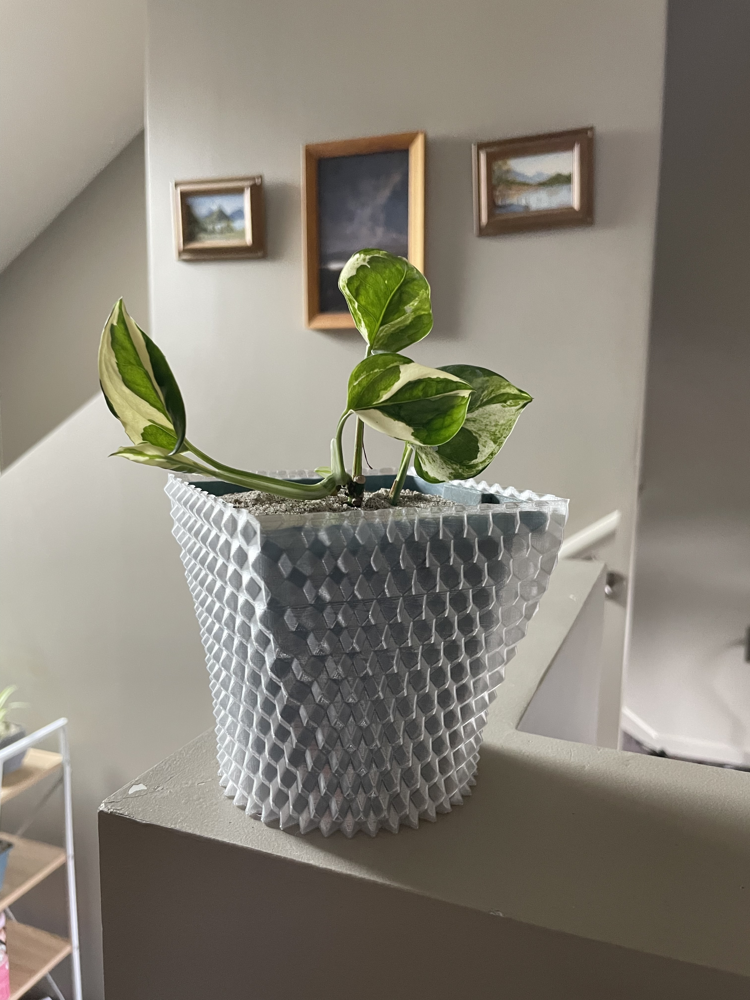
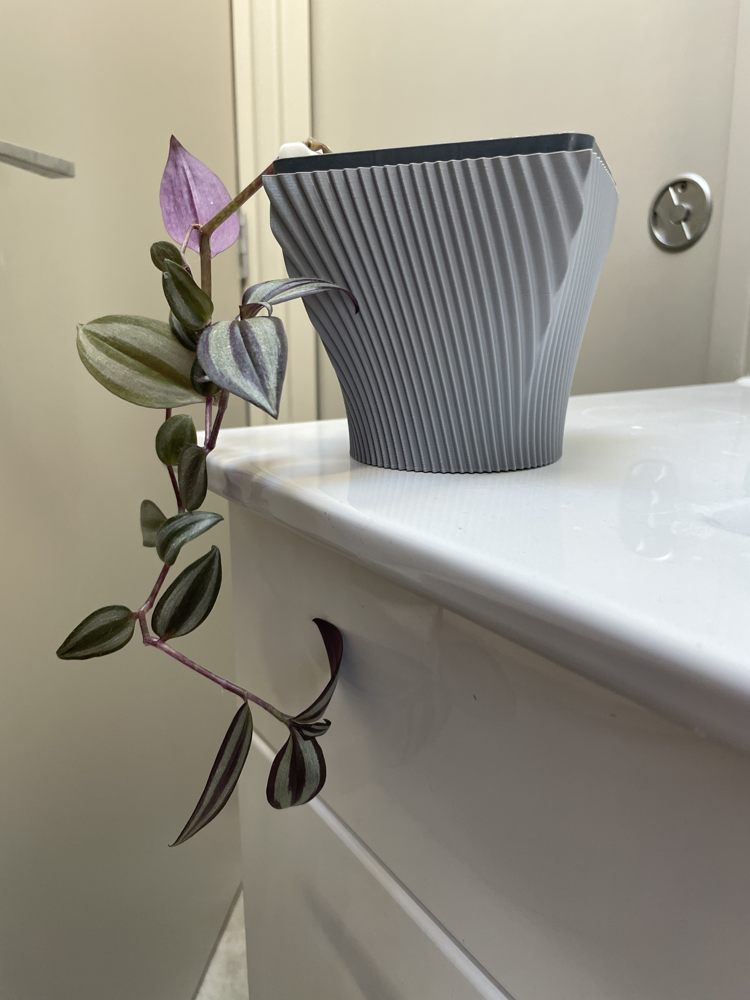

I was recently inspired by some impressive 3D-printed geometric vase designs and considered how I could replicate a similar effect for some decorative pot covers. It struck me that many of these designs could be described by a mathematical function. I love the simplicity of "printing" a 3D function, but I was unsure as to how I could achieve this in practice.

There are a [few solutions](https://3dprinting.stackexchange.com/questions/18189/how-can-i-convert-a-mathematically-defined-shape-into-a-3d-printable-g-code-file) I have seen proposed for tackling this kind of thing:

1. **Use an off-the-shelf graphical CAD program supporting functions.** There are tools that support defining surfaces as functions. SideFX Houdini and Full Control Designer are mentioned. The disadvantage here is that I would need to learn these specific workflows and be at the mercy of their limitations.
1. **Work out how to do it in OpenSCAD.** The `polyhedron` feature, combined with a lot of iteration, could be used. While I love OpenSCAD for basic parts, I suspect this approach would be very slow and cumbersome to output a complicated shape with the resolution I desire.
1. **Code it from scratch.** I chose this option as it would give full flexibility, maximum speed and let me learn a bit more about STL files along the way.

# How to make a pot with code

Enter my solution: [vasestl](https://github.com/albertnis/vasestl). I opted to use Rust for its blazing-fast performance, and because I have recently been learning the basics of Rust through the Advent of Code challenges. On reflection, I doubt the performance advantages were necessary because the program can build tens of thousands of triangles in a matter of milliseconds.

## Compute points

The first step is to come up with an equation describing the shape. I decided to use polar co-ordinates for this process, which makes it easier to define periodic shapes that will wrap around the pot seamlessly. At each increment of height ($z$) and angle ($\theta$), the distance from the origin ($r$) can be defined--which yields a point in 3D space. One of the simplest options is a cylinder, which would have a mathematical definition like this:

```math
r(\theta, z) = 30
```

With four iterations of z and 14 iterations of θ, the corresponding point cloud for this equation would look something like:

<svg style="margin: auto" viewBox="-54 -35.764571353075624 108 179.529" width="108" height="179.529"><circle cx="30.000" cy="0.000" opacity="1" fill="currentColor" r="4" /><circle cx="27.029" cy="3.369" opacity="1" fill="currentColor" r="4" /><circle cx="18.705" cy="6.071" opacity="1" fill="currentColor" r="4" /><circle cx="6.676" cy="7.570" opacity="1" fill="currentColor" r="4" /><circle cx="-6.676" cy="7.570" opacity="1" fill="currentColor" r="4" /><circle cx="-18.705" cy="6.071" opacity="1" fill="currentColor" r="4" /><circle cx="-27.029" cy="3.369" opacity="1" fill="currentColor" r="4" /><circle cx="-30.000" cy="0.000" opacity="1" fill="currentColor" r="4" /><circle cx="-27.029" cy="-3.369" opacity="0.5" fill="currentColor" r="4" /><circle cx="-18.705" cy="-6.071" opacity="0.5" fill="currentColor" r="4" /><circle cx="-6.676" cy="-7.570" opacity="0.5" fill="currentColor" r="4" /><circle cx="6.676" cy="-7.570" opacity="0.5" fill="currentColor" r="4" /><circle cx="18.705" cy="-6.071" opacity="0.5" fill="currentColor" r="4" /><circle cx="27.029" cy="-3.369" opacity="0.5" fill="currentColor" r="4" /><circle cx="30.000" cy="36.000" opacity="1" fill="currentColor" r="4" /><circle cx="27.029" cy="39.369" opacity="1" fill="currentColor" r="4" /><circle cx="18.705" cy="42.071" opacity="1" fill="currentColor" r="4" /><circle cx="6.676" cy="43.570" opacity="1" fill="currentColor" r="4" /><circle cx="-6.676" cy="43.570" opacity="1" fill="currentColor" r="4" /><circle cx="-18.705" cy="42.071" opacity="1" fill="currentColor" r="4" /><circle cx="-27.029" cy="39.369" opacity="1" fill="currentColor" r="4" /><circle cx="-30.000" cy="36.000" opacity="1" fill="currentColor" r="4" /><circle cx="-27.029" cy="32.631" opacity="0.5" fill="currentColor" r="4" /><circle cx="-18.705" cy="29.929" opacity="0.5" fill="currentColor" r="4" /><circle cx="-6.676" cy="28.430" opacity="0.5" fill="currentColor" r="4" /><circle cx="6.676" cy="28.430" opacity="0.5" fill="currentColor" r="4" /><circle cx="18.705" cy="29.929" opacity="0.5" fill="currentColor" r="4" /><circle cx="27.029" cy="32.631" opacity="0.5" fill="currentColor" r="4" /><circle cx="30.000" cy="72.000" opacity="1" fill="currentColor" r="4" /><circle cx="27.029" cy="75.369" opacity="1" fill="currentColor" r="4" /><circle cx="18.705" cy="78.071" opacity="1" fill="currentColor" r="4" /><circle cx="6.676" cy="79.570" opacity="1" fill="currentColor" r="4" /><circle cx="-6.676" cy="79.570" opacity="1" fill="currentColor" r="4" /><circle cx="-18.705" cy="78.071" opacity="1" fill="currentColor" r="4" /><circle cx="-27.029" cy="75.369" opacity="1" fill="currentColor" r="4" /><circle cx="-30.000" cy="72.000" opacity="1" fill="currentColor" r="4" /><circle cx="-27.029" cy="68.631" opacity="0.5" fill="currentColor" r="4" /><circle cx="-18.705" cy="65.929" opacity="0.5" fill="currentColor" r="4" /><circle cx="-6.676" cy="64.430" opacity="0.5" fill="currentColor" r="4" /><circle cx="6.676" cy="64.430" opacity="0.5" fill="currentColor" r="4" /><circle cx="18.705" cy="65.929" opacity="0.5" fill="currentColor" r="4" /><circle cx="27.029" cy="68.631" opacity="0.5" fill="currentColor" r="4" /><circle cx="30.000" cy="108.000" opacity="1" fill="currentColor" r="4" /><circle cx="27.029" cy="111.369" opacity="1" fill="currentColor" r="4" /><circle cx="18.705" cy="114.071" opacity="1" fill="currentColor" r="4" /><circle cx="6.676" cy="115.570" opacity="1" fill="currentColor" r="4" /><circle cx="-6.676" cy="115.570" opacity="1" fill="currentColor" r="4" /><circle cx="-18.705" cy="114.071" opacity="1" fill="currentColor" r="4" /><circle cx="-27.029" cy="111.369" opacity="1" fill="currentColor" r="4" /><circle cx="-30.000" cy="108.000" opacity="1" fill="currentColor" r="4" /><circle cx="-27.029" cy="104.631" opacity="0.5" fill="currentColor" r="4" /><circle cx="-18.705" cy="101.929" opacity="0.5" fill="currentColor" r="4" /><circle cx="-6.676" cy="100.430" opacity="0.5" fill="currentColor" r="4" /><circle cx="6.676" cy="100.430" opacity="0.5" fill="currentColor" r="4" /><circle cx="18.705" cy="101.929" opacity="0.5" fill="currentColor" r="4" /><circle cx="27.029" cy="104.631" opacity="0.5" fill="currentColor" r="4" /></svg>

Adding a cool swept sine pattern to this shape is as simple as incorporating the angle and offsetting it with changing z-height:

```math
r(\theta, z) = 31 + sin(12\theta + z)
```

In the Rust code, we could consider the base cylindrical shape and the decorative "ripple" separately, representing it as something like:

```rust
fn r(t: f32, z: f32) -> f32 {
    const CYLINDER_RADIUS: f32 = 30.0;

    // "Base": Just the cylinder, in this case
    let base = CYLINDER_RADIUS;

    // "Decoration": A sine wave to add a rippled texture
    let decoration = 1.0 + f32::sin(12.0*t + z);

    // Return the sum of these components
    base + decoration
}
```

Where this can get a bit painful is for non-circular shapes, such as squares and rectangles. These need to use a polar representation of the shape. For example, a square pot shape of side length $s$ would be defined as:

```math
r(\theta, z) = \begin{cases}
   |s\cosec(\theta)| &\text{if } \pi/4 < \theta < 3\pi/4 \\
   |s\cosec(\theta)| &\text{if } 5\pi/4 < \theta < 7\pi/4 \\
   |s\sec(\theta)| &\text{otherwise}
\end{cases}
```

Awkward, right? In code it's at least a tad clearer to build these shapes up piece by piece. For example, here is the definition of a pot which sweeps from a circular bottom to a square top. Once this "base shape" is defined, it is easy to add any decorative elements just like before:

```rust
fn r(t: f32, z: f32) -> f32 {
    // Pot is circle ø88 at bottom; square 104×104 at top

    const SQUARE_SIZE: f32 = 52.0; // Half the width (minimum "radius") of square
    let square = if (PI * 0.25..PI * 0.75).contains(&t) || (PI * 1.25..PI * 1.75).contains(&t) {
        f32::abs(SQUARE_SIZE / f32::sin(t))
    } else {
        f32::abs(SQUARE_SIZE / f32::cos(t))
    };

    const CIRCLE: f32 = 44.0; // Radius of circle

    // Ease sinusoidally between circle base and square top
    let z_ease = -(f32::cos(PI * z) - 1.0) / 2.0;
    let base = CIRCLE * (1.0 - z_ease) + square * z_ease;

    // "Decoration": A sine wave to add a rippled texture
    let decoration = f32::sin((t + 0.5 * z) * 80.0) * 1.0;

    // Combine and return
    base + decoration
}
```

This yields the following shape:



It is possible to also build rectangles using a similar strategy. See the [examples in the repository](https://github.com/albertnis/vasestl/blob/main/examples).

## Convert the points to triangles

After computing the points at every increment of $z$ and $\theta$, the code has a point cloud where every point lies on the surface of the pot shape. This needs to be converted to a series of triangles which will define the surface which can later be printed.

Because the points were computed at discrete increments of $z$, the array of points is effectively a series of vertically-stacked "rings" of points, where each "ring" has the same number of points (determined by the increment of $\theta$). Building triangles is a matter of iterating through the rings and connecting adjacent points to form squares, which are then stored as two triangles. Additionally, the normal vector of each triangle is determined, which can be computed using a cross product. This normal is later embedded in the STL file to indicate which side is the "outside" of the surface.

<figure>
<div style="display: flex; justify-content: center; gap: 3rem">
<svg viewBox="-76 -37.31748562369074 152 215.529" width="152" height="215.529"><circle cx="36.000" cy="0.000" opacity="1" fill="currentColor" r="4" /><circle cx="32.435" cy="4.043" opacity="1" fill="currentColor" r="4" /><circle cx="22.446" cy="7.285" opacity="1" fill="currentColor" r="4" /><circle cx="8.011" cy="9.084" opacity="1" fill="currentColor" r="4" /><circle cx="-8.011" cy="9.084" opacity="1" fill="currentColor" r="4" /><circle cx="-22.446" cy="7.285" opacity="1" fill="currentColor" r="4" /><circle cx="-32.435" cy="4.043" opacity="1" fill="currentColor" r="4" /><circle cx="-36.000" cy="0.000" opacity="1" fill="currentColor" r="4" /><circle cx="-32.435" cy="-4.043" opacity="0.5" fill="currentColor" r="4" /><circle cx="-22.446" cy="-7.285" opacity="0.5" fill="currentColor" r="4" /><circle cx="-8.011" cy="-9.084" opacity="0.5" fill="currentColor" r="4" /><circle cx="8.011" cy="-9.084" opacity="0.5" fill="currentColor" r="4" /><circle cx="22.446" cy="-7.285" opacity="0.5" fill="currentColor" r="4" /><circle cx="32.435" cy="-4.043" opacity="0.5" fill="currentColor" r="4" /><circle cx="36.000" cy="36.000" opacity="1" fill="currentColor" r="4" /><circle cx="32.435" cy="40.043" opacity="1" fill="currentColor" r="4" /><circle cx="22.446" cy="43.285" opacity="1" fill="currentColor" r="4" /><circle cx="8.011" cy="45.084" opacity="1" fill="currentColor" r="4" /><circle cx="-8.011" cy="45.084" opacity="1" fill="currentColor" r="4" /><circle cx="-22.446" cy="43.285" opacity="1" fill="currentColor" r="4" /><circle cx="-32.435" cy="40.043" opacity="1" fill="currentColor" r="4" /><circle cx="-36.000" cy="36.000" opacity="1" fill="currentColor" r="4" /><circle cx="-32.435" cy="31.957" opacity="0.5" fill="currentColor" r="4" /><circle cx="-22.446" cy="28.715" opacity="0.5" fill="currentColor" r="4" /><circle cx="-8.011" cy="26.916" opacity="0.5" fill="currentColor" r="4" /><circle cx="8.011" cy="26.916" opacity="0.5" fill="currentColor" r="4" /><circle cx="22.446" cy="28.715" opacity="0.5" fill="currentColor" r="4" /><circle cx="32.435" cy="31.957" opacity="0.5" fill="currentColor" r="4" /><circle cx="45.000" cy="72.000" opacity="1" fill="currentColor" r="4" /><circle cx="40.544" cy="77.053" opacity="1" fill="currentColor" r="4" /><circle cx="28.057" cy="81.106" opacity="1" fill="#8b5cf6" r="4" /><circle cx="10.013" cy="83.355" opacity="1" fill="#8b5cf6" r="4" /><circle cx="-10.013" cy="83.355" opacity="1" fill="currentColor" r="4" /><circle cx="-28.057" cy="81.106" opacity="1" fill="currentColor" r="4" /><circle cx="-40.544" cy="77.053" opacity="1" fill="currentColor" r="4" /><circle cx="-45.000" cy="72.000" opacity="1" fill="currentColor" r="4" /><circle cx="-40.544" cy="66.947" opacity="0.5" fill="currentColor" r="4" /><circle cx="-28.057" cy="62.894" opacity="0.5" fill="currentColor" r="4" /><circle cx="-10.013" cy="60.645" opacity="0.5" fill="currentColor" r="4" /><circle cx="10.013" cy="60.645" opacity="0.5" fill="currentColor" r="4" /><circle cx="28.057" cy="62.894" opacity="0.5" fill="currentColor" r="4" /><circle cx="40.544" cy="66.947" opacity="0.5" fill="currentColor" r="4" /><circle cx="52.000" cy="108.000" opacity="1" fill="currentColor" r="4" /><circle cx="46.850" cy="113.839" opacity="1" fill="currentColor" r="4" /><circle cx="32.421" cy="118.522" opacity="1" fill="#8b5cf6" r="4" /><circle cx="11.571" cy="121.121" opacity="1" fill="#f97316" r="4" /><circle cx="-11.571" cy="121.121" opacity="1" fill="currentColor" r="4" /><circle cx="-32.421" cy="118.522" opacity="1" fill="currentColor" r="4" /><circle cx="-46.850" cy="113.839" opacity="1" fill="currentColor" r="4" /><circle cx="-52.000" cy="108.000" opacity="1" fill="currentColor" r="4" /><circle cx="-46.850" cy="102.161" opacity="0.5" fill="currentColor" r="4" /><circle cx="-32.421" cy="97.478" opacity="0.5" fill="currentColor" r="4" /><circle cx="-11.571" cy="94.879" opacity="0.5" fill="currentColor" r="4" /><circle cx="11.571" cy="94.879" opacity="0.5" fill="currentColor" r="4" /><circle cx="32.421" cy="97.478" opacity="0.5" fill="currentColor" r="4" /><circle cx="46.850" cy="102.161" opacity="0.5" fill="currentColor" r="4" /><circle cx="30.000" cy="144.000" opacity="1" fill="currentColor" r="4" /><circle cx="27.029" cy="147.369" opacity="1" fill="currentColor" r="4" /><circle cx="18.705" cy="150.071" opacity="1" fill="currentColor" r="4" /><circle cx="6.676" cy="151.570" opacity="1" fill="currentColor" r="4" /><circle cx="-6.676" cy="151.570" opacity="1" fill="currentColor" r="4" /><circle cx="-18.705" cy="150.071" opacity="1" fill="currentColor" r="4" /><circle cx="-27.029" cy="147.369" opacity="1" fill="currentColor" r="4" /><circle cx="-30.000" cy="144.000" opacity="1" fill="currentColor" r="4" /><circle cx="-27.029" cy="140.631" opacity="0.5" fill="currentColor" r="4" /><circle cx="-18.705" cy="137.929" opacity="0.5" fill="currentColor" r="4" /><circle cx="-6.676" cy="136.430" opacity="0.5" fill="currentColor" r="4" /><circle cx="6.676" cy="136.430" opacity="0.5" fill="currentColor" r="4" /><circle cx="18.705" cy="137.929" opacity="0.5" fill="currentColor" r="4" /><circle cx="27.029" cy="140.631" opacity="0.5" fill="currentColor" r="4" /></svg>

<svg height="215" width="215" viewbox="-20 -20 215 215">
  <path d="M0 0 H 175 V 175 H 0 V 0 L 175 175" stroke="currentColor" fill="transparent" stroke-width="2" />
  <circle cx="0" cy="0" r="8" fill="#8b5cf6" />
  <circle cx="175" cy="0" r="8" fill="#8b5cf6" />
  <circle cx="0" cy="175" r="8" fill="#f97316" />
  <circle cx="175" cy="175" r="8" fill="#8b5cf6" />
</svg>
</div>
<figcaption>Illustration of deriving two triangles from a selected point highlighted in orange. Certain adjacent points (purple) are considered as a square which is then bisected.</figcaption>
</figure>

## Build an STL file

The STL file itself was surprisingly simple to build. I opted to use the binary variant of the file for its more efficient structure. After a mostly-empty header, the data for each triangle is simply stuffed into the file bytes. Each triangle is defined by 12 floating point numbers (x, y, z coordinates of each corner, plus a 3D normal vector) and Rust's `to_le_bytes()` function made the data dumping trivial, if [verbose](https://github.com/albertnis/vasestl/blob/main/src/stl.rs#L24).

# Printing the pots

In part, this whole project started an excuse to play around with vase mode. Vase mode is offered by many 3D slicers and enabled the printing of a single-walled part with a continuous spiralling layer, as opposed to the more typical discrete layers used in conventional prints. This process leads to a fairly flimsy part, but saves on filament and is perfect for aesthetic pot and vase covers.

In Cura, enabling this mode is as simple as checking the "Spiralize outer contours" box. I've had great success using this feature with PLA and PETG.


