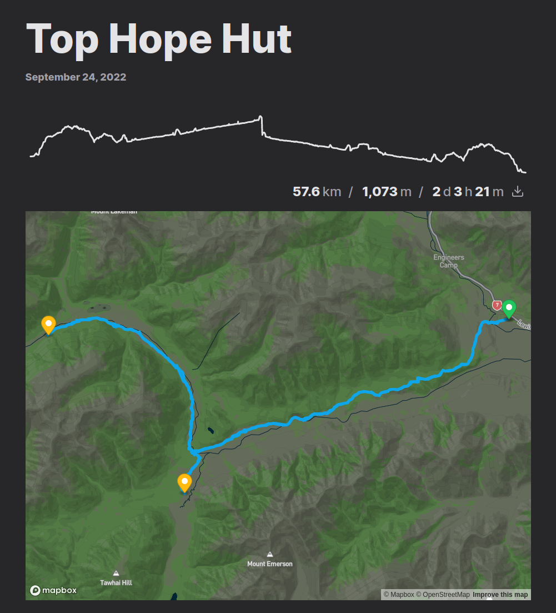
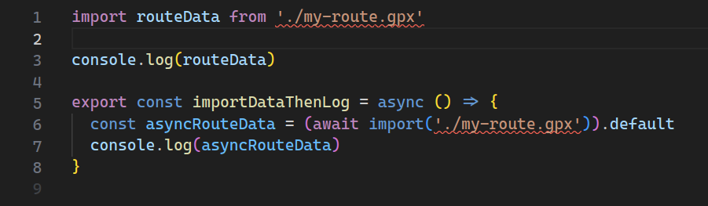
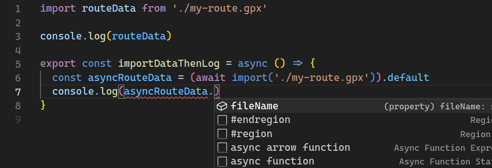
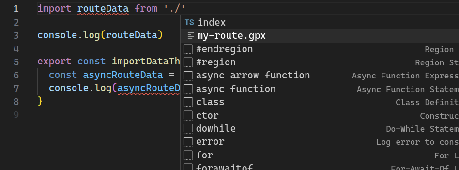

I love posting adventures on my blog. When I go on a hike, I track the route on my watch and upload the resulting GPX file to Strava. That's fine, but what I really want is to display the route on my own website alongside photos and a full trip report. In this post, I will walk through how I achieved this on my SvelteKit site using a custom Vite plugin. The concepts are easily applicable to any site using Rollup or Vite, and hopefully are helpful for anybody hoping to deal with GPX file inputs on the web.

Spoiler alert: here's the end result! By simply adding a GPX file to the `routes` key in the frontmatter of a Markdown blog post, I can see an interactive map and elevation profile. Here is the example for the [Top Hope Hut](/top-hope-hut) adventure.

```yaml
title: Top Hope Hut
date: 2022-09-24T19:42:00+1200
description: Meandering river valley track up Hope Valley near Lewis Pass
tags: [adventures]
routes:
  - ./Top_Hope_Hope_Kiwi_.gpx
```

<figcaption>The frontmatter</figcaption>



Let's jump in and see how this is achieved, or [check out the code in GitHub](https://github.com/albertnis/albert.nz/tree/f0cf77fe327c37dff6bcdc2bf21364586650a815/src/plugins/vite-plugin-gpx).

# Desired features

The first step for tackling this problem was to identify the features I wanted from this functionality. Here are some features I want to replicate from Strava:

- View the route on an interactive map
- View an elevation profile
- See metadata:
  - Elapsed time
  - Total distance
  - Gross elevation gain

And here are some features I desire beyond Strava's functionality:

- Ability for anybody to download original GPX file
- View overnight stops along the route (most of my blogged adventures are multi-day hikes and the stops usually correspond to notable huts or campsites)

# Setting up the Vite plugin

Before tackling most of these features, a Vite plugin needs to be set up.

## Create a minimal plugin

A Vite plugin is simple in that it's a function that is directly referenced by config. That is great for type-safety and ease of getting started. To create one, I simply created the following stub in a `src/plugins/vite-plugin-gpx/index.ts` file:

```ts
import type { Plugin } from 'vite'

export function gpxPlugin(): Plugin {
	return {
		name: 'vite-plugin-gpx'
	}
}
```

Loading this stub plugin is as easy as adding a reference into `vite.config.ts` or equivalent:

```ts
import type { UserConfig } from 'vite'
import { gpxPlugin } from './src/plugins/vite-plugin-gpx'

const config: UserConfig = {
	// ...
	plugins: [
		// ...
		gpxPlugin()
	]
}

export default config
```

I find it awesome that Vite supports type-safety all the way from the config file. If `gpxPlugin` didn't properly implement `Plugin`, we would see errors in the IDE well before we built any output. This code "works" great but doesn't achieve anything!

## Enabling importing of GPX files

Let's go over what this Vite plugin will let us achieve. Specifically, we want to be able to import the GPX file directly. The return value of the import will be an object with the data we're interested in.

```ts
import routeData from './my-route.gpx'

console.log(routeData)

// Object { fileName: "my-route.gpx", ... }
```

Initially, we want the output object to just have a `fileName` property, just to prove that we can get some output from the plugin. We'll make the output more useful in subsequent steps.

Let's add a `load` function to our `gpxPlugin`.

```ts
import { basename } from 'node:path'
import type { Plugin } from 'vite'

export interface ViteGpxPluginOutput {
	fileName: string
}

export function gpxPlugin(): Plugin {
	return {
		name: 'vite-plugin-gpx',
		load(id) {
			if (!/\.gpx$/.test(id)) return null

			const srcURL = new URL(id, 'file://')
			const pluginOutput: ViteGpxPluginOutput = {
				fileName: basename(srcURL.pathname)
			}

			return {
				code: `export default ${JSON.stringify(pluginOutput)}`
			}
		}
	}
}
```

The `load` function is called whenever `import` is invoked, with the absolute path of the imported file present in the `id` parameter. In this example, we do a few things:

1. If the file does not end with `.gpx`, ignore it!
1. Get the name of the imported file
1. Wrap the name with an object matching the output interface defined as `ViteGpxPluginOutput`
1. Return a plugin output object. The `code` key is set to a string containing JavaScript code which exports the output object, in string form.

The last part is particularly wild to me. **We are effectively transforming our GPX file into a JavaScript file**! Importing a GPX file will "trick" the compiler into thinking it has imported whatever JavaScript file contents this function returns.

## Enabling type-safe imports

Running the import example above should work well now. But there's a problem:



The imports fail with the error `Cannot find module './my-route.gpx' or its corresponding type declarations.` even though the file does exist. What's possibly even worse is that the return type of the import is `any`, as demonstrated by `asyncRouteData` having an `any` type.

This can be easily fixed with a TypeScript module declaration. In my case, I put it in `src/plugins/vite-plugin-gpx/ambient.d.ts`. The main thing is to ensure the file matches an `include` rule from `tsconfig.json`.

```ts
declare module '*.gpx' {
	const output: import('./index').ViteGpxPluginOutput
	export default output
}
```

With this file in place, import errors are gone and we see beautiful, beautiful autocomplete on the imported variable! Even import paths will autocomplete `.gpx` files now.





Now the plugin is fully set up and type-safe. By adding to our `pluginOutput`, we can return more data about the file. Time to incorporate the first feature.

## Enabling downloading of the original file

The first and most trivial feature for the plugin is to enable the download of the original GPX file. Frustratingly, this feature is withheld by Strava; I personally love the idea of letting people download GPX files as it can help with navigation for their own travels.

The main aim here is to instruct Vite to either render or serve the file then obtain the hosted path for the file. I was inspired by Jonas Kruckenberg's work on the [`imagetools`](https://github.com/JonasKruckenberg/imagetools) library and implemented a simplified version of imagetools' [Vite plugin definition](https://github.com/JonasKruckenberg/imagetools/blob/82a810b78c3d5b7b44a1dfa0518c397c76f23522/packages/vite/src/index.ts). I'll place the code below and then walk through it.

```ts
import { basename } from 'node:path'
import { readFile } from 'node:fs/promises'
import type { Plugin } from 'vite'

export interface ViteGpxPluginOutput {
	filePath: string
}

export function gpxPlugin(): Plugin {
	let basePath: string
	const gpxPaths = new Map()
	return {
		name: 'vite-plugin-gpx',
		configResolved(cfg) {
			const viteConfig = cfg
			basePath = (viteConfig.base?.replace(/\/$/, '') || '') + '/@gpx/'
		},
		async load(id) {
			if (!/\.gpx$/.test(id)) return null

			const srcURL = new URL(id, 'file://')
			const fileContents = await readFile(decodeURIComponent(srcURL.pathname))

			gpxPaths.set(basename(srcURL.pathname), id)

			let src: string
			if (!this.meta.watchMode) {
				const handle = this.emitFile({
					name: basename(srcURL.pathname),
					source: fileContents,
					type: 'asset'
				})

				src = `__VITE_ASSET__${handle}__`
			} else {
				src = basePath + basename(srcURL.pathname)
			}

			const pluginOutput: ViteGpxPluginOutput = {
				filePath: src
			}

			return {
				code: `export default ${JSON.stringify(pluginOutput)}`
			}
		},
		configureServer(server) {
			server.middlewares.use(async (req, res, next) => {
				if (req.url?.startsWith(basePath)) {
					const [, id] = req.url.split(basePath)

					const gpxPath = gpxPaths.get(id)

					if (!gpxPath)
						throw new Error(
							`gpx cannot find GPX file with id "${id}" this is likely an internal error. Files are ${JSON.stringify(
								gpxPaths
							)}`
						)

					res.setHeader('Content-Type', 'application/gpx+xml')
					res.setHeader('Cache-Control', 'max-age=360000')
					const buffer = await readFile(gpxPath)
					const contents = buffer.toString()
					return res.end(contents)
				}

				next()
			})
		}
	}
}
```

There's a lot going on here. But at its core you should still able to see the `return` statement within the `load` function. Here's what is happening:

1. When Vite is started and "sees" the plugin, `configResolved` is called. The `cfg` argument contains a bunch of configuration and context about Vite. In this case, we use it to get base path information and store it for later use.
1. Whenever we import a file, the `load` function is called, just like before. It has a bit more functionality now, though. First, it reads the file using Node's `readFile`. It then needs to ensure this GPX data is hosted somewhere before returning the path at which it is hosted. This is achieved quite differently depending on whether Vite is running with a dev server or as a build command:
   - In build mode, the file contents are registered with Vite using the `this.emitFile` function. The output path looks like `__VITE_ASSET_{uniqueid}__`. Behind the scenes, Vite will replace this magic path with the path at which it has stored the emitted file. (I can't find much documentation on this process--reach out if you know more).
   - In dev server mode, a path is generated for each loaded gpx file with the form `/@gpx/{filename}`. The plugin also registers each loaded gpx file in the `gpxPaths` map. To ensure the files actually exist in this location, the `configureServer` function is used to register a sever middleware which intercepts requests to `/@gpx/*` paths. If the request is for a loaded GPX file, the file contents are read and returned.

Now, when a GPX file is imported, there is easy access to the file path--perfect for a download link or button.

# Extracting data from the GPX file

It's time to delve into the file contents and extract some data. It might be time to refactor the output into its own function:

```ts
export function gpxPlugin(): Plugin {
	// ...
	return {
		// ...
		async load(id) {
			// ...
			const pluginOutput = gpxDataToOutput(fileContents.toString(), src)
			// ...
		}
	}
	// ...
}

const gpxDataToOutput = (gpxData: string, path: string): ViteGpxPluginOutput => {
	return {
		filePath: path
	}
}
```

The rest of the code in this section will be within the scope of this `gpxDataToOutput` function, unless specified otherwise.

## Understanding GPX

A GPX file is an XML file with a schema. The most useful thing to do with it in this plugin is to parse it into an GeoJSON format. This makes it easier to work with in JavaScript. Besides, most mapping libraries will accept GeoJSON as input. The [`@xmldom/xmldom`](https://www.npmjs.com/package/@xmldom/xmldom) and [`@mapbox/togeojson`](https://www.npmjs.com/package/@mapbox/togeojson) libraries work well here.

```ts
import geojson from '@mapbox/togeojson'
import { DOMParser } from '@xmldom/xmldom'

// ...

const gpxXmlDocument = new DOMParser().parseFromString(gpxData)
const gj = geojson.gpx(gpxXmlDocument)
```

It's worth noting that the `@mapbox/togeojson` library, while reliable, is quite old and has no type definitions. Thankfully, the GeoJSON output from the library is externally standardised so we can simply use a separate library for typing and apply a module declaration. I achieved this by creating a `src/@mapbox/ambient.d.ts` file with the following declaration which uses the `geojson` library to provide typing:

```ts
declare module '@mapbox/togeojson' {
	import type { GeoJSON } from 'geojson'

	interface MapboxToGeoJson {
		gpx: (data: Document) => GeoJSON
	}

	const mapboxToGeoJson: MapboxToGeoJson

	export default mapboxToGeoJson
}
```

Once we have converted to a GeoJSON value stored in `gj`, we can evaluate the contents:

```js
{
	"type": "FeatureCollection",
	"features": [
		{
			"type": "Feature",
			"properties": {},
			"geometry": {
				"type": "LineString",
				"coordinates": [
					[171.96891, -41.855557, 653],
					[171.968706, -41.855599, 653],
					[171.968748, -41.855728, 653],
					[171.968787, -41.855936, 654], // ...
				]
			}
		}
	]
}
```

That's a GeoJSON! Each co-ordinate is displayed as `[latitude, longitude, elevation]`.

## Data compression

It might be tempting to surface our path and elevation data at this point by simply returning:

```ts
return {
	filePath: path,
	geoJson: gj
}
```

Before doing that, consider file size! Everything that we return here will have to travel across the wire at some point, and GPX files can be huge--often tens of megabytes for long trips. That includes position, heart rate and timestamp data taken every second or two. Without intervention, most of this data will end up in our GeoJSON file as metadata. Compressed server responses will help to some extent, but we have a prime candidate for optimisation here. Let's see how this can be achieved for path and elevation data.

## Path data

First, the plugin calculates the target number of datapoints for the route. The input count is raised to the power of 0.7 (a number I settled on after much experimentation) to obtain the desired number of coordinates in the output data. This means that longer trips are compressed more aggressively. A short route with 1,000 points will be downsampled to about 125 points, while a 30,000-point adventure will result in around 1,361 points in the output.

```ts
const coordinatesDataCount = feature.geometry.coordinates.length

const targetPathDataCount = Math.pow(coordinatesDataCount, 0.7)
const pathSamplingPeriod = Math.floor(coordinatesDataCount / targetPathDataCount)
const downSampledCoordinates = downSampleArray(feature.geometry.coordinates, pathSamplingPeriod)
```

Downsampling occurs by only taking values spaced `pathSamplingPeriod` apart:

```ts
const downSampleArray = <T>(input: T[], period: number): T[] => {
	if (period < 1 || period % 1 != 0) {
		throw new TypeError('Period must be an integer greater than or equal to 1')
	}

	if (period === 1) {
		// Return a copy of input
		return [...input]
	}

	const output: T[] = []

	for (let i = 0; i < input.length; i += period) {
		output.push(input[i])
	}

	return output
}
```

After downsampling the coordinates, we can exclude elevation data from the GeoJSON as this will be handled separately. Removing this data will decrease the filesize further by a third.

```ts
import type { Geometry } from 'geojson'

// ...

const downSampledGeometry: Geometry = {
	...feature.geometry,
	coordinates: downSampledCoordinates.map((c) => [c[0], c[1]])
}
```

## Elevation data

I used a similar method for elevation data, but with a different approach to obtaining a count target. Here I want the target to be at least 900, as this is approximately the number of pixels my elevation graph takes up at its maximum width.

```ts
const targetElevationDataCount = 900
const elevationSamplingPeriod =
	coordinatesDataCount < targetElevationDataCount
		? 1 // Use all the datapoints if there are fewer
		: Math.floor(coordinatesDataCount / targetElevationDataCount) // Downsample
const downSampledGeometryForElevation = downSampleArray(
	feature.geometry.coordinates,
	elevationSamplingPeriod
)
```

The final step is to extract just a list of elevations from the GeoJSON:

```ts
const downSampledElevations = downSampledGeometryForElevation.map((g) => g[2])
```

We could downsample elevation at the same rate as position data but generally speaking there are fewer elevation points required, so this saves space overall.

## Bringing it together

With some changes to the ouput interface, we can set the ouput of `gpxDataToOutput` function to look a bit like the following:

```ts
return {
	elevationData: {
		downSampledElevations,
		samplingPeriod: elevationSamplingPeriod
	},
	pathData: {
		geoJson: buildGeoJSONFromGeometry(downSampledGeometry),
		samplingPeriod: pathSamplingPeriod
	},
	metadata: {
		gpxFilePath: path
	}
}
```

`buildGeoJSONFromGeometry` simply reconstructs a minimal GeoJSON to wrap geometry. In this case it's used to strip out any of the extra bloat that may have been in the original GeoJSON.

It's coming together! This is enough information to show path data and basic elevation data.

# Computing metadata

## Distance

There are two purposes for computing the distance of the path:

1. Display the total distance of the route
1. Display an accurate elevation graph

The first item is probably obvious, but the interaction between distance and elevation graph is particularly interesting. You see, an elevation graph typically has _distance_ as the x-axis, not _data point index_. Currently we only have a list of elevations and no distance data for correlation.

To provide this distance data, a list of cumulative distances is required. This enables us to map an index to a distance.

```ts
/**
 * Compute cumulative distances along a path
 * @param input List of coordinate arrays representing a path
 * @returns Array of distances. Each distance is the distance along the path from the start of the path to that point.
 */
const computeCumulutiveDistanceMetres = (input: Position[]): number[] => {
	let distanceMetres = 0
	const distancesMetres = [0]

	for (let i = 1; i < input.length; i++) {
		distanceMetres += haversineDistanceMetres(
			input[i] as [number, number],
			input[i - 1] as [number, number]
		)
		distancesMetres.push(distanceMetres)
	}

	return distancesMetres
}
```

The distance between each successive pair of co-ordinates is computed using the [Haversine formula](https://en.wikipedia.org/wiki/Haversine_formula) then added to the previous distance and appended to the array.

The total distance is simple the last item in the cumulative distance array.

## Elevation gain

Gross elevation gain is a useful metric for assessing how hilly a route was. Conceptually it's the total cumulative upwards travel. In practice, it can be a bit nuanced to compute given that elevation data can be imprecise and noisy at times. I implemented a fairly simple version which includes some downsampling and a threshold for elevation gain. I don't think it's perfect, but it gives a fairly good estimate.

```ts
const computeCumulativeElevationGainMetres = (input: Position[]): number => {
	let vertGain = 0
	const gainThreshold = 2
	let currentBaseline = input[0][2]

	for (let i = 0; i < input.length; i += 3) {
		const alt = input[i][2]
		const climb = alt - currentBaseline

		if (climb >= gainThreshold) {
			// We have gone up an appreciable amount
			currentBaseline = alt
			vertGain += climb
		} else if (climb <= -gainThreshold) {
			// We have gone down an appreciable amount
			currentBaseline = alt
		}
	}

	return vertGain
}
```

## Time

There are two key times to capture from an activity: duration and start time.

Start time is easy. Most of the time the GeoJSON feature will contain a "time" which can be used. Just in case, I fall back to the first coordinate time.

Times in GeoJSON are represented in ISO format, so liberal use of `parseISO` from `date-fns` is appropriate here.

```ts
import { parseISO } from 'date-fns'

/**
 * Calculate the start time from a feature
 * @param input Feature to use for calculating start time
 * @returns Date object representing the feature's `time` property, or the first `coordTime` if there is no such property
 */
const computeStartTime = (input: Feature): Date | null => {
	const startTime = input.properties?.time

	if (typeof startTime === 'string') {
		return parseISO(startTime)
	}

	const times = input.properties?.coordTimes

	if (Array.isArray(times)) {
		return parseISO(times[0])
	}

	return null
}
```

Elapsed duration can be calculated by taking the difference between the first and last coordinate time. The `date-fns` library has some very helpful methods and types to assist with this. The timestamps appear in the `properties` key of the GeoJSON. I'm unsure whether this is standard or arbitrary behaviour in `@mapbox/togeojson`.

```ts
import { intervalToDuration, parseISO } from 'date-fns'

/**
 * Calculate the duration from the `coordTime`s stored in a feature's property
 * @param input Feature to use for calculating duration
 * @returns Duration between first and last `coordTime` in the feature
 */
const computeDuration = (input: Feature): Duration | null => {
	const times = input.properties?.coordTimes
	if (times == null || !Array.isArray(times)) {
		return null
	}

	const start = parseISO(times[0])
	const end = parseISO(times[times.length - 1])

	return intervalToDuration({ start, end })
}
```

## Breaks

Many of the trips I track are multi-day hikes (or "tramps" as they're lovingly known by New Zealanders). It is nice to know where the huts and campsites were along the route. Manually entering the locations of these spots is probably the most foolproof way of doing this, but I opted for an alternative, lazy, method. I simply extract the locations where there are no GPX entries for over four hours. This tends to be a good indicator of where I paused my tracking device overnight--and a great proxy for hut and campsite locations.

```ts
import { differenceInHours, parseISO } from 'date-fns'

/**
 * Compute the locations of breaks exceeding four hours within a feature
 * @param input Feature with coordTimes data used to evaluate breaks
 * @returns Array of indexes where each index corresponds to a coordinate after which there were no coordinates recorded for at least four hours
 */
const computeBreakIndices = (input: Feature): number[] => {
	// Self-contained sampling rate to accelerate calcs
	// Can ususally set this high unless there are lots of stops
	const samplingRate = 30

	const times = input.properties?.coordTimes

	if (!Array.isArray(times)) {
		return []
	}

	// Get the date objects for a subsampled set of timestamps
	const parsedTimes = times.filter((_, i) => i % samplingRate === 0).map((t) => parseISO(t))

	const indices = []
	for (let i = 1; i < parsedTimes.length; i++) {
		if (differenceInHours(parsedTimes[i], parsedTimes[i - 1]) > 4) {
			indices.push((i - 1) * samplingRate)
		}
	}
	return indices
}
```

# Displaying data

Now that all the data and metadata has been computed, it's time to put this to use! Let's import a gpx file like before and see what we're dealing with:

```js
import geoData from '../top-hope-hut/Top_Hope_Hope_Kiwi_.gpx'
```

Inspecting or logging `geoData` shows that has the following value:

```js
{
	"elevationData": {
		"downSampledElevations": [
			602,
			602,
			602,
			603 // ... [907 items total]
		],
		"elevationGainMetres": 1073,
		"samplingPeriod": 54
	},
	"metadata": {
		"gpxFilePath": "/@gpx/Top_Hope_Hope_Kiwi_.gpx",
		"breakIndices": [23940, 34560],
		"duration": {
			"years": 0,
			"months": 0,
			"days": 2,
			"hours": 3,
			"minutes": 21,
			"seconds": 45
		},
		"startTime": "2022-09-23T21:34:06.000Z",
		"distanceMetres": 57605.837060918944
	},
	"pathData": {
		"geoJson": {
			"type": "FeatureCollection",
			"features": [
				{
					"type": "Feature",
					"properties": {},
					"geometry": {
						"type": "LineString",
						"coordinates": [
							[172.382772, -42.584167],
							[172.38245, -42.58434],
							[172.382203, -42.584338],
							[172.381928, -42.584328],
							[172.381573, -42.584365] // ... [1958 items total]
						]
					}
				}
			]
		},
		"cumulativeDistancesMetres": [
			0,
			36.508624548783956,
			61.228052816957145,
			88.76666712805523,
			124.48251406266579 // ... [1958 items total]
		],
		"samplingPeriod": 25
	}
}
```

We can see all the geo information is stored there as we expect! Elevation data has a sparser sampling rate than point data and both sampling rates are present. Plus, the object gives us a `gpxFilePath` which can be used to download the original file. Here the file starts with `/@gpx/` because the example output is from a local server.

Displaying the file is now a matter of writing some code that takes this data and renders something with it. It could be plain old JavaScript, a React component, or just about anything. For my Sveltekit blog, I created a `<MapGroup>` Svelte component that renders an elevation graph using SVG and a map using MapBox. The details are a bit beyond this article, but suffice it to say that I can use the component with the following code snippet:

```svelte
<script>
	import MapGroup from '$lib/components/MapGroup.svelte'
	import geoData from '../top-hope-hut/Top_Hope_Hope_Kiwi_.gpx'
</script>

<figure>
	<MapGroup geo={geoData} />
	<figcaption>Example of GPX-derived data being loaded via map component</figcaption>
</figure>
```

For my blog, I check the blog post for the `routes` key, then import every GPX file reference and insert a component similar to the above. [See how it works on GitHub](<https://github.com/albertnis/albert.nz/blob/f0cf77fe327c37dff6bcdc2bf21364586650a815/src/routes/(main)/%5Bslug%5D/%2Bpage.ts>).

## Graceful degradation in the absence of JavaScript

An early version of my site's GPX integration used lazy loading for the entire map group, consisting of elevation graph, metadata display and map. But it's always worth considering how much can be rendered without JavaScript present in the browser at all. In my case, I could easily pre-render or server-side-render the SVG elevation graph, as well as the metadata block.

```svelte
<script lang="ts">
	import type { ViteGpxPluginOutput } from '../../plugins/vite-plugin-gpx/types'
	import type { ComponentType, SvelteComponentTyped } from 'svelte'
	import { onMount } from 'svelte'
	import ElevationGraph from '$lib/components/ElevationGraph.svelte'
	import MapMetadata from '$lib/components/MapMetadata.svelte'
	import MapLoading from '$lib/components/MapLoading.svelte'

	export let geo: ViteGpxPluginOutput
	let hoveredIndex: number | undefined = undefined
	let mapComponent: ComponentType<SvelteComponentTyped> | undefined

	onMount(async () => {
		mapComponent = (await import('$lib/components/Map.svelte')).default
	})
</script>

<svelte:head>
	<noscript>
		<style>
			.maploading {
				display: none;
			}
		</style>
	</noscript>
</svelte:head>

<ElevationGraph {...elevationGraphPropsGoHere} />

<MapMetadata {...metadataPropsGoHere} />

{#if mapComponent == null}
	<div class="maploading">
		<MapLoading />
	</div>
{:else}
	<svelte:component this={mapComponent} {...otherMapPropsGoHere} />
{/if}
```

Here, the map component itself is lazy-loaded (and will be hidden if there is no JavaScript on the client) but elevation graph and metadata will be present regardless of whether the code is running on server or client. The next level would be to fall back to Mapbox's image API to render an image instead of an interactive map in the absence of JavaScript!

# Conclusion

In building a Vite GPX plugin, I set out to move a small slice of Strava to my personal site. A Vite plugin achieves this in a fairly elegant way, abstracting the messy work away from application code which simply imports it. With creative downsampling it is possible to minimise file sizes while retaining the full GPX file for download.

The next step might be to make some improvements to the performance of the loader, given that it can take 2-3 minutes to build the entire site. There are also plenty of options for enabling configuration which I will explore if I ever publish `vite-plugin-gpx` as a standalone library.

I hope you have enjoyed this walkthrough of building a Vite GPX plugin! You can find [the full source code for the plugin on GitHub](https://github.com/albertnis/albert.nz/tree/f0cf77fe327c37dff6bcdc2bf21364586650a815/src/plugins/vite-plugin-gpx).
