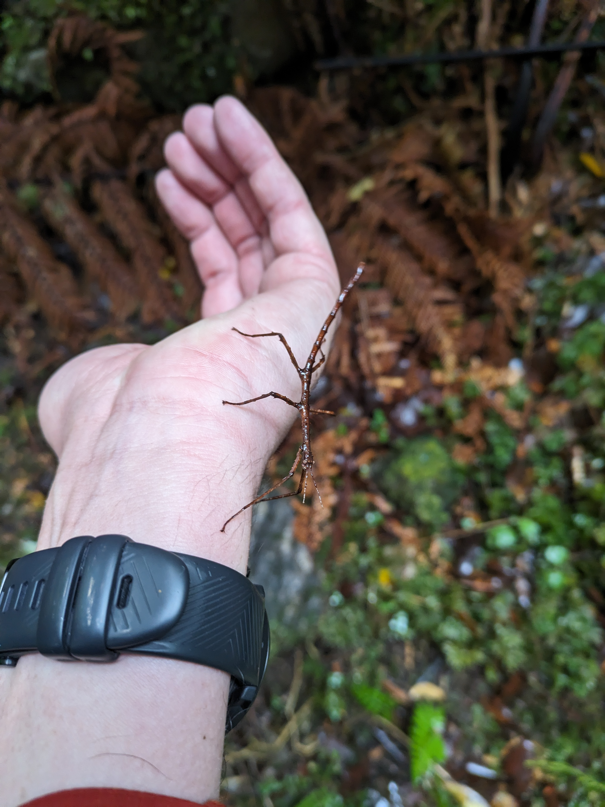
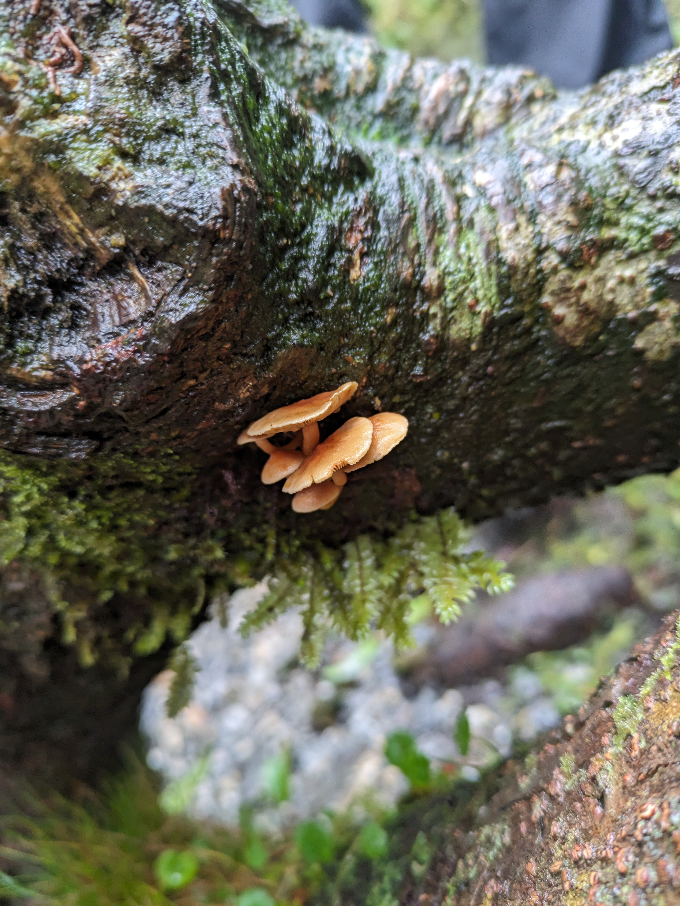
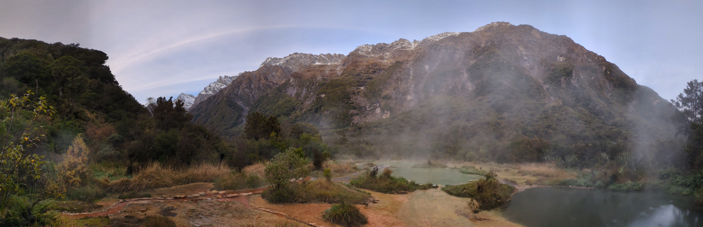
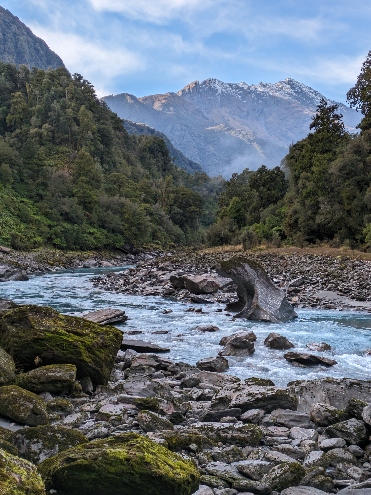

Welcome Flat is one of the most stunning spots on the West Coast, and possibly in the entire country. In a 2.5-hour drive and a few hours' walk into the bush, walkers are rewarded with a well-equipped hut with exceptional natural hot pools adjacent. Our group had booked two nights in the hut to afford a hut day and made our way over on Friday night from Christchurch and Dunedin

The trail is well-maintained and relatively straightforward for a West Coast track--but it's still a West Coast track, with a couple of short rock-hopping sections but thankfully not much steep climbing. Experienced hikers or trail runners will take less than the DOC time of seven hours, but inexperienced hikers will find things more challenging; this can lead to a long day on the legs!

We were subjected to an absolute deluge while attempting to reach the hut, and side streams became uncrossable. Architect Creek Hut provided a great place to rest up for a couple of hours until the rain and waterways subsided. If you're attempting this, make sure to allow extra time for such inclement weather, which is fairly common in the area. DOC is quite good at communicating with those who have booked the hut and on this weekend were offering booking refunds, even though the track stayed open.

Our day in to the hut saw us walking through lush and very damp bush. It was particularly impressive to look up to the steep rocky hills on either side of the valley, upon which waterfalls materialised in the heavy rain.

The hut is generously-sized, with four sleeping rooms upstairs plus the Sierra Room downstairs--a four-bunk room which can only be booked with sole occupancy. The downstairs fire didn't seem particularly effective but with enough people, the space warmed up a little. The most impressive feature of the hut is the flush toilets which are available all year round.

I was particularly excited to check out the hot pools, which I had heard much about. The pools are just a short walk from the hut along a 50-metre track. A small shelter near the pools provides a place to change and hang dry clothes.

The pools are absolutely stunning, and I proceeded to spend about seven hours in them the following day. The hot water, dramatic view and cold air truly is a winning combination. In this single trip, Welcome Flat became one of my favourite places in the country and I'm already planning a return.

